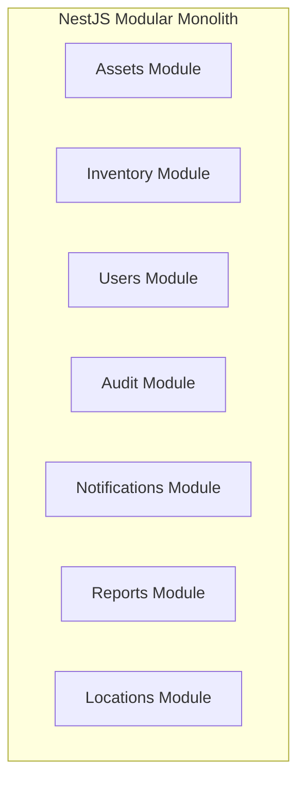
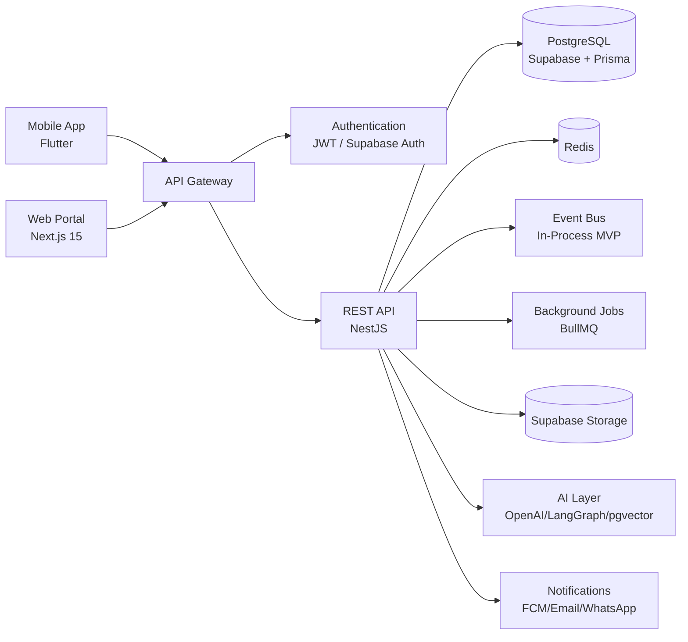
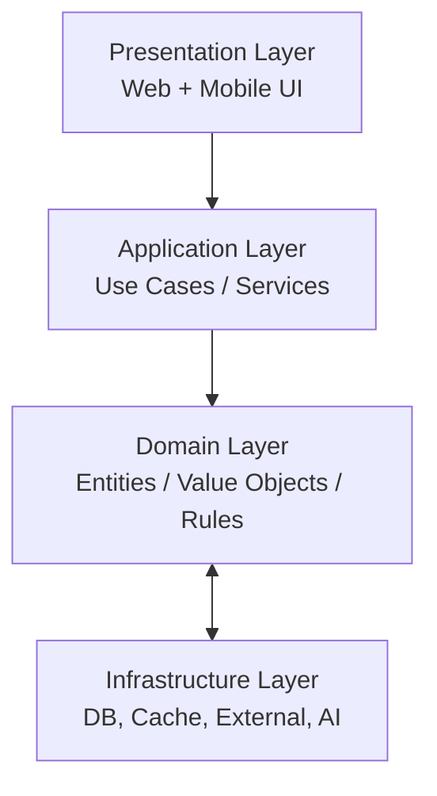
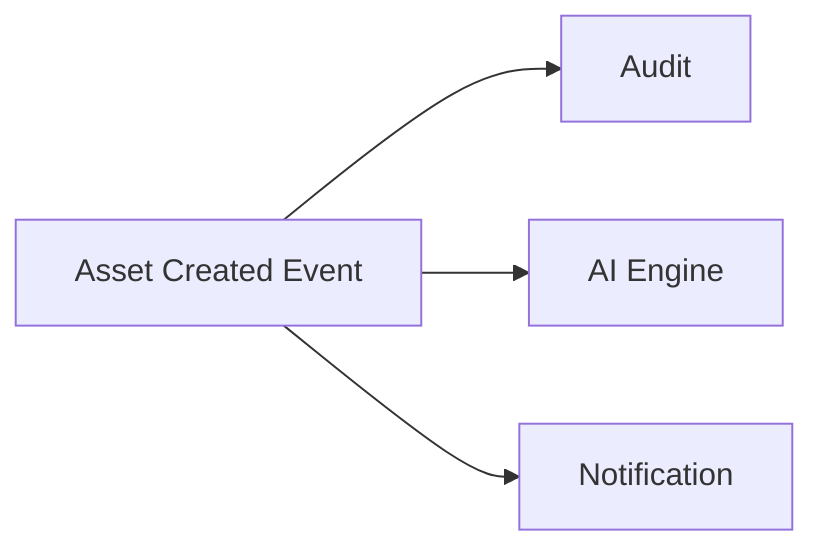
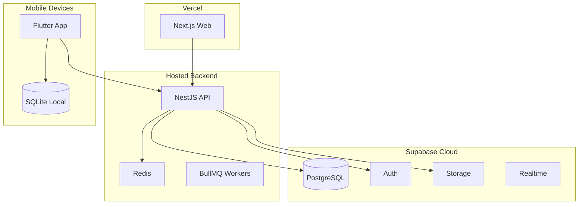

# SOFTWARE ARCHITECTURE DOCUMENT (SAD)
## AssetX Enterprise Platform

> **Document ID:** `ARCH-SAD-001` | **Version:** 1.0 | **Status:** Approved Baseline
> **Reference:** AAB v6.0 (§5, §10, §11–11AD, §11A) · Approved Architecture Decisions · PEP v1.0
> **Path:** `Architecture/Software_Architecture_Document.md`

---

## 0. Document Control

| Field | Value |
|---|---|
| **Document Title** | Software Architecture Document (SAD) |
| **Document Owner** | Senior Enterprise Solution Architect |
| **Contributors** | Development Leads, DevOps, Security |
| **Authoritative Basis** | AAB v6.0; Approved Architecture Decisions; ADRs |
| **Review Body** | TRB |
| **Approval Body** | CAB |
| **Version** | 1.0 |

---

## 1. Introduction

### 1.1 Purpose

This document describes the **software architecture** of the AssetX Enterprise Platform: the architectural style, system context, logical/physical views, module decomposition, data flow, and key cross-cutting concerns. It is the bridge between business requirements (PRD/FRS) and implementation (Backend/Mobile/API docs).

### 1.2 Scope

Covers the Web Administration Portal, Public REST APIs (NestJS), Mobile Field Application (Flutter), PostgreSQL/Supabase data layer, Redis cache, notifications, AI layer, and the operational/integration fabric — per the approved architecture and technology stack.

---

## 2. Architectural Goals & Principles

### 2.1 Goals

| Goal | Description |
|---|---|
| Enterprise-scope architecture | All enterprise capabilities designed from the start |
| Incremental implementation | MVP → V6+ per roadmap |
| Offline-first | Field operations without internet |
| Multi-tenant-ready | `tenant_id` + RLS |
| API-first | Every function has an API before UI |
| Security & audit by design | Built-in, not retrofitted |
| Scalable & observable | Horizontal scaling + full telemetry |

### 2.2 Architecture Principles (from AAB §5 / Approved Decisions)

- Enterprise First · Offline First · Cloud Native · API First · Security by Design · Audit by Design · Mobile First (Field) · AI Ready · Modular Monolith First · Event Driven · Multi-Tenant Ready · Domain Driven Design · Clean Architecture · CQRS Ready · SOLID.

---

## 3. Architecture Style

### 3.1 Primary Style: Modular Monolith (ADR-002)

AssetX starts as a **Modular Monolith**: a single deployable application with internally separate modules (bounded contexts), each with its own models, services, routes — but running in one process. It evolves to Distributed Monolith → Microservices → Event-Driven per AAB §11AC.

### 3.2 Why Modular Monolith First

| Reason | Detail |
|---|---|
| Team size | Small team / new product |
| Complexity | Avoid premature distributed complexity |
| Performance | Single process, direct module calls |
| Evolution | Modules map 1:1 to future services |

### 3.3 Evolution Triggers (AAB §11AC)

| Trigger | Move To |
|---|---|
| > 5000 users or module slowdown | Distributed Modular Monolith |
| Multiple teams / independent scaling | Microservices |
| High-scale real-time events | Event-Driven |

---

## 4. System Context & Architecture Views

### 4.1 High-Level System Context

### 4.2 Context Diagram (Actors)

| Actor | Interaction |
|---|---|
| Administrator | Web portal management |
| Asset Manager | Web portal asset lifecycle |
| Auditor | Web portal review/verify |
| Field Agent | Mobile offline inventory |
| External Systems | API/integrations (later) |
| Tenants (SaaS) | Tenant-scoped data (later) |

---

## 5. Logical Architecture

### 5.1 Layered Architecture (Clean Architecture)

### 5.2 Module/Bounded Context Mapping (AAB §11A)

| Bounded Context | Modules | Responsibility |
|---|---|---|
| **Asset Context** | Asset, Category, Model, Status | Asset lifecycle |
| **Location Context** | Main/Sub Location | Hierarchical structure |
| **Inventory Context** | Cycle, Record, Verification, Team | Inventory + discrepancies |
| **Identity Context** | User, Role, Permission | Auth & permissions |
| **Movement Context** | Movement, Transfer, Disposal | Transfers & changes |
| **Maintenance Context** | Order, Technician, SparePart | Maintenance |
| **Audit Context** | AuditEvent (append-only) | Audit |
| **Notification Context** | Notification, Template, Channel | Notifications |

> Each context has clear boundaries; contexts communicate via events/APIs, not direct calls.

---

## 6. Data Flow & Event-Driven Architecture

### 6.1 Event-Driven (AAB §11C)

Events: `AssetCreated/Updated/Deleted` · `InventoryCompleted` · `DiscrepancyDetected` · `MaintenanceScheduled`.

- MVP: In-Process Event Bus.
- V2+: Redis Pub/Sub.
- V4+: Kafka/RabbitMQ (high load) — per ADR-011.

### 6.2 CQRS-Ready

Architecture is **CQRS-ready**: commands (writes) and queries (reads) can be separated for scalability, especially for reporting/dashboard reads via read replicas/materialized views.

---

## 7. Physical / Deployment Architecture

### 7.1 Deployment Model

### 7.2 Environments (PEP §31)

| Environment | Purpose |
|---|---|
| Dev | Developer integration |
| Staging | Pre-production parity |
| Production | Live service |

---

## 8. Data Architecture

### 8.1 Database Strategy (ADR-004, AAB §11J/§11K)

- **PostgreSQL** via **Supabase** + **Prisma ORM**.
- **UUID** technical identifiers (ADR-001) for all FKs.
- **Business Codes** (e.g., `ASSET-2026-0001`) for display/search/print.
- **`tenant_id` + RLS** for multi-tenant isolation.
- **Standard audit columns** on every table: `id (UUID)`, `tenant_id`, `created_at`, `updated_at`, `created_by`, `updated_by`, `is_active`.

### 8.2 Hierarchy (ADR-005)

- **Materialized Path (LTREE + GIN)** for hierarchical locations.
- Rationale: high read performance for field inventory; simple; smooth migration from legacy.

> Full schema details in `Database/Database_Design_Specification.md`.

---

## 9. Key Design Decisions (ADRs Summary)

| ADR | Decision |
|---|---|
| `ADR-001` | UUID instead of IDENTITY |
| `ADR-002` | Modular Monolith before Microservices |
| `ADR-003` | Offline Sync Strategy (queue + conflict resolution) |
| `ADR-004` | Multi-Tenant Strategy (`tenant_id` + RLS) |
| `ADR-005` | Hierarchy Strategy (Materialized Path LTREE) |
| `ADR-006` | Observability Strategy |
| `ADR-007` | Backup Strategy |
| `ADR-008` | Integration Strategy |
| `ADR-009` | Governance Strategy |
| `ADR-010` | Monitoring Stack |
| `ADR-011` | Event Bus Strategy |
| `ADR-012` | Cost Optimization |
| `ADR-013` | AI Usage Strategy |
| `ADR-014` | Release Strategy |
| `ADR-015` | Disaster Recovery |

> Authoritative ADR text lives in the Architecture Bible. This doc references, not redefines.

---

## 10. Technology Stack (Approved)

| Layer | Technology |
|---|---|
| Web | Next.js 15, React 19, TypeScript, Tailwind v4, shadcn/ui, TanStack Query, React Hook Form, Zod |
| Backend | NestJS, TypeScript, REST, OpenAPI, JWT, RBAC, BullMQ |
| Database | PostgreSQL, Supabase, Prisma, RLS, Realtime, Storage, UUID |
| Mobile | Flutter |
| Local storage | SQLite, Repository Pattern, Sync Queue, Conflict Resolution |
| Auth | Supabase Auth, JWT, Refresh, MFA-ready |
| Cache | Redis |
| Notifications | FCM, Email, WhatsApp |
| Monitoring | OpenTelemetry, Prometheus, Grafana, Loki, Sentry |
| CI/CD | GitHub Actions, Docker, Vercel |
| AI | OpenAI, LangGraph, pgvector, Embeddings |

---

## 11. Cross-Cutting Concerns

### 11.1 Security (by Design)

- Security architecture detailed in `Security/Security_Architecture.md`.
- RBAC, MFA, JWT, encryption, OWASP ASVS.

### 11.2 Audit (by Design)

- Append-only audit across sensitive operations.
- Audit columns + AuditEvent context.

### 11.3 Observability

- Metrics, logs, tracing (OpenTelemetry/Prometheus/Loki).
- SLO/SLA + error budget.

### 11.4 Performance

- Caching, indexing, partitioning, pooling, read replicas.
- Targets per NFR.

### 11.5 Internationalization

- Arabic-first + English; RTL/LTR.

---

## 12. Integration Architecture (Later Versions)

### 12.1 Integration Strategy (ADR-008)

| Channel | Use |
|---|---|
| REST API | Standard operations |
| GraphQL | Flexible queries (optional) |
| Webhooks | Async push to external systems |
| Event Bus | Internal async |
| Message Queue | Long-running tasks |

### 12.2 Integration Targets

| System | Protocol | Timing |
|---|---|---|
| ERP (SAP/Oracle) | REST | V4 |
| HR System | REST/LDAP | V3 |
| Microsoft Entra/AD | OAuth2/SAML | V3 |
| WhatsApp Business | API | V4 |
| Email (SMTP) | SMTP | V2 |

---

## 13. AI Architecture

### 13.1 AI Tiers (ADR-013, AAB §11E)

| Tier | Capabilities | Timing |
|---|---|---|
| L1 | Smart search, duplicate, NL reports, anomaly | V3 |
| L2 | Image comparison, auto-classification, root cause | V4 |
| L3 | Predictive maintenance, voice, smart route | V5+ |

### 13.2 AI Components

- OpenAI APIs + LangGraph for orchestration.
- pgvector + embeddings for similarity/duplicate detection.
- Provider abstraction to avoid lock-in.
- Caching + batch processing for cost control.

---

## 14. Technology Decision Considerations (Future TDR)

- The approved stack is baseline until a **Technology Decision Record (TDR)** changes it.
- Any change goes through ADR → TRB → CAB.

---

## 15. Traceability

| Architecture Element | Traced To |
|---|---|
| Modules | AAB §11A Bounded Contexts; FRS modules |
| ADRs | AAB §11P/§11AD |
| Deployment | PEP Environment Strategy |
| Technology | Approved Decisions |

---

## 16. References

| Reference | Location |
|---|---|
| AAB v6.0 | AssetX-Architecture-Bible/ |
| Database Design | Database/Database_Design_Specification.md |
| API Specification | API/API_Specification.md |
| Mobile Specification | Mobile/Mobile_Technical_Specification.md |
| Security Architecture | Security/Security_Architecture.md |

---

## 17. Document Control (Closure)

| Field | Value |
|---|---|
| **Status** | Approved Baseline |
| **Reviewed By** | TRB |
| **Approved By** | CAB |

> **End of Software Architecture Document.**
