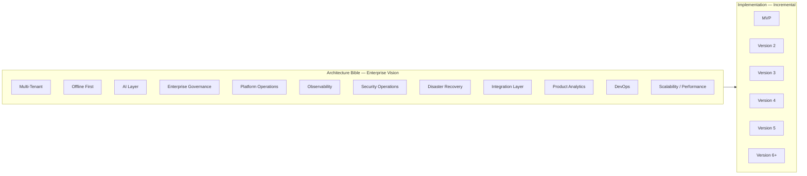
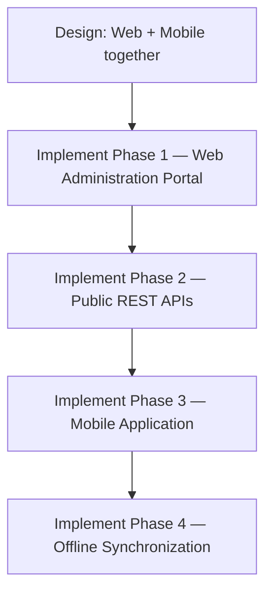

# 000 — Project Charter

> **AssetX Architecture Bible (AAB)** — Document `000`
> Reference: `01-Executive/000_Project_Charter.md`

---

## 0.1 Document Control

| Field | Value |
|---|---|
| **Document ID** | `AAB-000` |
| **Document Title** | AssetX Project Charter |
| **Bible Folder** | `01-Executive` |
| **Version** | `1.0` |
| **Status** | Approved |
| **Date** | 2026-08-03 |
| **Author / Role** | AssetX Architecture Team — Senior Software Architect |
| **Audience** | Executive Sponsors, Product Owners, Engineering Leads, All Contributors |
| **Classification** | Internal — Confidential |

### Revision History

| Version | Date | Author | Summary of Change |
|---|---|---|---|
| 0.1 | 2026-08-03 | Architecture Team | Initial draft |
| 1.0 | 2026-08-03 | Architecture Team | Approved — baseline for AssetX Architecture Bible |

### Approval Record

> Per AssetX governance (ref. `11V — Platform Governance`), this charter was reviewed by the **Technical Review Board (TRB)** and approved by the **Change Approval Board (CAB)** before becoming the baseline of the Architecture Bible.

---

## 0.2 Document Purpose

This **Project Charter** is the highest-level governing document of the **AssetX Enterprise Platform**. It establishes:

- The **identity, vision, and mission** of the product.
- The **business problem** AssetX solves and its **value proposition**.
- The **strategic goals** (Business Objectives `BO-001 … BO-007`).
- The **scope** and the **phased delivery model**.
- The **non-negotiable product principles**.
- The **official technology direction**.
- The **governance model** that makes the **AssetX Architecture Bible (AAB)** the **Single Source of Truth**.

It does **not** describe technical design, database schemas, or implementation details. Those belong to their respective Bible folders (`05-Architecture`, `06-Database`, `07-Backend`, …). This document references approved decisions rather than redefining them.

> **Status of this document:** Approved. All subsequent documents must remain consistent with the content and decisions recorded here.

---

## 1. Executive Summary

**AssetX** is an **enterprise SaaS platform for full fixed-asset lifecycle management** — from acquisition through disposal/retirement — with a strategic differentiator in **smart offline-first field inventory** delivered through mobile and tablet applications.

AssetX is explicitly **not** a "counting/inventory app." It is an **enterprise platform** for which field inventory is one module within a larger lifecycle and governance ecosystem.

The platform follows an **Architecture First** methodology: **no code is written until the AssetX Architecture Bible (AAB) is complete**. The AAB is the single, authoritative reference for everything about the system — from vision to deployment.

| Attribute | Value |
|---|---|
| **Project (working) name** | AssetX Enterprise Platform |
| **Category** | Enterprise Asset Lifecycle & Smart Field Inventory Platform |
| **Type** | SaaS — Cloud-Native & Offline-First — Cross-Platform |
| **Primary surfaces** | Web Administration Portal + Mobile Field Application |
| **Current status** | Architecture phase — Architecture Bible in build |
| **Version line** | v5.0+ (Enterprise Architecture Foundation) → v6.0 (Enterprise Operating Model) |

---

## 2. Vision & Mission

### 2.1 Vision

To become the **reference platform** for fixed-asset management and smart inventory in organizations — a system powered by **data, automation, and artificial intelligence** that combines ease of use, reliability, and scalability.

### 2.2 Mission

To enable organizations to manage the complete lifecycle of their assets with high efficiency, **reduce waste and operational errors**, and transform inventory operations from cumbersome paper-based procedures into **smart digital operations** supported by analytics and AI.

---

## 3. Business Context

### 3.1 Business Problem

Organizations today face systemic asset-management challenges:

| # | Problem |
|---|---|
| 1 | No unified asset database (fragmented records across departments). |
| 2 | Difficulty knowing the true physical location of an asset. |
| 3 | Heavy reliance on Excel files and paper forms. |
| 4 | Annual inventory takes too long and interrupts operations. |
| 5 | Duplicate registrations and lost assets. |
| 6 | Weak tracking of transfers between departments. |
| 7 | No complete historical record of asset movement. |
| 8 | Inventory halts in remote locations without internet connectivity. |

### 3.2 The AssetX Solution

| Pillar | What AssetX delivers |
|---|---|
| **Management** | A Web administration portal for control and configuration. |
| **Field inventory** | A mobile app (Android / iOS / Tablet) for field counting. |
| **Data** | Centralized cloud database + local on-device database (offline-first). |
| **Synchronization** | Smart sync engine with conflict resolution and incremental sync. |
| **Identification** | QR Code + Barcode support; NFC, GPS, and Bluetooth Beacon-ready for the future. |
| **Intelligence** | Reporting/analytics engine + real-time dashboard + AI assistant. |

### 3.3 Why AssetX (Differentiation)

| Differentiator | Detail |
|---|---|
| **Offline First** | Full field operation without connectivity, then sync. |
| **Mobile Native** | First-class mobile experience for field work. |
| **Authentic Arabic** | Native Arabic-first experience with i18n. |
| **AI Built-in** | AI integrated into the platform, not bolted on. |
| **Competitive SaaS** | Enterprise-grade value at approachable cost/speed. |
| **Fast deployment** | Phased rollout from MVP to enterprise. |

---

## 4. Strategic Objectives (Business Objectives)

These objectives are the measurable anchors of the product. They are referenced across the Bible (Requirements, Domain, Reporting, Analytics).

| Code | Objective |
|---|---|
| `BO-001` | Reduce annual inventory execution time by at least **70%**. |
| `BO-002` | Reduce human errors during inventory operations. |
| `BO-003` | Provide a unified database for all assets. |
| `BO-004` | Provide a complete historical record for every asset. |
| `BO-005` | Enable inventory **offline without internet** (Offline First). |
| `BO-006` | Provide real-time KPI dashboards for senior management. |
| `BO-007` | Be scalable toward a full Enterprise Asset Management suite. |

### 4.1 Success Criteria (KPIs)

Per section `16` of the Master Context Document and `11Z — Product Analytics`:

| KPI | Purpose |
|---|---|
| Inventory campaign duration | Time to complete a campaign. |
| % of assets inventoried | Coverage of a cycle. |
| Discrepancy rate | Share of discrepancies detected. |
| Data synchronization time | Sync engine performance. |
| Response time | API/user-interface latency. |
| Uptime | Service availability. |
| User satisfaction | Product experience quality. |
| Critical errors | Frequency of critical defects. |

---

## 5. Scope

### 5.1 Scope Model — Enterprise Architecture, Incremental Implementation

> **Approved constraint (from the official Architecture Decisions):** The Architecture Bible describes the **complete Enterprise vision**, not only the MVP. **Implementation** is incremental per the approved roadmap.
>
> **Design once. Implement gradually.**



### 5.2 In Scope — Enterprise Capability Areas

The architecture (not necessarily the MVP implementation) covers all of the following areas **from the beginning**:

1. **Multi-Tenant Architecture** — tenant isolation, RLS, SaaS readiness.
2. **Offline First** — local DB, sync queue, conflict resolution, incremental sync.
3. **AI Layer** — tiered (L1/L2/L3) AI capabilities.
4. **Enterprise Governance** — Maker-Checker, SoD, Approval Engine.
5. **Platform Operations** — ITSM, runbooks, escalation.
6. **Observability** — metrics, logs, tracing, SLO/SLA, error budgets.
7. **Security Operations** — threat detection, vulnerability mgmt, SIEM.
8. **Disaster Recovery** — backup, RPO/RTO, failover, business continuity.
9. **Integration Layer** — ERP/HR/AD, webhooks, event bus, message queue.
10. **Product Analytics** — KPIs, funnels, cohorts, dashboards.
11. **DevOps** — CI/CD, environments, feature flags, release management.
12. **Scalability & Performance Engineering** — caching, indexing, load testing, capacity planning.

### 5.3 Out of Scope — Early Versions (Explicit Exclusions)

Per the Master Context Document, the following are **excluded from early versions** (evaluated only in later phases, not part of MVP):

- Inventory/stock management, vehicle management, contracts.
- Full ERP implementation.
- IoT, NFC, Beacon, Voice commands, and Subscription/Billing in early versions.

> These are architectural considerations (Ready/design) but not early implementation targets.

### 5.4 Platform Scope — Design Both, Implement Web First

> **Approved constraint:** Both platforms are **first-class citizens** and must be designed together from the beginning.



| Phase | Focus | Notes |
|---|---|---|
| **Phase 1** | Web Administration Portal | Management, configuration, dashboards. |
| **Phase 2** | Public REST APIs | API-first contract surface. |
| **Phase 3** | Mobile Application | Field inventory client. |
| **Phase 4** | Offline Synchronization | Sync engine, conflict resolution, incremental sync. |

---

## 6. Product Overview — Modules

AssetX is organized into high-level modules. The canonical, detailed module registry (including per-module permissions) is maintained in the Domain and Requirements folders; the high-level view is:

| # | Module | Description |
|---|---|---|
| 01 | Authentication | Authentication and sign-in |
| 02 | Organization Management | Organization and branch management |
| 03 | Asset Management | Asset CRUD, QR, photos |
| 04 | Asset Categories | Asset classification |
| 05 | Location Management | Hierarchical locations (building/floor/room) |
| 06 | Employee Management | Employees and custody |
| 07 | Inventory Campaigns | Inventory cycles |
| 08 | Field Inventory | Offline field counting |
| 09 | Asset Transfers | Asset movement |
| 10 | Attachments | Attachments and images |
| 11 | Reporting | Reports and export |
| 12 | Dashboard | KPI dashboards |
| 13 | Notifications | Notifications |
| 14 | AI Assistant | AI assistant |
| 15 | Administration | Administration and permissions |
| 16 | Audit Logs | Audit trail |
| 17 | Settings | General settings |

> **Note on numbering:** The module registry is a reference view. The formal Bounded Contexts and module boundaries are defined in `04-Domain` (Domain Model) and `05-Architecture` (Module Design), which drive the database design.

---

## 7. Product Principles (Non-Negotiable)

These principles are **non-negotiable**. Every design decision must respect them:

| # | Principle | Meaning |
|---|---|---|
| 1 | **Offline First** | Works without internet, then syncs. |
| 2 | **Cloud Native** | Designed for the cloud from the start. |
| 3 | **API First** | Every function has an API before its UI. |
| 4 | **Security by Design** | Security is built-in, not an add-on. |
| 5 | **Audit by Design** | Every operation is traceable and auditable. |
| 6 | **Mobile First (Field)** | Mobile-first for field operations. |
| 7 | **Modular Architecture** | Independent, activatable modules. |
| 8 | **AI Ready** | Architecture prepared for AI. |
| 9 | **Scalable** | Horizontally scalable. |
| 10 | **Multi-Tenant Ready** | Ready for multi-tenancy (SaaS). |

### 7.1 Architecture Principles (From Approved Decisions)

All future documents must additionally follow:

- **Enterprise First**
- **Offline First**
- **Cloud Native**
- **API First**
- **Security by Design**
- **Audit by Design**
- **Mobile First for Field Operations**
- **AI Ready**
- **Modular Monolith First**
- **Event Driven**
- **Multi-Tenant Ready**
- **Domain Driven Design**
- **Clean Architecture**
- **CQRS Ready**
- **SOLID Principles**

---

## 8. Target Customers

| Segment | Examples |
|---|---|
| Public Sector | Government agencies, municipalities |
| Education | Universities |
| Healthcare | Hospitals |
| Industry | Factories and plants |
| Commercial | Trade companies, banks, telecoms, hotels |
| Leisure | Entertainment cities / parks |

---

## 9. Technology Direction (Approved Stack)

> The following stack is **officially approved** and remains the baseline unless changed by a future **Technology Decision Record (TDR)**. Detailed technical justification and evolution live in `13-DevOps` and `05-Architecture`.

### 9.1 Frontend — Web

| Concern | Technology |
|---|---|
| Framework | Next.js 15 |
| UI Library | React 19 |
| Language | TypeScript |
| Styling | Tailwind CSS v4 |
| Component library | shadcn/ui |
| Server-state/data fetching | TanStack Query |
| Forms | React Hook Form |
| Validation | Zod |

### 9.2 Backend

| Concern | Technology |
|---|---|
| Framework | NestJS |
| Language | TypeScript |
| API | REST (OpenAPI / Swagger) |
| Auth | JWT Authentication |
| Authorization | RBAC |
| Background jobs | BullMQ |

### 9.3 Database

| Concern | Technology |
|---|---|
| Database | PostgreSQL |
| Provider / platform | Supabase |
| ORM | Prisma ORM |
| Required features | Row Level Security, Storage, Realtime, UUID Primary Keys |

### 9.4 Mobile

| Concern | Technology |
|---|---|
| Framework | Flutter |
| Rationale | Cross-platform, Offline First, SQLite, high performance, camera, QR scanner, NFC-ready, GPS-ready, Bluetooth-ready |

### 9.5 Local Storage (Mobile)

| Concern | Technology |
|---|---|
| Local database | SQLite |
| Data access | Repository Pattern |
| Sync | Sync Queue, Conflict Resolution Engine, Incremental Synchronization |

### 9.6 Platform Services

| Concern | Technology |
|---|---|
| Authentication | Supabase Auth, JWT, Refresh Tokens, MFA-ready |
| Storage | Supabase Storage |
| Cache | Redis |
| Notifications | Firebase Cloud Messaging |
| Email | Email service |
| Messaging | WhatsApp API |

### 9.7 Observability, CI/CD & AI

| Concern | Technology |
|---|---|
| Monitoring | OpenTelemetry, Prometheus, Grafana, Loki |
| Error tracking | Sentry |
| CI/CD | GitHub, GitHub Actions, Docker |
| Hosting | Vercel (Web), Supabase |
| AI platform | OpenAI APIs, LangGraph, pgvector, Embeddings |

---

## 10. Delivery Phases (Roadmap Overview)

> The full detailed roadmap, including scope per release and transition criteria, is maintained in `17-Roadmap`. This section records the high-level approved phase model.

| Version | Theme | Focus |
|---|---|---|
| **MVP (v1.0)** | Core Asset Platform | Assets, hierarchical locations, employees, inventory foundation (snapshot), RBAC, audit, basic reporting, QR generation |
| **v2.0** | Field Inventory + Governance | Offline mobile + sync engine, QR scanning + GPS, advanced reporting, enterprise governance (Maker-Checker, approval, SoD), field operations management |
| **v3.0** | AI Layer + Analytics | AI L1 (smart search, NL reports, duplicate, anomaly), audit intelligence, interactive dashboards, maintenance + depreciation, transfers/disposal + notifications |
| **v4.0** | Full SaaS + Enterprise | Multi-tenant (full + RLS) + subscription/billing, API gateway + integration hub (ERP/HR/AD), AI L2 (image comparison, auto-classification), white-label, webhooks, scheduled reports |
| **v5.0** | Advanced | AI L3 (predictive maintenance, voice, smart route), NFC + Beacon + IoT + PWA |
| **v6.0+** | Enterprise Operating Model | Platform ops, observability, SecOps, business continuity, integration hub, data governance, performance/cost, product analytics |

---

## 11. Governance Model

### 11.1 The Architecture Bible as Single Source of Truth

> **The AssetX Architecture Bible (AAB) is the official, single reference for everything about the system — from idea to deployment.**

Governing rules:

- **Every architecture decision must be documented** in the Bible to be considered approved.
- **Each reply/output = one complete document.**
- The project does **not** advance to the next phase until the previous one is **approved**.
- Every decision is **documented** and is not re-opened unless a change is explicitly requested.
- **No programming** before the Architecture Bible is complete.

### 11.2 Document Order (Mandatory — Business Driven)

> **Approved constraint:** The documentation follows a **business-driven architecture** approach. The official sequence is **mandatory**:

```mermaid
flowchart LR
    A["01 — Executive"] --> B["02 — Business"]
    B --> C["03 — Requirements"]
    C --> D["04 — Domain"]
    D --> E["05 — Architecture"]
    E --> F["06 — Database"]
    F --> G["07 — Backend"]
    G --> H["08 — Mobile"]
    H --> I["09 — AI"]
    I --> J["10 — Security"]
    J --> K["11 — UI/UX"]
    K --> L["12 — Testing"]
    L --> M["13 — DevOps"]
    M --> N["14 — Deployment"]
    N --> O["15 — Documentation"]
    O --> P["16 — Prompt Library"]
    P --> Q["17 — Roadmap"]
    Q --> R["18 — Legacy Analysis"]
```



> **The Domain Model drives the Database Design.** The Database must never drive the Business Model.

### 11.3 Decision Records (ADR)

Architecture decisions are recorded as **Architecture Decision Records (ADR)**. Approved baseline records from the Master Context Document include:

| ADR | Decision |
|---|---|
| `ADR-001` | UUID instead of IDENTITY (global uniqueness for offline sync). |
| `ADR-002` | Modular Monolith before Microservices. |
| `ADR-003` | Offline Sync Strategy (Offline First + Sync Queue + Conflict Resolution). |
| `ADR-004` | Multi-Tenant Strategy (`tenant_id` + RLS). |
| `ADR-005` | Hierarchy Strategy (Materialized Path, LTREE + GIN). |
| `ADR-006 … 015` | Observability, Backup, Integration, Governance, Monitoring stack, Event Bus, Cost, AI usage, Release, DR strategies. |

> The authoritative ADR log is maintained in `05-Architecture` (and referenced consistently). No decision here redefines an approved ADR.

### 11.4 Governance Bodies (Reference)

Per `11V — Platform Governance`:

| Body | Composition | Responsibility |
|---|---|---|
| **Technical Review Board (TRB)** | Architect + Tech Leads | Review of major technical decisions |
| **Change Approval Board (CAB)** | Product + Eng + QA | Approval of changes before production |
| **Security Review Board** | SecOps + Architect | Review of sensitive security changes |

---

## 12. Architecture Bible Structure

The full Bible is organized as follows (detailed structure in the Bible index):

```text
AssetX-Architecture-Bible/
├── 01-Executive/              # Vision, objectives, market, competitors, charter
├── 02-Business/               # Business rules, BPMN, personas, use cases
├── 03-Requirements/           # PRD: functional & non-functional requirements
├── 04-Domain/                 # Domain model — entities & relationships
├── 05-Architecture/           # Technical architecture, modules, data flow
├── 06-Database/               # ERD, tables, RLS, audit tables, triggers
├── 07-Backend/                # API design, REST, auth, rate limiting, cache
├── 08-Mobile/                 # Offline first, SQLite, sync engine, QR/NFC/GPS
├── 09-AI/                     # Image comparison, duplicate detection, anomalies
├── 10-Security/               # RBAC, MFA, JWT, OAuth, encryption, OWASP
├── 11-UI-UX/                  # Design system, tokens, components, dark mode
├── 12-Testing/                # Unit, integration, E2E, performance, security
├── 13-DevOps/                 # CI/CD, Docker, rollback, blue/green, canary
├── 14-Deployment/             # Runbook, monitoring, logging, backup
├── 15-Documentation/          # User guide, admin guide, developer guide
├── 16-Prompt-Library/         # Standard prompt catalog for the project
├── 17-Roadmap/                # MVP → v1 → v2 → v3 → Enterprise
└── 18-Legacy-System-Analysis/ # Legacy analysis — knowledge, not code
```

---

## 13. Risks & Assumptions (High-Level)

> The detailed Risk Register is maintained in `05-Architecture` (ref. `11V — Platform Governance`). This section records only the charter-level highlights.

| Risk | Mitigation |
|---|---|
| Offline inventory data loss | Sync queue + conflict resolution + field operations monitoring |
| Tenant account compromise | MFA + RLS + Audit |
| Backup failure | Mandatory monthly restore testing + monitoring |
| Scope creep beyond enterprise vision | Phased roadmap; architecture is enterprise, implementation is incremental |

**Assumptions:**
- The Master Context Document (`AssetX_README (3).md`) is the authoritative source of product context; the AAB derives from it and may only refine (not contradict) it.
- No code is produced until the AAB is complete.
- Approved technology decisions remain baseline until superseded by a future TDR.

---

## 14. References

| Reference | Location |
|---|---|
| Master Context Document | `AssetX_README (3).md` (repository root) |
| Product README | `README.md` |
| Architecture Decision Records | `05-Architecture` (ADR log) |
| Roadmap | `17-Roadmap` |
| Business Rules & Legacy Knowledge | `02-Business`, `18-Legacy-System-Analysis` |

---

## 15. Document Control (Closure)

| Field | Value |
|---|---|
| **Document Status** | Approved — baseline of the AssetX Architecture Bible |
| **Review By** | Technical Review Board (TRB) |
| **Approval By** | Change Approval Board (CAB) |
| **Next Document** | `01-Executive/001_Competitive_Analysis.md` (or per approved Executive sequence) |

> **End of Document `AAB-000` — Project Charter.**
