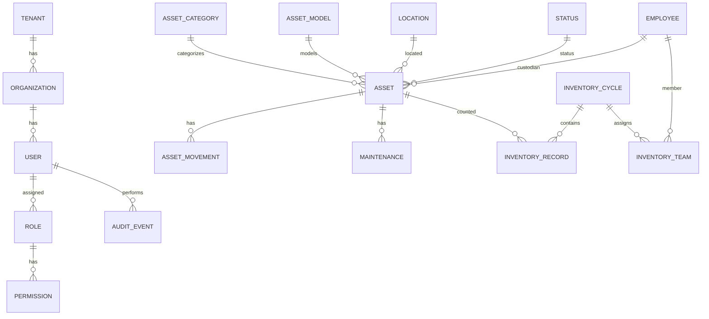

# DATABASE DESIGN SPECIFICATION (DDS)
## AssetX Enterprise Platform

> **Document ID:** `DB-DDS-001` | **Version:** 1.0 | **Status:** Approved Baseline
> **Reference:** AAB v6.0 (§11D, §11J, §11K, §11W, §13.15) · SAD · ADR-001/004/005
> **Path:** `Database/Database_Design_Specification.md`

---

## 0. Document Control

| Field | Value |
|---|---|
| **Document Title** | Database Design Specification (DDS) |
| **Document Owner** | Senior Solution Architect / Data Engineer |
| **Contributors** | Backend Team, DevOps, SecOps |
| **Authoritative Basis** | AAB v6.0 (Database Strategy); Domain Model |
| **Review Body** | TRB |
| **Approval Body** | CAB |
| **Version** | 1.0 |

> **Approved decision honored:** The **Domain Model drives the Database Design**. This schema derives from the domain, not the reverse.

---

## 1. Introduction

### 1.1 Purpose

Defines the **physical/logical database design** for AssetX: entity-relationship model, tables, columns, keys, indexes, RLS policies, audit tables, and database functions. It translates the domain model (AAB §11A) into a PostgreSQL schema implemented via Prisma migrations on Supabase.

### 1.2 Scope

PostgreSQL/Supabase; UUID PKs; `tenant_id` + RLS; standard audit columns; materialized path for hierarchies; append-only audit.

---

## 2. Database Strategy & Conventions

### 2.1 Platform

| Item | Choice |
|---|---|
| Database | PostgreSQL |
| Provider | Supabase |
| ORM | Prisma |
| Keys | UUID (ADR-001) |
| Isolation | `tenant_id` + RLS (ADR-004) |
| Hierarchy | Materialized Path LTREE (ADR-005) |

### 2.2 Naming Conventions (AAB §11AA)

| Element | Rule | Example |
|---|---|---|
| Tables | `snake_case`, plural | `assets`, `inventory_cycles` |
| Columns | `snake_case` | `created_at`, `tenant_id` |
| PK | `id` | UUID |
| FK | `<table>_id` | `asset_id`, `tenant_id` |
| Audit | standard set | `created_at/updated_at/created_by/updated_by/is_active` |

### 2.3 Standard Columns (Every Business Table)

Every business table includes:

```text
id UUID PRIMARY KEY
tenant_id UUID NOT NULL
created_at TIMESTAMPTZ NOT NULL DEFAULT now()
updated_at TIMESTAMPTZ NOT NULL DEFAULT now()
created_by UUID
updated_by UUID
is_active BOOLEAN NOT NULL DEFAULT true
```

> `tenant_id` is present in all business tables for RLS; technical FKs use UUID; business codes are display columns.

---

## 3. Entity-Relationship Overview (ERD)



---

## 4. Core Tables

### 4.1 Identity & Organization

**`tenants`**

| Column | Type | Notes |
|---|---|---|
| `id` | UUID PK | Technical ID |
| `tenant_code` | TEXT UNIQUE | Business code |
| `name` | TEXT NOT NULL | Tenant name |
| `is_active` | BOOLEAN | Soft delete |
| audit columns | | |

**`organizations`**

| Column | Type | Notes |
|---|---|---|
| `id` | UUID PK | |
| `tenant_id` | UUID FK NOT NULL | RLS scope |
| `name` | TEXT NOT NULL | |
| `parent_id` | UUID FK (self) | Hierarchy |
| audit columns | | |

**`users`**

| Column | Type | Notes |
|---|---|---|
| `id` | UUID PK | |
| `tenant_id` | UUID FK | |
| `employee_id` | UUID FK | Link to employee |
| `username` | TEXT UNIQUE | |
| `email` | TEXT | |
| `password_hash` | TEXT | bcrypt/argon2 |
| `last_login` | TIMESTAMPTZ | |
| `is_active` | BOOLEAN | |
| audit columns | | |

**`roles`** / **`permissions`** / **`role_permissions`** / **`user_roles`**

- `roles`: `id`, `tenant_id`, `name`, `description`.
- `permissions`: `id`, `module_name`, `can_view/can_add/can_edit/can_delete/can_print`.
- `role_permissions`: composite `(role_id, permission_id)`.
- `user_roles`: composite `(user_id, role_id)`.

**`user_permissions`** (granular per-user grants — AAB §13.5)

| Column | Type | Notes |
|---|---|---|
| `id` | UUID PK | |
| `user_id` | UUID FK | |
| `module_name` | TEXT | Registry module |
| `can_view/can_add/can_edit/can_delete/can_print` | BOOLEAN | |
| CONSTRAINT | | `UNIQUE(user_id, module_name)` |

### 4.2 Asset Context

**`asset_categories` (types)**

| Column | Type | Notes |
|---|---|---|
| `id` | UUID PK | |
| `tenant_id` | UUID | |
| `name` | TEXT NOT NULL UNIQUE | |
| `parent_id` | UUID FK (self) | Nested |
| `full_path` | TEXT | Materialized |
| `level_number` | INT | |
| audit columns | | |

**`asset_models`**

| Column | Type | Notes |
|---|---|---|
| `id` | UUID PK | |
| `tenant_id` | UUID | |
| `category_id` | UUID FK | |
| `sub_type_id` | UUID FK | |
| `name` | TEXT NOT NULL UNIQUE | |
| audit columns | | |

**`statuses`**

| Column | Type | Notes |
|---|---|---|
| `id` | UUID PK | |
| `tenant_id` | UUID | |
| `name` | TEXT NOT NULL | e.g., New/Good/Used/Needs Maintenance/Under Maintenance/Damaged/Missing/Retired |
| `color` | TEXT | StatusColor (hex) |
| audit columns | | |

**`locations`** (hierarchical — ADR-005)

| Column | Type | Notes |
|---|---|---|
| `id` | UUID PK | |
| `tenant_id` | UUID | |
| `parent_id` | UUID FK (self) | Loop-prevented |
| `name` | TEXT NOT NULL | |
| `location_type` | TEXT | building/room/warehouse/workshop/outdoor |
| `path` | LTREE | Materialized path |
| `full_path` | TEXT | DisplayName |
| `level_number` | INT | TreeLevel |
| audit columns | | |

> Index: GIN on `path` (LTREE) for descendant queries.

**`assets`** (central table — AAB §13.15)

| Column | Type | Notes |
|---|---|---|
| `id` | UUID PK | |
| `tenant_id` | UUID FK | |
| `name` | TEXT NOT NULL | min 2 chars |
| `base_asset_code` | TEXT NOT NULL | `YYYY-NNNN` |
| `full_asset_code` | TEXT NOT NULL UNIQUE | `Base@Location` |
| `description` | TEXT | |
| `category_id` | UUID FK | |
| `sub_type_id` | UUID FK | |
| `model_id` | UUID FK | |
| `location_id` | UUID FK | |
| `quantity` | INT default 1 | > 0 |
| `status_id` | UUID FK | |
| `employee_id` | UUID FK | custodian |
| `purchase_price` | DECIMAL(18,2) | ≥ 0 |
| `purchase_date` | DATE | |
| `depreciation_rate` | DECIMAL(5,2) | 0–100 |
| `useful_life` | INT | ≥ 0 |
| `serial_number` | TEXT | |
| `barcode` | TEXT | |
| `reference_number` | TEXT | |
| `inventory_year` | INT | |
| `notes` | TEXT | |
| `is_active` | BOOLEAN | soft delete |
| audit columns | | |

> Indexes: B-Tree on `full_asset_code`, `base_asset_code`, `tenant_id`; partial index on `is_active`.

### 4.3 Employee Context

**`employees`**

| Column | Type | Notes |
|---|---|---|
| `id` | UUID PK | |
| `tenant_id` | UUID | |
| `name` | TEXT NOT NULL | |
| `department` | TEXT | |
| `phone` | TEXT | PII (encrypt) |
| `email` | TEXT | PII |
| `is_active` | BOOLEAN | |
| audit columns | | |

### 4.4 Movement Context

**`asset_movements`** (append-only)

| Column | Type | Notes |
|---|---|---|
| `id` | UUID PK | |
| `tenant_id` | UUID | |
| `asset_id` | UUID FK | |
| `movement_type` | TEXT | Transfer/Disposal/Retirement |
| `from_location_id` / `to_location_id` | UUID FK | |
| `from_employee_id` / `to_employee_id` | UUID FK | |
| `from_status_id` / `to_status_id` | UUID FK | |
| `reason` | TEXT | |
| `reference_number` | TEXT | |
| `approved_by` | UUID | |
| `quantity` | INT | |
| `notes` | TEXT | |
| `performed_by` | UUID | |
| audit columns | | |

> Movement records are **never deleted** (BR-MOV-004).

### 4.5 Maintenance Context

**`maintenance_orders`**

| Column | Type | Notes |
|---|---|---|
| `id` | UUID PK | |
| `tenant_id` | UUID | |
| `asset_id` | UUID FK | |
| `maintenance_code` | TEXT | |
| `maintenance_type` | TEXT | |
| `cost` | DECIMAL(18,2) | |
| `technician_name` / `technician_contact` | TEXT | |
| `start_date` / `end_date` | DATE | |
| `next_maintenance_date` | DATE | |
| `status_id` | UUID FK | |
| `priority` | TEXT | |
| audit columns | | |

### 4.6 Inventory Context

**`inventory_cycles`**

| Column | Type | Notes |
|---|---|---|
| `id` | UUID PK | |
| `tenant_id` | UUID | |
| `year` | INT | UNIQUE per tenant |
| `status` | TEXT | New/In Progress/Closed |
| `start_date` | DATE | |
| `end_date` | DATE | |
| audit columns | | |

**`inventory_records`** (expected/actual — AAB §13.15)

| Column | Type | Notes |
|---|---|---|
| `id` | UUID PK | |
| `tenant_id` | UUID | |
| `cycle_id` | UUID FK | |
| `asset_id` | UUID FK | |
| `expected_location_id` | UUID FK | |
| `expected_quantity` | INT | |
| `expected_status_id` | UUID FK | |
| `expected_employee_id` | UUID FK | |
| `actual_location_id` | UUID FK | |
| `actual_quantity` | INT | |
| `actual_status_id` | UUID FK | |
| `actual_employee_id` | UUID FK | |
| `result` | TEXT | computed: Matched/Deficit/Surplus/Transferred/Missing/Not Inventoried |
| `inventory_date` | DATE | |
| `inventory_by` | UUID | |
| `is_verified` | BOOLEAN | |
| `verified_by` / `verified_date` | | |
| `notes` | TEXT | |
| audit columns | | |

> CONSTRAINT `UNIQUE(cycle_id, asset_id)` — no duplicate asset per cycle.

**`inventory_team`**

| Column | Type | Notes |
|---|---|---|
| `id` | UUID PK | |
| `tenant_id` | UUID | |
| `cycle_id` | UUID FK | |
| `employee_id` | UUID FK | |
| `team_role` | TEXT | default 'member' |
| CONSTRAINT | | `UNIQUE(cycle_id, employee_id)` |

### 4.7 Audit Context

**`audit_events`** (append-only, immutable)

| Column | Type | Notes |
|---|---|---|
| `id` | UUID PK | |
| `tenant_id` | UUID | |
| `user_id` | UUID FK | |
| `action_type` | TEXT | |
| `table_name` | TEXT | |
| `record_id` | TEXT | |
| `details` | JSONB | |
| `ip_address` | TEXT | |
| `device_fingerprint` | TEXT | |
| `geo` | TEXT | optional |
| `user_agent` | TEXT | |
| `created_at` | TIMESTAMPTZ | |

> Audit is append-only; retention 7 years (AAB §11W). Partitioned by time/tenant for scale.

### 4.8 Notification Context

**`notifications`** / **`notification_templates`** / **`notification_channels`**

- `notifications`: `id`, `tenant_id`, `user_id`, `template_id`, `channel`, `status`, `payload`.
- `notification_templates`: `id`, `tenant_id`, `name`, `subject`, `body`.
- `notification_channels`: `id`, `name`, `config`.

### 4.9 Settings

**`settings`** (key-value — AAB §13.6)

| Column | Type | Notes |
|---|---|---|
| `id` | UUID PK | |
| `tenant_id` | UUID | |
| `setting_key` | TEXT UNIQUE | e.g., org name, logo |
| `setting_value` | TEXT/JSONB | |
| audit columns | | |

---

## 5. Row-Level Security (RLS)

### 5.1 RLS Policy Model (ADR-004)

Every business table has an RLS policy:

```text
WHERE tenant_id = current_tenant_id()
```

Where `current_tenant_id()` is resolved from the authenticated session context.

### 5.2 RLS Implementation Notes

| Aspect | Detail |
|---|---|
| Enable RLS | On all business tables |
| Session tenant | Set via auth context / JWT claim |
| Admin bypass | Service/admin roles with defined policy |
| Testing | Automated RLS isolation tests |

---

## 6. Indexing Strategy

| Index | Purpose |
|---|---|
| GIN on `locations.path` | Descendant queries (LTREE) |
| B-Tree on `assets.full_asset_code` | Lookup/unique |
| B-Tree on `assets.base_asset_code` | Code search |
| Composite on `assets(tenant_id, is_active)` | Tenant + soft-delete filter |
| Partial index on `is_active` | Active asset queries |
| Index on `inventory_records(cycle_id, asset_id)` | Unique + lookup |

---

## 7. Partitioning & Performance

| Table | Strategy |
|---|---|
| `inventory_records` | Partition by tenant (or by cycle year) |
| `audit_events` | Partition by time/tenant |
| `asset_movements` | Partition by time (large) |

- Cursor-based pagination (no OFFSET).
- Materialized views for dashboard aggregates.
- Connection pooling (PgBouncer).
- Read replicas for reporting.

---

## 8. Audit Triggers & Functions

- **Triggers:** automatic audit events on sensitive mutations (created/updated/deleted).
- **Functions:** `current_tenant_id()`, code-generation helpers, inventory result computation (DB view).
- Inventory **result is computed** (DB view/API), not stored static (AAB §13.12a).

---

## 9. Data Governance & Retention (AAB §11W)

| Data Set | Retention |
|---|---|
| Assets | Permanent (archived after retirement) |
| Audit log | 7 years |
| Inventory records | 5 years |
| Soft delete | `is_active=false` (no physical DELETE) |

- PII (employee names/phones) → encrypted, limited access.
- Data classification enforced.

---

## 10. Migration & Seeding

- Prisma migrations versioned in repo.
- Legacy data migration per AAB §11M (7-stage pipeline).
- Seed data for statuses, reference data, default roles/permissions.

---

## 11. Traceability

| Table | Domain Entity (AAB) | Business Rule |
|---|---|---|
| `assets` | Asset | BR-ASSET-001/002/009/010 |
| `inventory_cycles` | Cycle | BR-INV-001 |
| `inventory_records` | Record | BR-INV-002/003 |
| `asset_movements` | Movement | BR-MOV-001/004 |
| `user_permissions` | Permission | BR-SEC-005 |

---

## 12. References

| Reference | Location |
|---|---|
| AAB v6.0 | AssetX-Architecture-Bible/ |
| SAD | Architecture/Software_Architecture_Document.md |
| API Specification | API/API_Specification.md |
| Test Strategy | Testing/Test_Strategy.md |

---

## 13. Document Control (Closure)

| Field | Value |
|---|---|
| **Status** | Approved Baseline |
| **Reviewed By** | TRB |
| **Approved By** | CAB |

> **End of Database Design Specification.**
