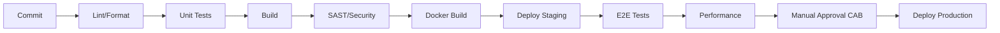
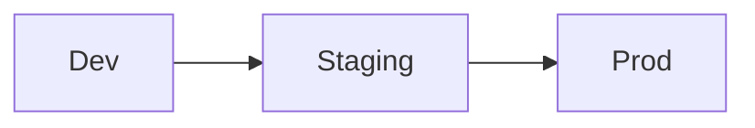
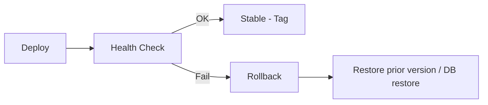

# CI/CD GUIDE
## AssetX Enterprise Platform — Continuous Integration & Continuous Delivery

> **Document ID:** `DEV-CICD-001` | **Version:** 1.0 | **Status:** Approved Baseline
> **Reference:** AAB v6.0 (§11AA, §11AB, ADR-014) · PEP v1.0 (§30–§37) · SAD
> **Path:** `DevOps/CI_CD_Guide.md`

---

## 0. Document Control

| Field | Value |
|---|---|
| **Document Title** | CI/CD Guide |
| **Document Owner** | DevOps Lead / SRE |
| **Contributors** | Development, QA, SecOps |
| **Authoritative Basis** | AAB v6.0 (Release Strategy, Quality Framework) |
| **Approval Body** | CAB |
| **Version** | 1.0 |

---

## 1. Introduction

### 1.1 Purpose

Defines the **continuous integration and continuous delivery/deployment (CI/CD)** model for AssetX: pipeline architecture, stages, environments, release strategy, and rollback. It operationalizes ADR-014 (Release Strategy) and the PEP quality gates.

### 1.2 Scope

GitHub Actions + Docker, environments (Dev/Staging/Prod), build/test/deploy stages, quality gates, Blue/Green + canary, and automated rollback.

---

## 2. CI/CD Principles

- **Continuous integration:** code integrates to trunk continuously.
- **Continuous delivery:** every commit is releasable in principle.
- **Automation:** build, test, scan, deploy automated.
- **Quality gates:** failures block merge/release.
- **Reversible:** every release can roll back.
- **Reproducible:** IaC + versioned pipelines.

---

## 3. Pipeline Overview



### 3.1 Pipeline Stages

| Stage | Jobs | Gate |
|---|---|---|
| **Check** | Lint, format | Must pass |
| **Test** | Unit, coverage | Coverage ≥ 80% |
| **Build** | Web + Backend build | Must pass |
| **Security** | SAST, SCA, secret scan | 0 critical/high |
| **Container** | Docker build/push | Must pass |
| **Deploy Staging** | Deploy to staging | Must pass |
| **E2E** | Playwright/Cypress | Must pass |
| **Performance** | k6 (on release) | NFR targets |
| **Release** | Manual approval, deploy prod | CAB approval |

---

## 4. Tools & Stack

| Concern | Tool |
|---|---|
| CI/CD | GitHub Actions |
| Containers | Docker |
| Web hosting | Vercel |
| Backend/DB | Supabase |
| Monitoring | OpenTelemetry, Prometheus, Grafana, Loki, Sentry |

---

## 5. Branch & Trunk Strategy (from PEP §33)

- **Trunk-based** development.
- Short-lived branches → PR → merge to `main`.
- Release branches `release/vX.Y` + SemVer tags.
- Branch protection rules enforced (PEP §34).

---

## 6. Build & Test Configuration

### 6.1 Web (Next.js 15)
- `npm ci` · lint · type-check · unit (Vitest) · build.
- Vercel preview deployments per PR.

### 6.2 Backend (NestJS)
- `npm ci` · lint · unit (Jest) · integration (Supertest + Prisma) · build · Docker image.

### 6.3 Mobile (Flutter)
- `flutter analyze` · `flutter test` · build (Android/iOS).
- Device/E2E tests on release.

---

## 7. Quality Gates (AAB §11AB)

```text
Commit → Lint → Unit Test → Build → Security Scan → Integration Test
  → Deploy Staging → E2E Test → Performance Check → Manual Approval → Deploy Prod
```

- Any red gate blocks merge/release.
- Coverage gate ≥ 80% (critical modules).

---

## 8. Environments & Promotion

| Environment | Purpose | Promotion From |
|---|---|---|
| Dev | Developer integration | — |
| Staging | Pre-release parity + UAT | Dev |
| Production | Live service | Staging (after approval) |



- IaC defines environments reproducibly.
- Secrets per environment in Vault.

---

## 9. Release Strategy (ADR-014)

### 9.1 Release Types

| Type | Description |
|---|---|
| Patch | Bug/security fixes |
| Minor | New features (backward-compatible) |
| Major | Milestone/enterprise releases |

### 9.2 Deployment Techniques

| Technique | Use |
|---|---|
| Blue/Green | Major releases |
| Canary | Experimental features |
| Feature flags | Decouple deploy from release |
| Auto rollback | On failed health check |

---

## 10. Rollback Procedure



| Trigger | Action |
|---|---|
| Health check fail | Automatic rollback |
| Critical defect | Feature flag off / revert |
| Data migration issue | Restore backup (PITR) |

> Rollback rehearsed in staging before every major release.

---

## 11. Security in CI/CD

| Control | Implementation |
|---|---|
| SAST | On every PR |
| SCA | Dependency scan |
| Secret scan | Prevent secrets in code |
| Container scanning | Image vulnerabilities |
| Signed commits | Recommended |

---

## 12. Monitoring & Feedback

- Deployments reported to monitoring (Sentry, Grafana).
- Alerts on deploy failures.
- Metrics/health checks in staging & prod.
- Deployment events to team channel.

---

## 13. CI/CD Roles & Responsibilities

| Role | Responsibility |
|---|---|
| DevOps/SRE | Own pipelines, environments, deploy |
| QA | Test gate criteria |
| SecOps | Security gate |
| Developers | Pipeline-compliant commits |
| TPM/CAB | Release approval |

---

## 14. Traceability

| CI/CD Element | Reference |
|---|---|
| Release strategy | ADR-014, PEP §30 |
| Branch protection | PEP §34 |
| Quality gates | AAB §11AB, PEP §26 |
| Environments | PEP §31 |

---

## 15. References

| Reference | Location |
|---|---|
| PEP (Delivery/CI) | Execution/Project_Execution_Plan.md |
| SAD | Architecture/Software_Architecture_Document.md |
| Test Strategy | Testing/Test_Strategy.md |
| Operations Manual | Operations/Operations_Manual.md |

---

## 16. Document Control (Closure)

| Field | Value |
|---|---|
| **Status** | Approved Baseline |
| **Approved By** | CAB |

> **End of CI/CD Guide.**
