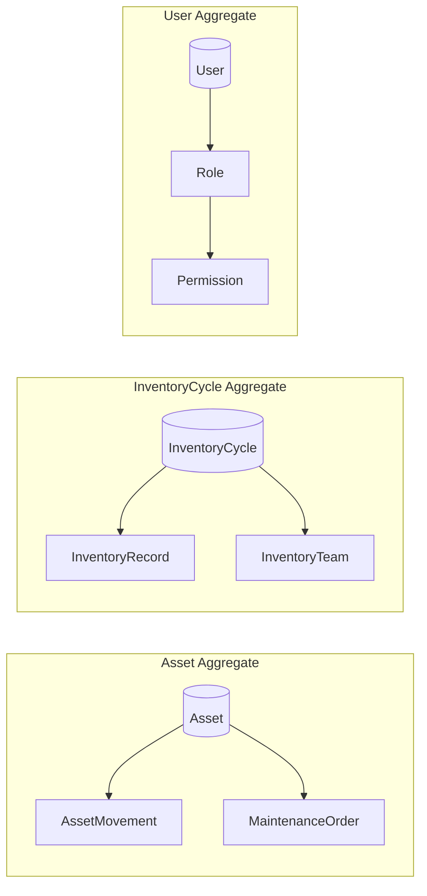
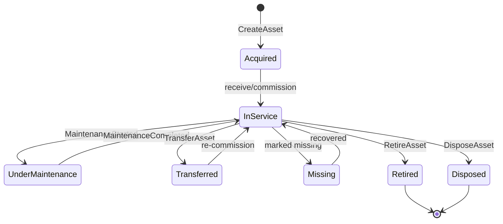
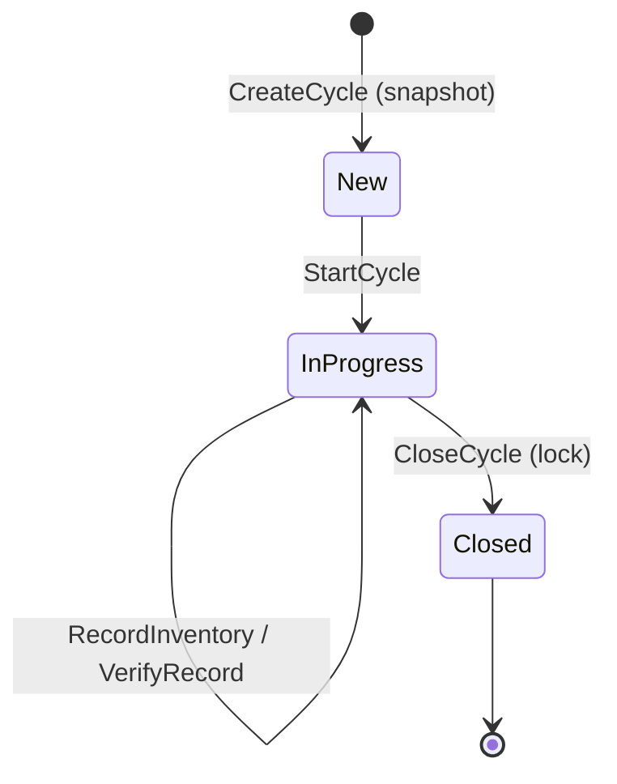
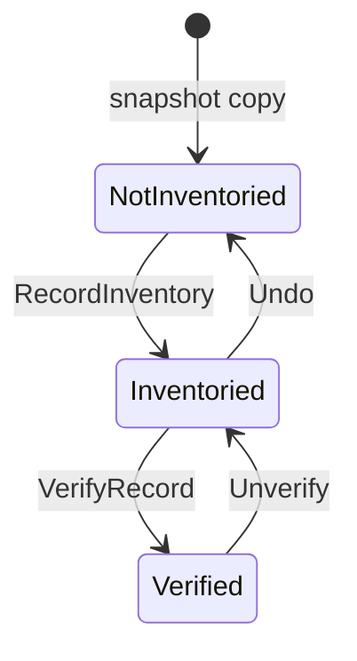

# ENTITY SPECIFICATIONS
## AssetX Enterprise Platform — Domain Model Reference

> **Document ID:** `DOC-21` (`ES-01`) | **Version:** 1.0 | **Status:** Approved Baseline
> **Package:** Engineering Specifications — Document 01
> **Reference:** AAB v6.0 (§11A) · SAD (DOC-08) · DDS (DOC-09) · FRS (DOC-06) · API Spec (DOC-10) · Architecture Index (DOC-20) · Decision Log (DOC-19)
> **Path:** `Engineering-Specifications/01_Entity_Specifications.md`

---

## 0. Document Control

| Field | Value |
|---|---|
| **Document Title** | Entity Specifications (Domain Model Reference) |
| **Document Owner** | Senior Enterprise Solution Architect |
| **Contributors** | Product Owner, Backend Lead, QA Lead |
| **Authoritative Basis** | AAB v6.0; SAD (Bounded Contexts); DDS (tables as reference) |
| **Review Body** | TRB |
| **Approval Body** | CAB |
| **Classification** | Internal — Confidential |
| **Effective Date** | 2026-08-03 |

### Revision History

| Version | Date | Author | Change Summary | Approved By |
|---|---|---|---|---|
| 1.0 | 2026-08-03 | Architect | Initial baseline — complete Domain Model | CAB (pending) |

---

## 1. Introduction

### 1.1 Purpose

This document is the **official reference of the AssetX Domain Model**. It describes the **business entities**, their purpose, lifecycle, states, events, relationships, and invariants — at the **domain level**, **not** the database level.

It is the authoritative input for:
- Backend developers (aggregates, commands, domain logic).
- Frontend & mobile developers (screens, workflows, states).
- Database architects (table derivation from aggregates).
- QA engineers (test scenarios from states/events).
- Solution architects (boundaries, events, integrations).
- AI coding agents (single domain reference to implement without assumptions).

### 1.2 Scope & Positioning

This document **is not**:
- A Database Specification (see DDS).
- A Data Dictionary (see ES-04).
- API Documentation (see ES-07 / API Spec).
- A Business Rules Catalog (see ES-02).
- A Permission Matrix (see ES-05).
- Workflow Specifications (see ES-06).

These documents are **referenced only** and never duplicated.

---

## 2. Domain Model Overview

### 2.1 Bounded Contexts (from AAB §11A / SAD §5.2)

| BC ID | Bounded Context | Responsibility | Entities |
|---|---|---|---|
| `BC-IDENTITY` | Identity Context | Authentication & authorization | Tenant, Organization, User, Role, Permission |
| `BC-ASSET` | Asset Context | Asset lifecycle | Asset, Category, Model, Status |
| `BC-LOCATION` | Location Context | Hierarchical spatial structure | Location |
| `BC-EMPLOYEE` | Employee Context | Employees & custody | Employee |
| `BC-MOVEMENT` | Movement Context | Transfers & changes | AssetMovement |
| `BC-MAINTENANCE` | Maintenance Context | Maintenance | MaintenanceOrder |
| `BC-INVENTORY` | Inventory Context | Inventory + discrepancies | InventoryCycle, InventoryRecord, InventoryTeam |
| `BC-AUDIT` | Audit Context | Audit trail | AuditEvent |
| `BC-NOTIFICATION` | Notification Context | Notifications | Notification, NotificationTemplate, NotificationChannel |
| `BC-CONFIG` | Configuration Context | System settings | Settings |
| `BC-DEVICE` | Device Context | Field device management | Device |

### 2.2 Module Mapping (from AAB §13.13)

Each entity is mapped to a System Module (`MOD-*`) per the Architecture Index registry (§3.3). The 17-vs-20 module count remains **Pending** (`ADL-001`); references use the 20-module granular registry without resolving the conflict.

---

## 3. Domain Relationship Diagram

### 3.1 High-Level Domain Relationships (Logical, not FK)

```mermaid
flowchart LR
    subgraph IDENTITY[BC-IDENTITY]
        TENANT[Tenant] --> ORG[Organization]
        ORG --> USER[User]
        USER --> ROLE[Role]
        ROLE --> PERM[Permission]
    end
    subgraph ASSET[BC-ASSET]
        CAT[Category] --> ASSET[Asset]
        MODEL[Model] --> ASSET
        STATUS[Status] --> ASSET
    end
    subgraph LOC[BC-LOCATION]
        LOCN[Location]
    end
    subgraph EMP[BC-EMPLOYEE]
        EMPL[Employee]
    end
    LOCN --> ASSET
    EMPL --> ASSET
    ASSET --> MOV[AssetMovement]
    ASSET --> MAINT[MaintenanceOrder]
    ASSET --> RECORD[InventoryRecord]
    CYCLE[InventoryCycle] --> RECORD
    CYCLE --> TEAM[InventoryTeam]
    TEAM --> EMPL
    ASSET --> AUDIT[AuditEvent]
    USER --> AUDIT
    ASSET --> NOTIF[Notification]
```

### 3.2 Domain Relationship Semantics

Relationships are **logical domain relationships**, expressed with multiplicity. Physical foreign keys are documented in the **Data Dictionary (ES-04)** and DDS; they are **not** the subject of this document.

| From (Entity) | To (Entity) | Relationship | Multiplicity | Meaning |
|---|---|---|---|---|
| Tenant | Organization | contains | 1..N | A tenant owns many organizations |
| Organization | User | employs | 1..N | Users belong to an organization |
| User | Role | assigned | 1..N | A user may hold multiple roles |
| Role | Permission | grants | 1..N | A role aggregates permissions |
| Category | Asset | categorizes | 1..N | Many assets per category |
| Model | Asset | models | 1..N | Many assets per model |
| Status | Asset | classifies | 1..N | Assets share statuses |
| Location | Asset | locates | 1..N | Assets located in a location |
| Employee | Asset | holds | 1..N | Assets in an employee's custody |
| Asset | AssetMovement | has-history | 1..N | Full movement history |
| Asset | MaintenanceOrder | undergoes | 1..N | Maintenance history |
| Asset | InventoryRecord | counted | 1..N | Asset counted across cycles |
| InventoryCycle | InventoryRecord | contains | 1..N | A cycle contains records |
| InventoryCycle | InventoryTeam | assigns | 1..N | A cycle assigns team members |
| InventoryTeam | Employee | member | N..M | Team members are employees |
| User | AuditEvent | performs | 1..N | Users generate audit events |
| Asset | Notification | triggers | 1..N | Assets trigger notifications |

---

## 4. Aggregate Boundaries

Aggregates group entities into **consistency boundaries**. Changes to an aggregate are transactional; cross-aggregate changes use events (event-driven, per AAB §11C).

| Aggregate Root | ID | Aggregate Members | Bounded Context | Consistency Boundary |
|---|---|---|---|---|
| **Asset** | `ENT-ASSET` | Category, Model, Status (references), Movement, Maintenance, InventoryRecord (references) | `BC-ASSET` | Asset + its lifecycle history |
| **Location** | `ENT-LOCATION` | (self-hierarchy of locations) | `BC-LOCATION` | Location tree consistency |
| **Employee** | `ENT-EMPLOYEE` | (references assets, team) | `BC-EMPLOYEE` | Employee identity + custody |
| **User** | `ENT-USER` | Role, Permission (references) | `BC-IDENTITY` | User + access rights |
| **Tenant** | `ENT-TENANT` | Organization (reference), Settings | `BC-IDENTITY` / `BC-CONFIG` | Tenant boundary + isolation |
| **InventoryCycle** | `ENT-CYCLE` | InventoryRecord, InventoryTeam | `BC-INVENTORY` | Cycle snapshot + its records |
| **AssetMovement** | `ENT-MOVEMENT` | (references Asset, Location, Employee, Status) | `BC-MOVEMENT` | Movement record + audit |

> **Aggregate Diagram (conceptual):**



### 4.1 Aggregate Rules

- Cross-aggregate references are by **ID** (UUID), not object graph navigation.
- Domain events propagate cross-aggregate effects asynchronously (per AAB §11C).
- Invariants are enforced **inside** the aggregate boundary.

---

## 5. Entity Catalog

> Each entity is documented with its full Domain Specification. Fields marked "(ref)" are reference-only links to the authoritative documents.

---

### 5.1 ENT-TENANT — Tenant

| Field | Value |
|---|---|
| **Entity ID** | `ENT-TENANT` |
| **Entity Name** | Tenant |
| **Business Name** | المؤسسة المستأجرة (Tenant) |
| **Description** | The highest isolation boundary in the SaaS model; a subscribing organization owning its data. |
| **Business Purpose** | Establish data isolation and ownership per subscribing organization (multi-tenant-ready, ADR-004). |
| **Business Value** | Enables SaaS delivery and per-tenant governance. |
| **Bounded Context** | `BC-IDENTITY` |
| **Module** | `MOD-18` (SystemSettings) / Organization mgmt |
| **Aggregate Root** | Yes — `ENT-TENANT` |
| **Aggregate Members** | Organization (ref), Settings (ref) |
| **Owner** | Product Owner (Business); Platform Architect (Technical) |
| **Business Owner** | Executive Sponsors |
| **Technical Owner** | Solution Architect / Platform Team |
| **Responsibilities** | Own tenant identity, isolation scope, tenant settings; root of tenant lifecycle. |
| **Lifecycle** | Provisioned → Active → Suspended → Retired |
| **States** | `Draft`, `Active`, `Suspended`, `Retired` |
| **State Transition Rules** | Only platform administrators transition states; suspension must be audited. |
| **Domain Events** | `TenantProvisioned`, `TenantSuspended`, `TenantRetired` |
| **Commands** | `ProvisionTenant`, `SuspendTenant`, `RetireTenant` |
| **Invariants** | Unique tenant code; tenant isolation must hold at all times. |
| **Constraints** | MVP is single-tenant (architecture Ready); full multi-tenancy in V4. |
| **Business Policies** | Isolation via `tenant_id` + RLS (ADR-004). |
| **Relationships** | has Organization (1..N); owns Settings (1..1). |
| **Navigation Rules** | Users may access only their tenant's data (RLS). |
| **Dependencies** | RLS policy; tenant context resolution. |
| **Security Considerations** | Data isolation; RLS; tenant compromise risk (RK-02). |
| **Audit Considerations** | Tenant lifecycle changes audited. |
| **Performance Considerations** | Tenant partitioning for large tables. |
| **Scalability Considerations** | RLS + partitioning enable horizontal scale. |
| **Future Extension Points** | Subscription/billing (V4); tenant data residency (DEC-OPEN-2). |

**References:**

| Type | IDs |
|---|---|
| BR | (none specific) |
| FR | `FR-ORG-002` (tenant isolation) |
| NFR | `NFR-SEC-006`, `NFR-SCL-001` |
| EP | `EP-AUTH-*` (auth context) |
| TB | `TB-TENANT` |
| BC | `BC-IDENTITY` |
| MOD | `MOD-18` |
| DOC | `DOC-09` (DDS), `DOC-13` (Security) |
| ADL | `ADL-004` (multi-tenant) |
| Workflows | `WF-TENANT-LIFECYCLE` |
| Notifications | (platform admin alerts) |
| Reports | (tenancy analytics) |
| Integrations | (billing — V4) |

---

### 5.2 ENT-ORG — Organization

| Field | Value |
|---|---|
| **Entity ID** | `ENT-ORG` |
| **Entity Name** | Organization |
| **Business Name** | الفرع / الجهة داخل المؤسسة |
| **Description** | A subdivision within a tenant (branch, department, unit). |
| **Business Purpose** | Represent organizational structure for reporting and access scoping. |
| **Business Value** | Enables departmental ownership and filtered reporting. |
| **Bounded Context** | `BC-IDENTITY` |
| **Module** | Organization Management |
| **Aggregate Root** | No (member of Tenant) |
| **Aggregate Members** | — |
| **Owner** | Product Owner (Business); Backend Lead (Technical) |
| **Business Owner** | Department heads |
| **Technical Owner** | Backend Team |
| **Responsibilities** | Model organizational units; scope users and assets. |
| **Lifecycle** | Created → Active → Restructured → Deactivated |
| **States** | `Active`, `Deactivated` |
| **State Transition Rules** | Deactivation requires no active users/assets blocking. |
| **Domain Events** | `OrganizationCreated`, `OrganizationDeactivated` |
| **Commands** | `CreateOrganization`, `DeactivateOrganization` |
| **Invariants** | Organization belongs to exactly one tenant. |
| **Constraints** | Hierarchical (self-parent) allowed. |
| **Business Policies** | Users belong to one tenant + one or more organizations. |
| **Relationships** | belongs-to Tenant (N..1); has Users (1..N). |
| **Navigation Rules** | Scoped by tenant. |
| **Dependencies** | Tenant exists. |
| **Security Considerations** | Access scoping by organization. |
| **Audit Considerations** | Organization changes audited. |
| **Performance Considerations** | Low volume; indexed by tenant. |
| **Scalability Considerations** | Scales with tenant count. |
| **Future Extension Points** | Organizational hierarchy depth; BI reporting. |

**References:** FR `FR-ORG-001/002/003`; NFR `NFR-SEC-006`; TB `TB-ORGANIZATION`; BC `BC-IDENTITY`; MOD Organization; DOC `DOC-05`, `DOC-09`.

---

### 5.3 ENT-USER — User

| Field | Value |
|---|---|
| **Entity ID** | `ENT-USER` |
| **Entity Name** | User |
| **Business Name** | المستخدم |
| **Description** | A system account representing a person who accesses AssetX. |
| **Business Purpose** | Provide authenticated, authorized access to the platform. |
| **Business Value** | Secure access control and accountability. |
| **Bounded Context** | `BC-IDENTITY` |
| **Module** | `MOD-16` (Users) |
| **Aggregate Root** | Yes — `ENT-USER` |
| **Aggregate Members** | Role (ref), Permission (ref) |
| **Owner** | Product Owner (Business); Security Lead (Technical) |
| **Business Owner** | HR / Department managers |
| **Technical Owner** | Security / IAM Team |
| **Responsibilities** | Own user identity, credentials, roles, permissions, session. |
| **Lifecycle** | Created → Active → Suspended → Deactivated |
| **States** | `Active`, `Suspended`, `Deactivated` |
| **State Transition Rules** | Suspension/deactivation revokes sessions; audited. |
| **Domain Events** | `UserCreated`, `UserSuspended`, `UserDeactivated`, `UserRoleChanged` |
| **Commands** | `CreateUser`, `SuspendUser`, `DeactivateUser`, `AssignRole` |
| **Invariants** | Username unique; user linked to an employee. |
| **Constraints** | Least privilege enforced (BR-SEC-005). |
| **Business Policies** | Per-user + per-role permissions; default permissions on creation. |
| **Relationships** | belongs-to Organization; holds Roles; performs AuditEvents. |
| **Navigation Rules** | Tenant-scoped access. |
| **Dependencies** | Organization, Employee, Role. |
| **Security Considerations** | Credentials hashed (bcrypt/argon2); MFA-ready; session revocation. |
| **Audit Considerations** | Login, role changes, permission changes audited. |
| **Performance Considerations** | Indexed by username/tenant. |
| **Scalability Considerations** | Scales with user count. |
| **Future Extension Points** | SSO (V3), MFA (V2). |

**References:** BR `BR-SEC-005`; FR `FR-AUT-001/002/003/006`, `FR-ADM-001/002/003`; NFR `NFR-SEC-001/005/008/009`; EP `EP-AUTH-*`, `EP-ADMIN-USERS-*`; TB `TB-USER`, `TB-USER-PERMISSION`; BC `BC-IDENTITY`; MOD `MOD-16`; DOC `DOC-06`, `DOC-10`, `DOC-13`; ADL `ADL-005`.

---

### 5.4 ENT-ROLE — Role

| Field | Value |
|---|---|
| **Entity ID** | `ENT-ROLE` |
| **Entity Name** | Role |
| **Business Name** | الدور |
| **Description** | A named set of permissions assignable to users. |
| **Business Purpose** | Enable RBAC and efficient permission management. |
| **Business Value** | Reduces permission administration effort. |
| **Bounded Context** | `BC-IDENTITY` |
| **Module** | `MOD-16` (Users) |
| **Aggregate Root** | No (member of User) |
| **Owner** | Product Owner; Security Lead |
| **Responsibilities** | Group permissions; template roles. |
| **Lifecycle** | Created → Active → Retired |
| **States** | `Active`, `Retired` |
| **Domain Events** | `RoleCreated`, `RolePermissionChanged` |
| **Commands** | `CreateRole`, `UpdateRolePermissions` |
| **Invariants** | Role name unique per tenant. |
| **Constraints** | Permission changes affect all assigned users. |
| **Business Policies** | Role templates (Admin/Manager/Auditor/Field Agent). |
| **Relationships** | granted to Users (N..M); aggregates Permissions. |
| **Dependencies** | Permission. |
| **Security Considerations** | Role changes audited. |
| **Future Extension Points** | Role templates customization. |

**References:** BR `BR-SEC-005`; FR `FR-ADM-001/002`; TB `TB-ROLE`, `TB-ROLE-PERMISSION`; BC `BC-IDENTITY`; MOD `MOD-16`.

---

### 5.5 ENT-PERMISSION — Permission

| Field | Value |
|---|---|
| **Entity ID** | `ENT-PERMISSION` |
| **Entity Name** | Permission |
| **Business Name** | الصلاحية |
| **Description** | A fine-grained access right on a module (View/Add/Edit/Delete/Print). |
| **Business Purpose** | Enforce least privilege per user/role on each module. |
| **Business Value** | Precise security control (AAB §13.5). |
| **Bounded Context** | `BC-IDENTITY` |
| **Module** | `MOD-16` (Users) |
| **Aggregate Root** | No |
| **Owner** | Security Lead |
| **Responsibilities** | Define and assign access rights. |
| **Lifecycle** | Defined → Active → Retired |
| **Domain Events** | `PermissionGranted`, `PermissionRevoked` |
| **Invariants** | Permission tied to a module + user or role. |
| **Constraints** | 4 vs 5 permissions Pending (`ADL-005`). |
| **Business Policies** | Per-module + per-user + per-role grants. |
| **Relationships** | granted by Role; granted to User (user_permissions). |
| **Security Considerations** | Core of authorization. |
| **Future Extension Points** | Fine-grained field/tenant permissions. |

**References:** BR `BR-SEC-005`; FR `FR-ADM-001/002`, `FR-PERM-*`; NFR `NFR-SEC-009`; TB `TB-PERMISSION`, `TB-USER-PERMISSION`; BC `BC-IDENTITY`; MOD `MOD-16`; ADL `ADL-005`.

---

### 5.6 ENT-ASSET — Asset ⭐ (Aggregate Root)

| Field | Value |
|---|---|
| **Entity ID** | `ENT-ASSET` |
| **Entity Name** | Asset |
| **Business Name** | الأصل |
| **Description** | A fixed asset owned/managed by an organization, tracked through its full lifecycle. |
| **Business Purpose** | Represent and manage the complete asset lifecycle from acquisition to disposal. |
| **Business Value** | Core of the platform; enables tracking, valuation, inventory, and reporting (BO-001…004). |
| **Bounded Context** | `BC-ASSET` |
| **Module** | `MOD-01` (Assets) |
| **Aggregate Root** | Yes — `ENT-ASSET` |
| **Aggregate Members** | AssetMovement (ref), MaintenanceOrder (ref), InventoryRecord (ref) |
| **Owner** | Asset Manager (Business); Backend Lead (Technical) |
| **Business Owner** | Asset Manager |
| **Technical Owner** | Backend Team |
| **Responsibilities** | Own asset identity, attributes, lifecycle state, and history. |
| **Lifecycle** | Acquired → In Service → Transferred / Under Maintenance → Retired / Disposed |
| **States** | `Acquired`, `InService`, `UnderMaintenance`, `Transferred`, `Missing`, `Retired`, `Disposed` |
| **State Transition Rules** | Transfers/retirement/disposal logged as movements; disposal sets status "Damaged"; asset protection checks before delete/edit. |
| **Domain Events** | `AssetCreated`, `AssetUpdated`, `AssetTransferred`, `AssetDisposed`, `AssetRetired`, `AssetMaintenanceStarted` |
| **Commands** | `CreateAsset`, `UpdateAsset`, `TransferAsset`, `DisposeAsset`, `RetireAsset`, `SoftDeleteAsset` |
| **Invariants** | Unique full asset code; required name/category/location/status; quantity > 0. |
| **Constraints** | Soft-delete only (BR-ASSET-010); protection when linked to movements/maintenance/cycle (BR-ASSET-009). |
| **Business Policies** | Base + Full code generation (BR-CODE-001); duplicate detection (merge/variant/new). |
| **Relationships** | categorized-by Category; modeled-by Model; classified-by Status; located-in Location; held-by Employee; has movements/maintenance/inventory records. |
| **Navigation Rules** | Asset navigable from category/location/employee; search across 9 fields. |
| **Dependencies** | Category, Model, Status, Location, Employee. |
| **Security Considerations** | High-value assets may require approval; access by role/permission. |
| **Audit Considerations** | Every asset mutation audited (append-only). |
| **Performance Considerations** | Indexed by full code, base code, tenant; partial index on is_active. |
| **Scalability Considerations** | Partition-friendly; cursor pagination. |
| **Future Extension Points** | Multi-depreciation methods; image comparison (AI L2); warranty tracking. |

**References:** BR `BR-ASSET-001/002/009/010`, `BR-CODE-001`; FR `FR-ASSET-001…010`, `FR-AUD-001`; NFR `NFR-PRF-001/002/003`, `NFR-CMP-003`; EP `EP-ASSET-*`; TB `TB-ASSET`; BC `BC-ASSET`; MOD `MOD-01`; DOC `DOC-06`, `DOC-09`, `DOC-10`; ADL `ADL-003` (code model).

---

### 5.7 ENT-CATEGORY — Asset Category / Type

| Field | Value |
|---|---|
| **Entity ID** | `ENT-CATEGORY` |
| **Entity Name** | AssetCategory (AssetType / SubType) |
| **Business Name** | تصنيف الأصل |
| **Description** | Hierarchical classification of assets (types and sub-types). |
| **Business Purpose** | Classify assets for reporting and search. |
| **Business Value** | Enables structured asset grouping and analytics. |
| **Bounded Context** | `BC-ASSET` |
| **Module** | `MOD-02` (AssetTypes) |
| **Aggregate Root** | No |
| **Owner** | Product Owner; Backend Lead |
| **Responsibilities** | Define classification tree. |
| **Lifecycle** | Created → Active → Retired |
| **Domain Events** | `CategoryCreated`, `CategoryUpdated` |
| **Invariants** | Category name unique; nested hierarchy allowed. |
| **Relationships** | categorizes Assets (1..N); self-hierarchy. |
| **Future Extension Points** | AI auto-classification (AI L2). |

**References:** FR `FR-CAT-001/002`; TB `TB-CATEGORY`; BC `BC-ASSET`; MOD `MOD-02`.

---

### 5.8 ENT-MODEL — Asset Model

| Field | Value |
|---|---|
| **Entity ID** | `ENT-MODEL` |
| **Entity Name** | AssetModel |
| **Business Name** | موديل الأصل |
| **Description** | Manufacturer/model reference for assets. |
| **Business Purpose** | Standardize asset make/model. |
| **Business Value** | Facilitates search and maintenance. |
| **Bounded Context** | `BC-ASSET` |
| **Module** | `MOD-06` (AssetModels) |
| **Owner** | Product Owner; Backend Lead |
| **Responsibilities** | Model reference data. |
| **Relationships** | models Assets (1..N); belongs to Category. |
| **References:** FR `FR-CAT-003`; TB `TB-ASSET-MODEL`; BC `BC-ASSET`; MOD `MOD-06`. |

---

### 5.9 ENT-STATUS — Asset Status

| Field | Value |
|---|---|
| **Entity ID** | `ENT-STATUS` |
| **Entity Name** | AssetStatus |
| **Business Name** | حالة الأصل |
| **Description** | Lifecycle status of an asset (with visual color). |
| **Business Purpose** | Represent asset condition/status with distinct color coding. |
| **Business Value** | Enables status-based reporting and dashboard. |
| **Bounded Context** | `BC-ASSET` |
| **Module** | `MOD-05` (AssetStatus) |
| **Owner** | Product Owner |
| **Responsibilities** | Define status reference + color. |
| **Relationships** | classifies Assets (1..N). |
| **Future Extension Points** | Custom statuses per tenant. |

**References:** FR `FR-ASSET-*`; TB `TB-STATUS`; BC `BC-ASSET`; MOD `MOD-05`.

---

### 5.10 ENT-LOCATION — Location (Aggregate Root)

| Field | Value |
|---|---|
| **Entity ID** | `ENT-LOCATION` |
| **Entity Name** | Location (Main/Sub) |
| **Business Name** | الموقع |
| **Description** | Hierarchical spatial location (building/floor/room/warehouse/workshop/outdoor). |
| **Business Purpose** | Model physical placement hierarchy for assets and inventory. |
| **Business Value** | Enables location-based tracking and field inventory efficiency. |
| **Bounded Context** | `BC-LOCATION` |
| **Module** | `MOD-03` (MainLocations), `MOD-04` (SubLocations) |
| **Aggregate Root** | Yes — `ENT-LOCATION` |
| **Owner** | Asset Manager; Backend Lead |
| **Responsibilities** | Own location tree integrity. |
| **Lifecycle** | Created → Active → Restructured → Deactivated |
| **States** | `Active`, `Deactivated` |
| **State Transition Rules** | Loop prevention (cannot be own parent); deactivation requires no blocking assets. |
| **Domain Events** | `LocationCreated`, `LocationMoved`, `LocationDeactivated` |
| **Invariants** | No cycles; path materialized (LTREE, ADR-005). |
| **Constraints** | Materialized path strategy (ADR-005); legacy mapping Pending (`ADL-004`). |
| **Relationships** | locates Assets (1..N); self-hierarchy (parent-child). |
| **Navigation Rules** | Selecting a parent includes all descendants. |
| **Future Extension Points** | GPS bounds; heat-map support. |

**References:** BR (locations) ; FR `FR-LOC-001…005`; NFR `NFR-PRF-001`; EP `EP-LOC-*`; TB `TB-LOCATION`; BC `BC-LOCATION`; MOD `MOD-03/04`; ADL `ADL-004`.

---

### 5.11 ENT-EMPLOYEE — Employee (Aggregate Root)

| Field | Value |
|---|---|
| **Entity ID** | `ENT-EMPLOYEE` |
| **Entity Name** | Employee |
| **Business Name** | الموظف |
| **Description** | A person who holds assets (custody) or participates in inventory. |
| **Business Purpose** | Track asset custody and inventory team membership. |
| **Business Value** | Accountability for assets in custody. |
| **Bounded Context** | `BC-EMPLOYEE` |
| **Module** | `MOD-07` (Employees) |
| **Aggregate Root** | Yes — `ENT-EMPLOYEE` |
| **Owner** | HR liaison (Business); Backend Lead |
| **Responsibilities** | Own employee identity and custody links. |
| **Lifecycle** | Hired → Active → Departed |
| **States** | `Active`, `Departed` |
| **Domain Events** | `EmployeeCreated`, `EmployeeDeparted` |
| **Invariants** | Employee identity unique. |
| **Relationships** | holds Assets (1..N); member of InventoryTeam (N..M); linked to User (1..1). |
| **Security Considerations** | PII (name/phone) is Confidential — encrypted, limited access (`ADL-009`). |
| **Audit Considerations** | Custody changes audited. |
| **Future Extension Points** | Digital custody handover (V3). |

**References:** FR `FR-EMP-001/002/003`; NFR `NFR-CMP-004`; TB `TB-EMPLOYEE`; BC `BC-EMPLOYEE`; MOD `MOD-07`; ADL `ADL-009`.

---

### 5.12 ENT-MOVEMENT — AssetMovement (Aggregate Root)

| Field | Value |
|---|---|
| **Entity ID** | `ENT-MOVEMENT` |
| **Entity Name** | AssetMovement |
| **Business Name** | حركة الأصل |
| **Description** | A permanent record of a transfer, disposal, or retirement of an asset. |
| **Business Purpose** | Provide complete, immutable movement history per asset. |
| **Business Value** | Full auditability and traceability of asset location/custody (BO-004). |
| **Bounded Context** | `BC-MOVEMENT` |
| **Module** | `MOD-11` (TransferAsset), `MOD-12` (MovementHistory) |
| **Aggregate Root** | Yes — `ENT-MOVEMENT` |
| **Owner** | Asset Manager; Backend Lead |
| **Responsibilities** | Record movement from/to location, employee, status + reason/ref/approver. |
| **Lifecycle** | Created → Applied |
| **States** | `Recorded`, `Applied` |
| **State Transition Rules** | Movement never deleted (BR-MOV-004); disposal/retirement deactivates asset. |
| **Domain Events** | `AssetTransferred`, `AssetDisposed`, `AssetRetired` |
| **Commands** | `LogTransfer`, `DisposeAsset`, `RetireAsset` |
| **Invariants** | Movement history immutable. |
| **Constraints** | Type color-coding; disposal hides location fields. |
| **Business Policies** | High-value transfers require approval (approval engine). |
| **Relationships** | belongs-to Asset; references Location/Employee/Status (from/to). |
| **Audit Considerations** | Movement is itself an audit record. |
| **Future Extension Points** | Maker-Checker approval for sensitive movements (V2). |

**References:** BR `BR-MOV-001/004`; FR `FR-MOV-001…005`; TB `TB-MOVEMENT`; BC `BC-MOVEMENT`; MOD `MOD-11/12`.

---

### 5.13 ENT-MAINTENANCE — MaintenanceOrder

| Field | Value |
|---|---|
| **Entity ID** | `ENT-MAINTENANCE` |
| **Entity Name** | MaintenanceOrder |
| **Business Name** | أمر الصيانة |
| **Description** | A maintenance event/order on an asset. |
| **Business Purpose** | Track maintenance history, cost, and status. |
| **Business Value** | Extends asset life; informs disposal decisions. |
| **Bounded Context** | `BC-MAINTENANCE` |
| **Module** | Maintenance |
| **Aggregate Root** | No |
| **Owner** | Maintenance Lead |
| **Responsibilities** | Record maintenance orders. |
| **Lifecycle** | Scheduled → In Progress → Completed |
| **State Transition Rules** | Starting maintenance auto-changes asset status (BR-MNT-002). |
| **Domain Events** | `MaintenanceScheduled`, `MaintenanceCompleted` |
| **Invariants** | Maintenance tied to an asset. |
| **Relationships** | belongs-to Asset. |
| **Future Extension Points** | Predictive maintenance (AI L3); spare parts (V2). |

**References:** BR `BR-MNT-002`; TB `TB-MAINTENANCE`; BC `BC-MAINTENANCE`.

---

### 5.14 ENT-CYCLE — InventoryCycle (Aggregate Root) ⭐

| Field | Value |
|---|---|
| **Entity ID** | `ENT-CYCLE` |
| **Entity Name** | InventoryCycle |
| **Business Name** | دورة الجرد |
| **Description** | A snapshot-based inventory campaign over active assets. |
| **Business Purpose** | Coordinate field inventory with expected-vs-actual comparison. |
| **Business Value** | Enables smart field inventory and discrepancy detection (BO-001/002/005). |
| **Bounded Context** | `BC-INVENTORY` |
| **Module** | `MOD-08` (InventoryCycles) |
| **Aggregate Root** | Yes — `ENT-CYCLE` |
| **Aggregate Members** | InventoryRecord, InventoryTeam |
| **Owner** | Inventory Manager; Backend Lead |
| **Responsibilities** | Own cycle snapshot, records, team, and lifecycle. |
| **Lifecycle** | New → In Progress → Closed |
| **States** | `New`, `InProgress`, `Closed` |
| **State Transition Rules** | Creating a cycle snapshots active assets (BR-INV-001); closed cycles locked (BR-INV-002). |
| **Domain Events** | `InventoryStarted`, `InventoryCompleted`, `CycleClosed` |
| **Commands** | `CreateCycle`, `StartCycle`, `RecordInventory`, `VerifyRecord`, `CloseCycle` |
| **Invariants** | No duplicate cycle per (tenant, year); unique (cycle, asset) record; result computed. |
| **Constraints** | Result computed vs stored Pending (`ADL-006`). |
| **Relationships** | contains Records; assigns Team; references Assets. |
| **Navigation Rules** | Cycle statistics real-time. |
| **Audit Considerations** | Cycle lifecycle and record verifications audited. |
| **Future Extension Points** | Field ops monitoring; heat-map. |

**References:** BR `BR-INV-001/002/003`; FR `FR-INV-001…008`, `FR-FLD-*`; NFR `NFR-PRF-004`; EP `EP-INV-*`; TB `TB-CYCLE`, `TB-RECORD`, `TB-TEAM`; BC `BC-INVENTORY`; MOD `MOD-08/09/10`; ADL `ADL-006`, `ADL-008`.

---

### 5.15 ENT-RECORD — InventoryRecord

| Field | Value |
|---|---|
| **Entity ID** | `ENT-RECORD` |
| **Entity Name** | InventoryRecord |
| **Business Name** | سجل الجرد |
| **Description** | A single expected-vs-actual inventory result for an asset within a cycle. |
| **Business Purpose** | Capture and compare expected vs actual inventory data. |
| **Business Value** | Core of discrepancy detection. |
| **Bounded Context** | `BC-INVENTORY` |
| **Module** | `MOD-09` (InventoryEntry), `MOD-10` (InventoryReview) |
| **Aggregate Root** | No (member of Cycle) |
| **Owner** | Field Agent (entry); Auditor (verify) |
| **Responsibilities** | Record expected/actual data + result + verification. |
| **Lifecycle** | Not Inventoried → Inventoried → Verified |
| **States** | `NotInventoried`, `Inventoried`, `Verified` |
| **State Transition Rules** | Cannot verify an uninventoried record (BR-INV-003); closed cycle blocks edits (BR-INV-002). |
| **Domain Events** | `InventoryRecordUpdated`, `InventoryVerified`, `DiscrepancyDetected` |
| **Commands** | `RecordInventory`, `VerifyRecord`, `UnverifyRecord` |
| **Invariants** | Unique (cycle, asset); result derived from actual vs expected. |
| **Relationships** | belongs-to Cycle; references Asset. |
| **Future Extension Points** | Photo capture + AI image comparison (L2). |

**References:** BR `BR-INV-001/002/003`; FR `FR-INV-005/006/007`, `FR-FLD-*`; TB `TB-RECORD`; BC `BC-INVENTORY`; MOD `MOD-09/10`; ADL `ADL-006`.

---

### 5.16 ENT-TEAM — InventoryTeam

| Field | Value |
|---|---|
| **Entity ID** | `ENT-TEAM` |
| **Entity Name** | InventoryTeam |
| **Business Name** | فريق الجرد |
| **Description** | Assignment of employees to an inventory cycle with a role. |
| **Business Purpose** | Assign field inventory personnel to cycles. |
| **Business Value** | Organizes field operations. |
| **Bounded Context** | `BC-INVENTORY` |
| **Module** | `MOD-08` (InventoryCycles) |
| **Owner** | Inventory Manager |
| **Responsibilities** | Manage team membership. |
| **Invariants** | Unique (cycle, employee). |
| **Relationships** | belongs-to Cycle; member Employee. |
| **References:** FR `FR-INV-004`; TB `TB-TEAM`; BC `BC-INVENTORY`; MOD `MOD-08`. |

---

### 5.17 ENT-AUDIT — AuditEvent

| Field | Value |
|---|---|
| **Entity ID** | `ENT-AUDIT` |
| **Entity Name** | AuditEvent |
| **Business Name** | سجل التدقيق |
| **Description** | An immutable append-only record of a user action. |
| **Business Purpose** | Provide complete auditability of sensitive operations (Audit by Design). |
| **Business Value** | Compliance, accountability, and traceability (BO-004). |
| **Bounded Context** | `BC-AUDIT` |
| **Module** | `MOD-19` (AuditLog) |
| **Aggregate Root** | No |
| **Owner** | Security/Compliance |
| **Responsibilities** | Record actions with user, table, record, details, IP. |
| **Lifecycle** | Append-only (no modification) |
| **States** | `Recorded` (immutable) |
| **Domain Events** | (none — audit is the event log) |
| **Invariants** | Append-only; immutable; retention 7 years. |
| **Relationships** | performed-by User. |
| **Security Considerations** | Audit immutability (NFR-CMP-006). |
| **Future Extension Points** | Audit intelligence / root-cause analysis (V3). |

**References:** FR `FR-AUD-001/002/003`, `FR-ADM-006`; NFR `NFR-CMP-006`; TB `TB-AUDIT`; BC `BC-AUDIT`; MOD `MOD-19`.

---

### 5.18 ENT-NOTIFICATION — Notification

| Field | Value |
|---|---|
| **Entity ID** | `ENT-NOTIFICATION` |
| **Entity Name** | Notification |
| **Business Name** | الإشعار |
| **Description** | A message delivered to a user via a channel (push/email/WhatsApp). |
| **Business Purpose** | Notify users of events (campaigns, approvals, sync failures). |
| **Business Value** | Timely communication and alerts. |
| **Bounded Context** | `BC-NOTIFICATION` |
| **Module** | Notifications |
| **Owner** | Product Owner; Backend Lead |
| **Responsibilities** | Deliver templated notifications via channels. |
| **Lifecycle** | Created → Queued → Sent → Read |
| **Domain Events** | `NotificationSent` |
| **Invariants** | Notification tied to user/template/channel. |
| **Relationships** | uses Template; uses Channel; targets User. |
| **References:** FR `FR-NTF-001…004`; TB `TB-NOTIFICATION`, `TB-NOTIF-TEMPLATE`, `TB-NOTIF-CHANNEL`; BC `BC-NOTIFICATION`. |

---

### 5.19 ENT-SETTINGS — Settings

| Field | Value |
|---|---|
| **Entity ID** | `ENT-SETTINGS` |
| **Entity Name** | Settings |
| **Business Name** | الإعدادات |
| **Description** | Key-value store of tenant configuration (org name, logo, backup settings). |
| **Business Purpose** | Store configurable system settings. |
| **Business Value** | Flexible configuration. |
| **Bounded Context** | `BC-CONFIG` |
| **Module** | `MOD-18` (SystemSettings) |
| **Owner** | Administrator |
| **Responsibilities** | Manage key-value settings. |
| **Invariants** | Unique setting key per tenant. |
| **References:** FR `FR-ADM-004`; TB `TB-SETTINGS`; BC `BC-CONFIG`; MOD `MOD-18`. |

---

### 5.20 ENT-DEVICE — Device

| Field | Value |
|---|---|
| **Entity ID** | `ENT-DEVICE` |
| **Entity Name** | Device |
| **Business Name** | الجهاز الميداني |
| **Description** | A registered mobile device used for field inventory. |
| **Business Purpose** | Manage field device identity, sync, and revocation. |
| **Business Value** | Ensures field operations reliability and security (BO-005). |
| **Bounded Context** | `BC-DEVICE` |
| **Module** | Field Operations / Sync |
| **Owner** | Field Operations Lead |
| **Responsibilities** | Register/revoke devices; track sync status. |
| **Lifecycle** | Registered → Active → Revoked |
| **States** | `Active`, `Revoked` |
| **State Transition Rules** | Revocation wipes local queue. |
| **Domain Events** | `DeviceRegistered`, `DeviceRevoked` |
| **Invariants** | Device linked to a user + assigned campaign. |
| **Relationships** | used-by User; assigned-to Cycle. |
| **Security Considerations** | Revocation + wipe on loss; storage limits. |
| **References:** FR `FR-SYN-001…005`; NFR `NFR-PRF-004`; BC `BC-DEVICE`; MOD Sync. |

---

## 6. Entity Lifecycle Diagrams

### 6.1 Asset Lifecycle (ENT-ASSET)



### 6.2 InventoryCycle Lifecycle (ENT-CYCLE)



### 6.3 InventoryRecord Lifecycle (ENT-RECORD)



---

## 7. State Machine Summary (Key Entities)

| Entity | States | Transitions (primary) |
|---|---|---|
| Asset | Acquired, InService, UnderMaintenance, Transferred, Missing, Retired, Disposed | via commands/events in §5.6 |
| InventoryCycle | New, InProgress, Closed | StartCycle, CloseCycle |
| InventoryRecord | NotInventoried, Inventoried, Verified | Record, Verify/Unverify |
| User | Active, Suspended, Deactivated | Suspend, Deactivate |
| Tenant | Draft, Active, Suspended, Retired | Platform admin |
| Device | Active, Revoked | Register, Revoke |

---

## 8. Domain Events Matrix

| Event ID | Event | Source Entity | Effect / Consumers |
|---|---|---|---|
| `EV-ASSET-CREATED` | AssetCreated | Asset | Audit, Notification, AI |
| `EV-ASSET-UPDATED` | AssetUpdated | Asset | Audit, AI |
| `EV-ASSET-TRANSFERRED` | AssetTransferred | Asset/Movement | Audit, Notification, Movement history |
| `EV-ASSET-DISPOSED` | AssetDisposed | Asset/Movement | Audit, Notification |
| `EV-ASSET-RETIRED` | AssetRetired | Asset/Movement | Audit |
| `EV-ASSET-MAINT-STARTED` | MaintenanceStarted | Maintenance | Status change, Audit |
| `EV-INVENTORY-STARTED` | InventoryStarted | Cycle | Notification, Dashboard |
| `EV-INVENTORY-RECORD-UPDATED` | InventoryRecordUpdated | Record | Dashboard, Sync |
| `EV-INVENTORY-VERIFIED` | InventoryVerified | Record | Audit, Review |
| `EV-INVENTORY-COMPLETED` | InventoryCompleted | Cycle | Notification, Reporting |
| `EV-CYCLE-CLOSED` | CycleClosed | Cycle | Lock, Audit |
| `EV-DISCREPANCY-DETECTED` | DiscrepancyDetected | Record | Notification, AI, Review |
| `EV-USER-CREATED` | UserCreated | User | Audit |
| `EV-USER-SUSPENDED` | UserSuspended | User | Audit, session revoke |
| `EV-NOTIFICATION-SENT` | NotificationSent | Notification | Logging |

> Events align with SAD §11C event-driven design (AssetCreated/Updated/Deleted, InventoryCompleted, DiscrepancyDetected, MaintenanceScheduled).

---

## 9. Cross-References

| Related Document | DOC ID | How Used Here |
|---|---|---|
| Database Design Specification | `DOC-09` | Tables referenced (`TB-*`); no columns copied |
| Functional Requirements Spec | `DOC-06` | FR references (`FR-*`) |
| API Specification | `DOC-10` | Endpoint references (`EP-*`) |
| Security Architecture | `DOC-13` | Security considerations |
| Software Architecture Document | `DOC-08` | Bounded contexts, events |
| Architecture Index | `DOC-20` | ID scheme, module registry |
| Documentation Audit & Decision Log | `DOC-19` | Pending decisions (`ADL-*`) |

> This document is the **Domain Model**. For column-level detail see the **Data Dictionary (ES-04)**; for permissions see **Permission Matrix (ES-05)**; for workflows see **Workflow Specifications (ES-06)**; for API schemas see **API Contracts (ES-07)**. These are not duplicated here.

---

## 10. Traceability

| Entity | BC | FR (primary) | BR | TB | MOD |
|---|---|---|---|---|---|
| Tenant | BC-IDENTITY | FR-ORG-002 | — | TB-TENANT | MOD-18 |
| Organization | BC-IDENTITY | FR-ORG-001 | — | TB-ORGANIZATION | Org |
| User | BC-IDENTITY | FR-AUT-*, FR-ADM-* | BR-SEC-005 | TB-USER | MOD-16 |
| Role | BC-IDENTITY | FR-ADM-001 | BR-SEC-005 | TB-ROLE | MOD-16 |
| Permission | BC-IDENTITY | FR-ADM-001 | BR-SEC-005 | TB-PERMISSION | MOD-16 |
| Asset | BC-ASSET | FR-ASSET-* | BR-ASSET-*, BR-CODE-001 | TB-ASSET | MOD-01 |
| Category | BC-ASSET | FR-CAT-* | — | TB-CATEGORY | MOD-02 |
| Model | BC-ASSET | FR-CAT-003 | — | TB-ASSET-MODEL | MOD-06 |
| Status | BC-ASSET | FR-ASSET-* | — | TB-STATUS | MOD-05 |
| Location | BC-LOCATION | FR-LOC-* | — | TB-LOCATION | MOD-03/04 |
| Employee | BC-EMPLOYEE | FR-EMP-* | — | TB-EMPLOYEE | MOD-07 |
| Movement | BC-MOVEMENT | FR-MOV-* | BR-MOV-* | TB-MOVEMENT | MOD-11/12 |
| Maintenance | BC-MAINTENANCE | (maint) | BR-MNT-002 | TB-MAINTENANCE | Maint |
| Cycle | BC-INVENTORY | FR-INV-* | BR-INV-* | TB-CYCLE | MOD-08 |
| Record | BC-INVENTORY | FR-INV-*, FR-FLD-* | BR-INV-* | TB-RECORD | MOD-09/10 |
| Team | BC-INVENTORY | FR-INV-004 | — | TB-TEAM | MOD-08 |
| Audit | BC-AUDIT | FR-AUD-* | — | TB-AUDIT | MOD-19 |
| Notification | BC-NOTIFICATION | FR-NTF-* | — | TB-NOTIFICATION | Notif |
| Settings | BC-CONFIG | FR-ADM-004 | — | TB-SETTINGS | MOD-18 |
| Device | BC-DEVICE | FR-SYN-* | — | TB-DEVICE | Sync |

---

## 11. Recommendations

> Per governing methodology, the following are **recommendations only** — no existing document is modified.

| Recommendation | Reason | Priority |
|---|---|---|
| Add a `Device` table (`TB-DEVICE`) to the DDS if not already present | Device is referenced by FR-SYN and mobile spec; a domain entity should have a table. | Medium |
| Define `TB-DEVICE`, `TB-ROLE-PERMISSION`, `TB-USER-ROLE` in the Data Dictionary | Aggregate members referenced in §4 need table backing. | Medium |
| Resolve `ADL-001` (17 vs 20 modules) before Permission Matrix | Permission matrix depends on canonical module set. | High (blocking ES-05) |

## 12. Decision Log Proposals

| Proposal | Topic | Why | Status |
|---|---|---|---|
| `ADL-PROP-001` | Confirm canonical entity list (23 entities across 11 bounded contexts) | Provides a stable domain reference | Pending — awaiting approval |
| `ADL-PROP-002` | Confirm device entity as first-class entity | Mobile/sync depends on it | Pending |

---

## 13. Document Control (Closure)

| Field | Value |
|---|---|
| **Status** | Approved Baseline |
| **Reviewed By** | TRB |
| **Approved By** | CAB (pending) |
| **Next Document** | `02. Business Rules Catalog` (after approval) |

> **End of Entity Specifications.**
