# PROJECT EXECUTION PLAN (PEP)
## AssetX Enterprise Platform — Master Execution Guide

> **Document Type:** Master Execution Manual
> **Reference Architecture:** AssetX Enterprise Architecture Foundation — **Version 6.0** (Single Source of Truth)
> **Document Path:** `Execution/Project_Execution_Plan.md`
> **Status:** Approved Baseline | **Version:** 1.0 | **Year:** 2026

---

## 0. Document Control & Governance

### 0.1 Document Control Table

| Field | Value |
|---|---|
| **Document ID** | `PEP-001` |
| **Document Title** | AssetX Project Execution Plan (PEP) |
| **Document Owner** | Technical Program Manager (TPM) |
| **Contributors** | Senior Enterprise Solution Architect, Product Owner, DevOps Lead, QA Lead, Security Lead |
| **Authoritative Basis** | AssetX Architecture Bible (AAB) — Version 6.0 |
| **Approval Body** | Change Approval Board (CAB) |
| **Review Body** | Technical Review Board (TRB) |
| **Classification** | Internal — Confidential |
| **Version** | 1.0 |
| **Effective Date** | 2026-08-03 |
| **Next Review** | At each Phase Gate, or upon any approved change |

### 0.2 Revision History

| Version | Date | Author | Change Summary | Approved By |
|---|---|---|---|---|
| 0.1 | 2026-08-03 | TPM | Initial draft structure | — |
| 0.2 | 2026-08-03 | Architect | Architecture alignment pass (v6.0) | — |
| 1.0 | 2026-08-03 | TPM | Approved baseline | CAB |

### 0.3 Relationship to the Architecture Bible

The **AssetX Architecture Bible (AAB) Version 6.0** is the **Single Source of Truth** for *what* AssetX is and *how* it is architected. The **Project Execution Plan (PEP)** is the **Single Source of Truth for delivery**: *how, when, by whom, and under what governance* the architecture is implemented, released, and operated.

The PEP does **not** redefine architecture. It operationalizes it. Any conflict between this document and the AAB is resolved in favor of the AAB; the conflict is escalated to the TRB for resolution and logged in the Decision Log (§49).

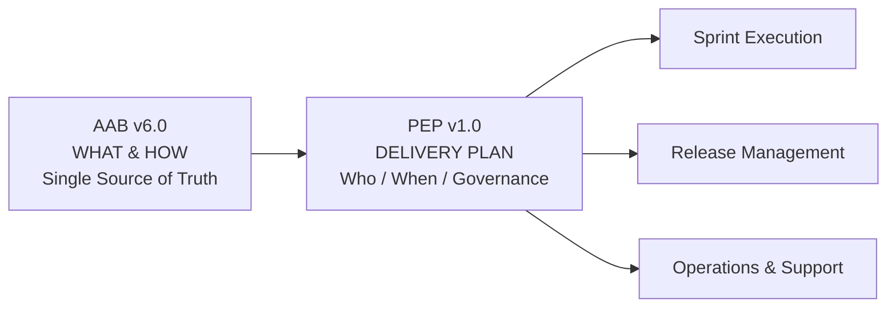

### 0.4 Alignment with Industry Standards

This plan is authored to align with recognized professional frameworks and standards:

| Standard / Framework | Where Applied |
|---|---|
| **PMI (PMBOK Guide)** | Scope, schedule, cost/quality/risk management, stakeholders, communications, integration |
| **Microsoft Solutions Framework (MSF)** | Team model, process governance, release readiness, risk discipline |
| **IEEE 830 / IEEE 12207 / IEEE 1061** | Software documentation, lifecycle processes, quality metrics |
| **Scrum Guide (2020)** | Framework definition, roles, events, artifacts, accountabilities |
| **Enterprise Architecture (TOGAF-inspired)** | Phased architecture development, governance, capability mapping |

> These frameworks inform *practice*. They do **not** supersede the approved AssetX architecture, methodology, or technology stack.

---

## 1. Executive Summary

AssetX is an **enterprise SaaS platform** for the **complete lifecycle management of fixed assets** — from acquisition through custody, transfer, maintenance, inventory, depreciation, and disposal — with a strategic differentiator in **smart, offline-first field inventory** delivered through mobile and tablet applications. It is a **platform**, not a "counting app"; field inventory is one module within a broader asset lifecycle and governance ecosystem.

The **Enterprise Architecture Foundation (Version 6.0)** — the AssetX Architecture Bible — is complete and approved. It establishes a **Modular Monolith-first** architecture (ADR-002) with **event-driven** design, **multi-tenant readiness** via `tenant_id` + Row-Level Security (ADR-004), **offline-first synchronization** (ADR-003), **UUID** technical identifiers (ADR-001), and **Materialized Path (LTREE)** for hierarchical locations (ADR-005). The architecture is **Enterprise scope**; **implementation is incremental** across defined release phases (MVP → Version 2 → … → Version 6+).

The **Project Execution Plan (PEP)** translates that approved architecture into a **governed, phased delivery roadmap**:

| Dimension | Approach |
|---|---|
| **Methodology** | Scrum (iterative) with a waterfall-style Phase Gate overlay for enterprise governance |
| **Architecture** | Enterprise-scope design; incremental implementation per roadmap |
| **Implementation order** | Web Platform (Phase 1) → Public REST APIs (Phase 2) → Mobile (Phase 3) → Offline Sync (Phase 4) |
| **Quality** | Definition of Ready / Done, quality gates, automated testing, security scanning |
| **Governance** | TRB, CAB, Security Review Board, ADR log, Decision Log, risk register |
| **Delivery** | Trunk-based git, CI/CD (GitHub Actions + Docker), staged environments |

The PEP defines the complete execution model: organization and roles (RACI), methodology and sprints, milestones and deliverables, dependencies and constraints, a comprehensive risk register and mitigation plan, communication and reporting, change and configuration management, quality and security governance, release and environment strategy, git and code-review policy, CI/CD and testing strategy, acceptance criteria, production-readiness and go-live checklists, post-go-live support, maintenance, KPIs, timeline with phase gates, and the decision log.

**Bottom line:** AssetX is designed once (AAB v6.0) and implemented gradually. This PEP is the manual that makes that gradual implementation **predictable, governable, and high-quality**.

---

## 2. Project Vision

To become the **reference enterprise platform** for fixed-asset management and smart inventory in organizations — a system powered by **data, automation, and artificial intelligence** that combines **ease of use, reliability, and scalability**, and that organizations trust for the full asset lifecycle.

The vision is realized through:

- A **Web Administration Portal** for management, configuration, dashboards, and governance.
- A **Mobile Field Application** (Android / iOS / Tablet) for offline-first field inventory.
- A **cloud-native, multi-tenant-ready** platform (Supabase/PostgreSQL) with **Row-Level Security**.
- An **offline-first synchronization engine** with conflict resolution and incremental sync.
- A **tiered AI layer** (L1/L2/L3) powering search, anomaly detection, image comparison, and predictive capabilities.
- A **governance and operations fabric** covering security, observability, disaster recovery, and platform operations.

> **Vision statement:** *Empower organizations to manage the complete lifecycle of their assets with high efficiency, reduce waste and operational errors, and transform inventory from cumbersome paper procedures into smart digital operations supported by analytics and AI.*

---

## 3. Project Objectives

The objectives below are the measurable anchors of the project. They map directly to the Business Objectives (`BO-001 … BO-007`) in the AAB and are tracked via project KPIs (§45) and success metrics (§46).

| Code | Objective | Mapping | Verification |
|---|---|---|---|
| `O-01` | Reduce annual inventory execution time by at least **70%** | `BO-001` | Field inventory feature; sync engine; quick-match |
| `O-02` | Reduce human error during inventory operations | `BO-002` | QR/barcode scanning, validation rules, audit |
| `O-03` | Provide a unified asset database | `BO-003` | Single PostgreSQL schema; data import |
| `O-04` | Provide a complete historical record for every asset | `BO-004` | Append-only audit; movement history |
| `O-05` | Enable inventory **offline without internet** (Offline First) | `BO-005` | SQLite local DB; sync queue; conflict resolution |
| `O-06` | Provide real-time KPI dashboards for senior management | `BO-006` | Live dashboards; reporting engine |
| `O-07` | Deliver an enterprise-grade, scalable, multi-tenant-ready platform | `BO-007` | RLS; modular monolith; phase-gated rollout |
| `O-08` | Implement Web first, then REST APIs, then Mobile, then Offline Sync | (Delivery) | Phase gates P1–P4 |
| `O-09` | Achieve target non-functional metrics (SLA, latency, sync rate) | (NFRs) | Load/performance tests; SLOs |

### 3.1 Supporting Goals

- **G-1:** Complete each Phase Gate with all Definition-of-Done criteria satisfied.
- **G-2:** Maintain test coverage ≥ 80% for business-critical modules.
- **G-3:** Maintain security posture at OWASP ASVS Level 2 for MVP.
- **G-4:** Ensure every release is reversible (rollback) and fully documented.
- **G-5:** Keep the Architecture Bible and PEP synchronized through change management.

---

## 4. Success Criteria

Success is measured across five dimensions. Each criterion has a measurable target and a measurement method.

### 4.1 Functional / Product Success Criteria

| ID | Criterion | Target | Measurement |
|---|---|---|---|
| `SC-01` | Asset lifecycle supported end-to-end | Acquisition → disposal | Acceptance tests (§40) |
| `SC-02` | Offline inventory works without connectivity | Full cycle offline | Field pilot + sync tests |
| `SC-03` | Real-time dashboards available to management | < 2 s load | Performance tests (§38) |
| `SC-04` | RBAC + granular permissions enforced | 100% modules | Security tests (§38) |
| `SC-05` | Complete audit trail for all operations | 100% auditable actions | Audit verification |

### 4.2 Technical Success Criteria

| ID | Criterion | Target | Measurement |
|---|---|---|---|
| `SC-06` | Dashboard load | < 2 seconds | Load test (k6) |
| `SC-07` | Search latency | < 500 ms | Performance test |
| `SC-08` | Asset list (10K rows) | < 1 second | Performance test |
| `SC-09` | Sync rate | ≥ 1000 records/min | Sync engine test |
| `SC-10` | QR scan → display | < 300 ms | Mobile perf test |
| `SC-11` | MVP SLA | 99.5% | Monitoring |
| `SC-12` | MVP scale | 10,000 assets / 100 users | Capacity test |
| `SC-13` | Enterprise scale (target) | 10,000,000 assets / 10,000 users | Capacity planning (§45) |

### 4.3 Delivery / Governance Success Criteria

| ID | Criterion | Target |
|---|---|---|
| `SC-14` | Sprint velocity predictable | ±10% variance across 3 consecutive sprints |
| `SC-15` | Definition of Done met | 100% of user stories entering "Done" |
| `SC-16` | Production incidents escaped | < 2 critical defects in first 60 days post go-live |
| `SC-17` | Phase gates passed | 100% gates on first attempt (or with approved variance) |

### 4.4 Quality Success Criteria

| ID | Criterion | Target |
|---|---|---|
| `SC-18` | Unit test coverage | ≥ 80% (business-critical modules) |
| `SC-19` | Defect escape rate | ≤ 5% of reported defects are critical |
| `SC-20` | Code review approval | 100% of merges reviewed |

### 4.5 Business Outcome Success Criteria

| ID | Criterion | Target |
|---|---|---|
| `SC-21` | Inventory campaign time reduction | ≥ 70% (measured vs. baseline) |
| `SC-22` | User satisfaction | ≥ 80% in post-go-live survey |

---

## 5. Scope

### 5.1 Scope Statement

The PEP governs the **incremental implementation** of the approved AssetX **Enterprise Architecture (Version 6.0)** across a phased roadmap, producing a **Web Administration Portal** first, followed by **Public REST APIs**, then the **Mobile Field Application**, then **Offline Synchronization** — with enterprise capabilities (multi-tenancy, AI, governance, operations, observability, security, DR, integration, analytics, DevOps, scalability) designed-in from the start and activated incrementally.

### 5.2 In-Scope Capability Areas (Architecture Baseline)

Per the approved decisions, the architecture covers all of the following **from the beginning**; implementation is incremental:

| # | Capability Area | Baseline Status |
|---|---|---|
| 1 | Multi-Tenant Architecture | Designed (Ready); activated per release |
| 2 | Offline First | Designed; implemented in Mobile/Sync phases |
| 3 | AI Layer (L1/L2/L3) | Designed; tiered activation |
| 4 | Enterprise Governance | Designed; activated in Version 2 |
| 5 | Platform Operations | Designed; operating-model phase |
| 6 | Observability | Designed; foundational telemetry from start |
| 7 | Security Operations | Designed; layered activation |
| 8 | Disaster Recovery | Designed; MVP = single region + hot standby |
| 9 | Integration Layer | Designed; integration hub in later versions |
| 10 | Product Analytics | Designed; telemetry/events from start |
| 11 | DevOps | Active from first sprint |
| 12 | Scalability & Performance Engineering | Designed; validated by testing |

### 5.3 In-Scope Modules

The following modules are within scope of the roadmap (full registry in AAB §7/§13.13):

Authentication · Organization Management · Asset Management · Asset Categories · Location Management · Employee Management · Inventory Campaigns · Field Inventory · Asset Transfers · Attachments · Reporting · Dashboard · Notifications · AI Assistant · Administration · Audit Logs · Settings.

### 5.4 Delivery Phases (In Scope)

| Phase | Title | Scope Highlights |
|---|---|---|
| **Phase 1** | Web Platform | Asset CRUD, hierarchical locations, employees, RBAC, audit, dashboards, reporting, settings |
| **Phase 2** | Public REST APIs | API-first surface (OpenAPI/Swagger), auth (JWT), background jobs (BullMQ) |
| **Phase 3** | Mobile Application | Flutter field app, QR scanning, camera, GPS, offline-capable UI |
| **Phase 4** | Offline Synchronization | SQLite local DB, sync queue, conflict resolution, incremental sync |
| **Release Phases** | V1 → V6+ | Governance, AI tiers, multi-tenant activation, integration hub, operating model |

---

## 6. Out of Scope

The following are **explicitly out of scope** for the early execution phases (per AAB §6 and §5.3). They are **architecture-ready** but not implementation targets now:

| # | Out of Scope Item | Rationale / Note |
|---|---|---|
| 1 | Full inventory/stock management | Not an asset-lifecycle concern |
| 2 | Vehicle fleet management | Future, outside early scope |
| 3 | Contract management | Future |
| 4 | Full ERP implementation | Integration hub later (V4) |
| 5 | IoT device integration | V5+ |
| 6 | NFC tags hardware integration | V5+ (NFC-ready architecture) |
| 7 | Bluetooth Beacon hardware | V5+ (Beacon-ready architecture) |
| 8 | Voice commands | V5+ |
| 9 | Subscription/Billing | V4+ (multi-tenant billing) |
| 10 | Full multi-tenant activation | MVP = single tenant, architecture Ready |
| 11 | Third-party integrations (ERP/HR/AD/WhatsApp) | Integration hub in V3/V4 |

> **Out-of-scope items are not ignored by architecture.** They influence design decisions (e.g., multi-tenant readiness, integration-ready interfaces) but are **not built** in early phases.

---

## 7. Stakeholders

Stakeholders are parties with an interest in, or impact on, the project. They are categorized by role, interest, and engagement level, in line with PMI stakeholder management and MSF team-model principles.

### 7.1 Stakeholder Register

| ID | Stakeholder | Category | Interest | Engagement Level | Communication Channel |
|---|---|---|---|---|---|
| `SH-01` | Executive Sponsors / Business Owners | Business | Strategic outcome, ROI, adoption | Manage closely | Steering review, monthly exec report |
| `SH-02` | Product Owner (PO) | Product | Scope, value prioritization | Manage closely | Daily touchpoint, sprint reviews |
| `SH-03` | Senior Enterprise Solution Architect | Architecture | Architecture fidelity, ADRs | Manage closely | Weekly architecture review |
| `SH-04` | Technical Program Manager (TPM) | Delivery | Schedule, risk, coordination | Manage closely | Daily standup, status reports |
| `SH-05` | Development Team (Web/Backend/Mobile) | Delivery | Implementation | Keep informed | Sprint events, team channel |
| `SH-06` | QA / Test Team | Quality | Quality, acceptance | Keep informed | Test reports, defect triage |
| `SH-07` | DevOps / SRE Team | Delivery | CI/CD, environments, ops | Keep informed | Pipeline reports, alerts |
| `SH-08` | Security Lead / SecOps | Security | Security posture, compliance | Manage closely | Security review, threat reports |
| `SH-09` | End Users (Asset Managers, Auditors, Field Agents) | Business | Usability, functionality | Keep informed | UAT sessions, feedback loops |
| `SH-10` | Tenant / Client Organizations (SaaS) | Business | Data isolation, reliability | Keep satisfied | Roadmap, release notes |
| `SH-11` | Governance Bodies (TRB, CAB, Security Review Board) | Governance | Decision quality, compliance | Manage closely | Decision gates, ADR review |
| `SH-12` | External Integrations Partners (ERP/HR/AD/WhatsApp) | External | Integration compatibility | Monitor | Integration catalog, API docs |

### 7.2 Stakeholder Power-Interest Matrix

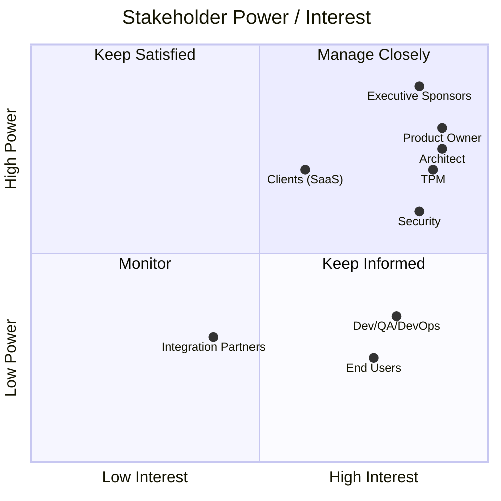

### 7.3 Stakeholder Engagement Strategy

- **Executive Sponsors:** Monthly steering review; escalate only high-impact risks; present business value and KPIs.
- **Product Owner:** Single accountable owner of scope and prioritization; participates in all sprint events.
- **Architect:** Gatekeeper of architecture fidelity; reviews every PR touching architecture, every ADR, every phase gate.
- **TPM:** Integrator of schedule, risk, dependencies; owns the PEP.
- **Teams:** Engaged through sprint ceremonies; empowered to self-organize within guardrails.
- **Security:** Embedded in every phase; security review board at release gates.
- **End Users:** Engaged through UAT and feedback loops; personas from AAB §02.

---

## 8. Project Organization

The project organization follows an integrated **MSF Team Model + Scrum** structure, with clear accountabilities and governance bodies on top.

### 8.1 Organization Chart

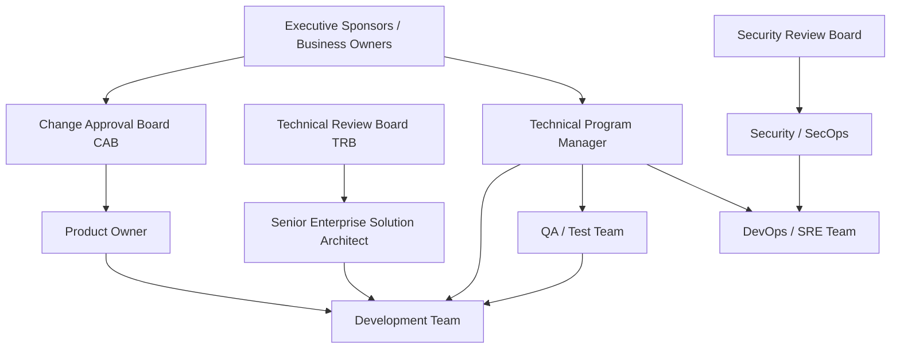

### 8.2 Organization Structure Table

| Layer | Entity | Primary Accountability |
|---|---|---|
| Governance | Executive Sponsors | Strategic outcomes, funding |
| Governance | TRB | Architecture decisions, ADR review |
| Governance | CAB | Change approval before production |
| Governance | Security Review Board | Security-sensitive changes |
| Delivery | Product Owner | Scope, prioritization, value |
| Delivery | Technical Program Manager | Schedule, risk, integration |
| Delivery | Senior Solution Architect | Architecture fidelity |
| Execution | Development Team | Build, quality of code |
| Execution | QA / Test Team | Quality assurance, acceptance |
| Execution | DevOps / SRE | CI/CD, environments, operations |
| Execution | Security / SecOps | Security posture, compliance |

---

## 9. Roles & Responsibilities (RACI Matrix)

RACI legend: **R** = Responsible (does the work) · **A** = Accountable (owns the outcome) · **C** = Consulted (provides input) · **I** = Informed (kept updated).

### 9.1 Primary RACI Matrix

| Activity | PO | TPM | Architect | Dev | QA | DevOps | SecOps | Sponsors |
|---|---|---|---|---|---|---|---|---|
| Product backlog prioritization | **A/R** | C | C | I | C | I | C | I |
| Sprint planning | **A** | R | C | **R** | C | C | C | I |
| Architecture decisions / ADRs | C | C | **A/R** | C | I | C | C | I |
| Backlog refinement | **A/R** | C | C | C | C | C | C | I |
| Development tasks | I | C | C | **A/R** | I | I | I | I |
| Code review | I | I | **A** | **R** | C | C | C | I |
| Test planning & execution | C | C | C | C | **A/R** | I | C | I |
| Definition of Ready/Done | **A** | R | C | C | **R** | C | C | I |
| CI/CD pipeline | I | C | C | C | C | **A/R** | C | I |
| Environment management | I | C | C | C | C | **A/R** | C | I |
| Release management | C | **A** | C | R | R | **R** | C | I |
| Security assessment | C | C | C | C | C | C | **A/R** | I |
| Risk identification & mitigation | C | **A/R** | C | R | R | R | R | I |
| Stakeholder communication | C | **A/R** | C | I | I | I | I | I |
| Change management (PEP/scope) | **A/R** | R | C | I | C | C | C | I |
| Configuration management | I | **A** | C | C | C | R | C | I |
| Production go-live decision | C | **A** | C | C | C | R | C | **R** |
| Post-go-live support | C | **A** | C | R | R | R | C | I |

### 9.2 Role Definitions

**Product Owner (PO):** Owns the Product Backlog, defines and prioritizes user stories, owns Definition of Ready/Done for value, accepts work, engages stakeholders.

**Technical Program Manager (TPM):** Owns the PEP, coordinates schedule/risk/integration, runs sprint events and phase gates, owns release management and communication.

**Senior Enterprise Solution Architect:** Owns architecture fidelity, ADRs, technical design reviews, ensures all implementation conforms to AAB v6.0; gatekeeper at TRB.

**Development Team:** Cross-functional (Web/Backend/Mobile) engineers who self-organize to deliver user stories; responsible for code quality and technical acceptance.

**QA / Test Team:** Owns test strategy, test execution, defect management, acceptance testing, and Definition-of-Done quality criteria.

**DevOps / SRE:** Owns CI/CD pipelines, environments, deployments, observability, monitoring, and operations readiness.

**Security / SecOps:** Owns security posture, threat modeling, vulnerability management, compliance, and security review gates.

### 9.3 Responsibility Notes

- One and only one **A** per activity row.
- **R** may be shared across a team; **A** is a single accountable individual.
- Any dispute over R/A assignments is escalated to the TPM; if unresolved, to the CAB.

---

## 10. Delivery Strategy

### 10.1 Strategy Overview

AssetX follows a **business-driven, architecture-first, phase-gated, incremental delivery** strategy. The architecture is **Enterprise-scope**; the delivery is **incremental** per the roadmap. This prevents "big-bang" delivery risk while keeping the enterprise vision intact.

### 10.2 Delivery Model

```mermaid
flowchart LR
    A[AAB v6.0 Approved] --> B[Phase 1 Web]
    B --> C[Phase 2 REST APIs]
    C --> D[Phase 3 Mobile]
    D --> E[Phase 4 Offline Sync]
    E --> F[V1 MVP]
    F --> G[V2 Governance]
    G --> H[V3 AI + Analytics]
    H --> I[V4 SaaS + Enterprise]
    I --> J[V5 Advanced]
    J --> K[V6+ Operating Model]
```

### 10.3 Delivery Principles

1. **Design once, implement gradually** — architecture is not redesigned per release.
2. **Value-driven sequencing** — Web first (management value), then APIs (integration value), then Mobile + Offline (field value).
3. **Phase gates** — each phase passes an explicit quality/business gate before proceeding (§48).
4. **Vertical slicing** — each user story delivers end-to-end value.
5. **Continuous integration** — code integrates continuously into trunk (git strategy §33).
6. **Security & audit by design** — not retrofitted.
7. **Fail fast, rollback fast** — reversible releases (§30).
8. **Enterprise-ready** — multi-tenant, observability, and security foundations present from the start.

### 10.4 Phase Strategy Table

| Phase | Primary Outcome | Entry Criterion | Exit Criterion |
|---|---|---|---|
| P1 Web | Functional Web portal | AAB v6.0 + backlog ready | All P1 DoD met; gate passed |
| P2 REST APIs | Public API contract | P1 approved | API conformance passed |
| P3 Mobile | Field app on devices | APIs approved | Mobile acceptance passed |
| P4 Offline Sync | Offline-first capability | P3 approved | Sync/conflict tests passed |
| V1–V6+ | Incremental enterprise capabilities | Prior release approved | Release gate passed |

### 10.5 Build vs. Buy

The PEP governs a **build** program using the approved open-source and commercial stack. Any future "buy" decision (e.g., third-party integration) is evaluated through a formal ADR + CAB approval and logged in the Decision Log (§49).

---

## 11. Development Methodology

### 11.1 Methodology Statement

AssetX uses **Scrum** as its iterative development framework (per the Scrum Guide 2020), governed by **enterprise Phase Gates** and **PMI-aligned project management discipline**. This hybrid ("Scrum with Phase Gates") balances agility with enterprise governance and auditability.

### 11.2 Methodology Components

| Component | Approach |
|---|---|
| Framework | Scrum (empirical, iterative, incremental) |
| Overlay | Phase Gates for release/enterprise governance |
| Planning | Rolling-wave: release plan + sprint plan |
| Estimation | Story points (Fibonacci) + velocity tracking |
| Prioritization | Value + risk + dependencies (PO) |
| Quality | Definition of Ready/Done + automated gates |
| Governance | TRB/CAB/Security Review at gates |
| Metrics | Velocity, burndown, defect density, lead time |

### 11.3 Methodological Principles (from Scrum Guide)

- **Empiricism:** Transparency, inspection, adaptation.
- **Self-management:** The Development Team self-organizes within guardrails.
- **Iteration:** Work is delivered in time-boxed Sprints.
- **Accountability:** Clear single ownership per artifact (PO for backlog, Scrum Master/TPM for process, Team for delivery).

### 11.4 Why Scrum + Phase Gates

| Need | How Scrum Serves | How Phase Gates Serve |
|---|---|---|
| Agility to changing requirements | Backlog re-prioritization every sprint | Controlled scope at gate boundaries |
| Frequent feedback | Sprint reviews, demos | Executive steering checkpoints |
| Predictable enterprise delivery | Velocity, burndown | Milestone certainty |
| Governance & audit | Sprint artifacts | Approved gate records |
| Risk control | Sprint retrospectives | Formal risk review at gates |

---

## 12. Scrum Framework

### 12.1 Roles

| Role | Responsibility (AssetX) |
|---|---|
| **Product Owner** | Owns backlog, value, prioritization, acceptance |
| **Scrum Master / Delivery Coach** | Facilitates Scrum events, removes impediments, guards process (held by TPM or dedicated SM) |
| **Development Team** | Self-organizing; owns delivery and technical quality |
| **Stakeholders (external)** | Review outcomes; provide feedback |

> AssetX treats the **Development Team** as one cross-functional unit (Web, Backend, Mobile, QA embedded, DevOps embedded) rather than siloed sub-teams, to enable vertical slicing.

### 12.2 Artifacts

| Artifact | Owner | Purpose |
|---|---|---|
| **Product Backlog** | PO | Ordered list of everything needed in the product |
| **Sprint Backlog** | Development Team | Selected work + plan for the sprint |
| **Increment** | Development Team | Sum of all Done items produced |

### 12.3 Events

| Event | Time-box | Purpose |
|---|---|---|
| Sprint | 2 weeks | Time-box for delivering an Increment |
| Sprint Planning | ≤ 4 hours | Define sprint goal and backlog |
| Daily Scrum | 15 min | Inspect progress toward sprint goal |
| Sprint Review | ≤ 2 hours | Inspect Increment; adapt backlog |
| Sprint Retrospective | ≤ 90 min | Inspect process; plan improvements |
| Backlog Refinement | Continuous | Break down and detail backlog items |

### 12.4 Scrum Commitments & Definition-of-Done Linkage

- **Product Goal** → guides Product Backlog (from AAB roadmap).
- **Sprint Goal** → guides Sprint Backlog.
- **Definition of Done** → the contract for a completed Increment (§28–29).

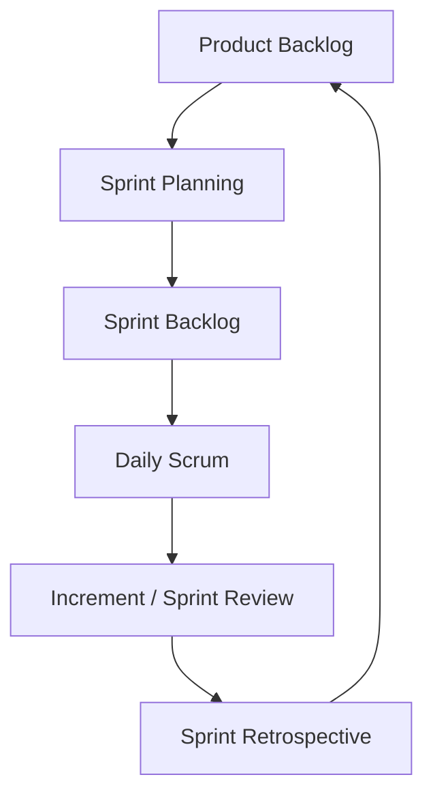

---

## 13. Sprint Structure

### 13.1 Sprint Cadence

- **Sprint Length:** 2 weeks (14 calendar days).
- **Sprint Capacity:** Based on historical velocity; capped to avoid overcommitment.
- **Sprint Calendar:** Aligned across all sub-teams to a single release train where applicable.

### 13.2 Sprint Lifecycle

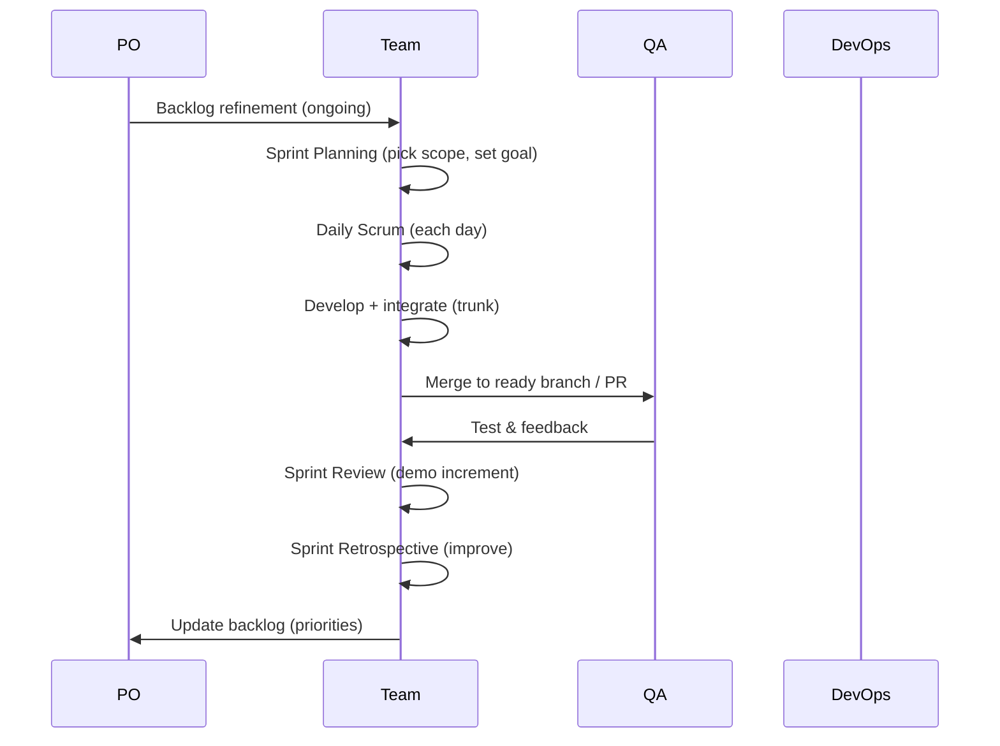

### 13.3 Sprint Ceremony Schedule

| Ceremony | Day/Time | Duration | Participants |
|---|---|---|---|
| Backlog Refinement | Mon & Thu | 30 min | PO, Team, Architect |
| Sprint Planning | Fri (before sprint) | ≤ 4 h | PO, Team |
| Daily Scrum | Daily, 15 min | 15 min | Team, SM |
| Sprint Review | Last day | ≤ 2 h | PO, Team, Stakeholders |
| Sprint Retrospective | Last day (after review) | ≤ 90 min | Team, SM |

### 13.4 Sprint Artifacts Produced

- Sprint Goal.
- Sprint Backlog (committed stories with acceptance criteria).
- Definition-of-Done checked increment.
- Burndown/burnup chart.
- Retrospective action items.
- Updated Product Backlog.

---

## 14. Milestones

Milestones are the major deliverable checkpoints of the project. They are gate-controlled (§48).

### 14.1 Milestone Schedule (High-Level)

| Milestone | Code | Target (Indicative) | Gate |
|---|---|---|---|
| Architecture Bible v6.0 Approved | `MS-00` | Done (baseline) | — |
| Backlog & PEP approved | `MS-01` | Sprint 0 | Gate 0 |
| Phase 1 — Web Platform complete | `MS-02` | End of P1 | Gate P1 |
| Phase 2 — REST APIs complete | `MS-03` | End of P2 | Gate P2 |
| Phase 3 — Mobile complete | `MS-04` | End of P3 | Gate P3 |
| Phase 4 — Offline Sync complete | `MS-05` | End of P4 | Gate P4 |
| **V1 MVP Release** | `MS-06` | MVP go-live | Release Gate V1 |
| V2 Governance Release | `MS-07` | | Release Gate V2 |
| V3 AI + Analytics Release | `MS-08` | | Release Gate V3 |
| V4 SaaS + Enterprise Release | `MS-09` | | Release Gate V4 |
| V5 Advanced Release | `MS-10` | | Release Gate V5 |
| V6+ Operating Model | `MS-11` | | Release Gate V6 |

> Exact dates are maintained in the live project schedule (timeline tool); the PEP records milestones, their definition, and their gates. A refined timeline appears in §47.

### 14.2 Milestone Definition of Done (Acceptance)

Each milestone is considered reached when:
- All planned user stories / epics for that phase pass Definition of Done.
- The corresponding Phase Gate criteria (§48) are satisfied.
- Required documentation and deliverables (§15) are complete and approved.
- Quality, security, and performance gates are green.


---

## 15. Deliverables

Deliverables are the tangible outputs of the project. They are grouped by category and linked to milestones and the Architecture Bible.

### 15.1 Deliverables Register

| ID | Deliverable | Type | Milestone | Owner | Description / Standard |
|---|---|---|---|---|---|
| `DL-01` | AssetX Architecture Bible v6.0 | Documentation | MS-00 | Architect | Single Source of Truth (approved baseline) |
| `DL-02` | Project Execution Plan (this) | Documentation | MS-01 | TPM | Master execution guide |
| `DL-03` | Product Backlog | Documentation | MS-01 | PO | Ordered user stories |
| `DL-04` | Web Administration Portal | Software | MS-02 | Dev | Next.js 15 / React 19 / Tailwind / shadcn/ui |
| `DL-05` | REST API (OpenAPI/Swagger) | Software | MS-03 | Dev | NestJS; REST; JWT; RBAC |
| `DL-06` | Backend Services (modules) | Software | MS-03 | Dev | Asset, Inventory, Audit, Notifications, etc. |
| `DL-07` | Mobile Field Application | Software | MS-04 | Dev (Mobile) | Flutter app |
| `DL-08` | Offline Sync Engine | Software | MS-05 | Dev (Mobile) | SQLite, queue, conflict resolution |
| `DL-09` | Database Schema + Migrations | Software | Ongoing | Dev/Architect | PostgreSQL/Supabase/Prisma; RLS; UUID |
| `DL-10` | CI/CD Pipelines | Infrastructure | Ongoing | DevOps | GitHub Actions + Docker |
| `DL-11` | Test Suite (Unit/Integration/E2E/Perf) | Quality | Ongoing | QA | Automated tests, k6 scripts |
| `DL-12` | Security Assessment Reports | Quality | Ongoing | SecOps | SAST/DAST/SCA, OWASP |
| `DL-13` | Environment Configuration | Infrastructure | Ongoing | DevOps | Dev/Staging/Prod IaC |
| `DL-14` | User / Admin / Developer Guides | Documentation | V1+ | Doc Team | AAB §15 |
| `DL-15` | Release Notes per Version | Documentation | Each release | TPM | Versioned changelog |
| `DL-16` | Operations Runbooks | Documentation | V6+ | DevOps/SRE | RB-001…RB-006 (AAB §11Q) |
| `DL-17` | Observability Dashboards | Infrastructure | Ongoing | DevOps | Prometheus/Grafana/Loki |
| `DL-18` | Product Analytics Events | Software | Ongoing | Dev | Telemetry/events (AAB §11Z) |
| `DL-19` | Integration Catalog | Documentation | V3/V4 | Architect | ERP/HR/AD/WhatsApp |
| `DL-20` | Decision Log / ADR Log | Documentation | Ongoing | Architect/TPM | §49 of this PEP; AAB ADRs |

### 15.2 Deliverable Acceptance Standard

Every deliverable is accepted when:
- It meets the referenced standard (in AAB or this PEP).
- It passes its Definition-of-Done.
- It is reviewed/approved by its accountable owner.
- It is recorded in the deliverable tracker and (if code) integrated to trunk.

---

## 16. Dependencies

Dependencies are sequenced relationships that affect scheduling. They are categorized as internal (project) and external.

### 16.1 Internal Dependencies

| ID | Dependency | Type | Effect on |
|---|---|---|---|
| `DP-01` | AAB v6.0 approved → backlog creation | Finish-to-Start | MS-01 |
| `DP-02` | Database schema/migrations → Web modules | Finish-to-Start | P1 |
| `DP-03` | REST API contract → Mobile app | Finish-to-Start | P3 |
| `DP-04` | Web platform → Mobile (shared patterns) | Start-to-Start | P3 |
| `DP-05` | REST APIs → Offline sync | Finish-to-Start | P4 |
| `DP-06` | Auth (Supabase/JWT) → all modules | Finish-to-Start | P1 |
| `DP-07` | RBAC foundation → governance modules | Finish-to-Start | V2 |
| `DP-08` | Observability foundation → ops dashboards | Start-to-Start | V6+ |
| `DP-09` | AI L1 (data) → AI L2/L3 | Finish-to-Start | V3/V4 |

### 16.2 External Dependencies

| ID | Dependency | Type | Risk Exposure | Mitigation |
|---|---|---|---|---|
| `DP-10` | Supabase / PostgreSQL availability | External service | Medium | Use official connectors; staging parity |
| `DP-11` | Firebase Cloud Messaging | External service | Medium | Fallback via email/WhatsApp |
| `DP-12` | OpenAI APIs / LangGraph | External service | Medium | Tiered AI; caching; provider abstraction |
| `DP-13` | Vercel hosting | External service | Medium | IaC; rollback path |
| `DP-14` | Third-party integration partners | External | High | Integration catalog; adapters |

### 16.3 Dependency Management

- Dependencies are tracked in the project schedule and reviewed at daily scrum (internal) and weekly (external).
- Critical-path dependencies are flagged and escalated through the TPM.
- External dependency risks are mitigated with abstraction layers (adapter pattern) per integration strategy (AAB ADR-008).

---

## 17. Assumptions

Assumptions are conditions assumed to be true; if invalidated, they become risks/constraints and are escalated.

### 17.1 Project Assumptions

| ID | Assumption | Validation / Fallback |
|---|---|---|
| `AS-01` | AAB v6.0 remains the authoritative architecture | Escalate conflicts to TRB |
| `AS-02` | Approved technology stack remains baseline unless a TDR changes it | TDR via ADR + CAB |
| `AS-03` | Development team is resourced and available as planned | Re-baseline schedule |
| `AS-04` | Stakeholders are available for reviews/UAT | Schedule windows; async reviews |
| `AS-05` | External services (Supabase, FCM, OpenAI, Vercel) remain available | Fallbacks in §16.2 |
| `AS-06` | Legacy system data is available as a knowledge source | Migration framework (AAB §11M) |
| `AS-07` | Offline-first is achievable with SQLite + sync queue | Pilot validation in P4 |
| `AS-08` | Test environments approximate production | IaC parity |
| `AS-09` | Data volumes scale as defined (10K→10M) | Capacity plan §45 |

### 17.2 Assumption Management

- Assumptions are recorded in the PEP and tracked.
- Any invalidated assumption is logged as a risk and reviewed at the next phase gate.

---

## 18. Constraints

Constraints are hard limits that cannot be changed without formal approval.

### 18.1 Project Constraints

| ID | Constraint | Nature | Governing Source |
|---|---|---|---|
| `CT-01` | Architecture = Enterprise; Implementation = incremental | Technical | AAB §6; approved decisions |
| `CT-02` | Design both platforms; implement Web first | Delivery | Approved decisions |
| `CT-03` | Mandatory document order (01→18) | Process | AAB §9–10 |
| `CT-04` | Domain model drives database design | Architecture | Approved decisions |
| `CT-05` | No coding before AAB complete | Process | AAB §9 |
| `CT-06` | Modular Monolith first (ADR-002) | Architecture | ADR-002 |
| `CT-07` | UUID identifiers (ADR-001) | Architecture | ADR-001 |
| `CT-08` | `tenant_id` + RLS (ADR-004) | Architecture | ADR-004 |
| `CT-09` | Approved technology stack | Technical | Approved decisions |
| `CT-10` | Non-negotiable product principles (10) | Product | AAB §5 |
| `CT-11` | OWASP ASVS L2 for MVP | Security | AAB §11B |
| `CT-12` | NFR targets (SLA, latency, sync) | Technical | AAB §11B |
| `CT-13` | Security/audit by design | Product | AAB §5 |

### 18.2 Constraint Management

- Constraints are not negotiable without formal change management (§24) and CAB approval.
- Conflicts between constraints are escalated to TRB.
- Constraints are referenced (not redefined) throughout downstream documents.

---

## 19. Risk Register

The risk register is the central inventory of project risks. It follows PMI risk-management discipline and references the AAB risk register (§11V).

### 19.1 Risk Rating Definitions

- **Likelihood (L):** 1=Very Low, 2=Low, 3=Medium, 4=High, 5=Very High.
- **Impact (I):** 1=Negligible … 5=Critical.
- **Score = L × I** (1–25). Thresholds: 1–6 Low, 7–12 Medium, 13–17 High, 18–25 Critical.

### 19.2 Risk Register

| ID | Risk | Category | L | I | Score | Level | Owner | Status |
|---|---|---|---|---|---|---|---|---|
| `RK-01` | Offline inventory data loss | Technical | 3 | 5 | 15 | High | Mobile/Architect | Open |
| `RK-02` | Tenant account compromise | Security | 2 | 5 | 10 | Medium | SecOps | Open |
| `RK-03` | Backup failure / data loss | Operations | 2 | 5 | 10 | Medium | DevOps/SRE | Open |
| `RK-04` | Scope creep beyond roadmap | Delivery | 4 | 3 | 12 | Medium | TPM/PO | Open |
| `RK-05` | External service outage | Technical | 3 | 3 | 9 | Medium | DevOps | Open |
| `RK-06` | Sync conflict complexity | Technical | 3 | 4 | 12 | Medium | Mobile/Architect | Open |
| `RK-07` | Performance degradation at scale | Technical | 3 | 4 | 12 | Medium | Architect/DevOps | Open |
| `RK-08` | Team resource availability | Resource | 3 | 3 | 9 | Medium | TPM | Open |
| `RK-09` | AI cost/accuracy issues | Technical | 3 | 3 | 9 | Medium | AI/Architect | Open |
| `RK-10` | Integration partner delays | External | 3 | 3 | 9 | Medium | TPM | Open |
| `RK-11` | Security vulnerability discovered late | Security | 2 | 4 | 8 | Medium | SecOps | Open |
| `RK-12` | Legacy data quality issues | Data | 3 | 3 | 9 | Medium | Architect | Open |
| `RK-13` | Adoption resistance by field users | Business | 3 | 3 | 9 | Medium | PO | Open |
| `RK-14` | Regulatory/compliance change | Compliance | 2 | 3 | 6 | Low | SecOps/PO | Open |
| `RK-15` | Multi-tenant activation complexity | Technical | 3 | 4 | 12 | Medium | Architect | Open |

### 19.3 Risk Scoring Matrix

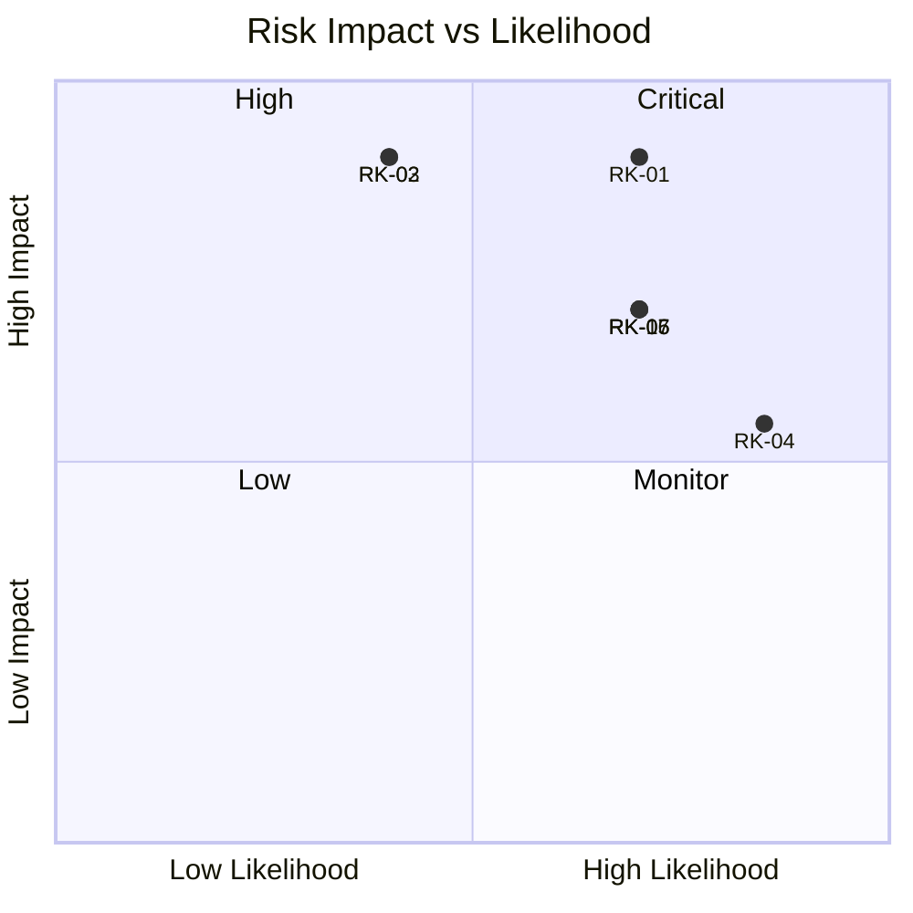

---

## 20. Risk Mitigation Plan

Each open risk has a mitigation strategy (Avoid, Mitigate, Transfer, Accept) and concrete actions, mapped to AAB controls.

| ID | Risk | Strategy | Mitigation / Contingency Actions | Reference (AAB) |
|---|---|---|---|---|
| `RK-01` | Offline data loss | Mitigate | Sync queue + conflict resolution; field ops monitoring; local→server ack; storage limits | §11N, ADR-003 |
| `RK-02` | Tenant compromise | Mitigate | MFA; RLS; audit; session mgmt; least privilege; SIEM | §10, §11S |
| `RK-03` | Backup failure | Mitigate | Monthly restore testing; WAL/PITR; monitoring; alerting | ADR-007, §11T |
| `RK-04` | Scope creep | Avoid | Phase gates; backlog governance; change mgmt (§24) | §17-Roadmap |
| `RK-05` | External outage | Mitigate | Adapter abstraction; fallbacks; monitoring | ADR-008 |
| `RK-06` | Sync conflict complexity | Mitigate | LWW for simple fields; manual for critical; conflict dashboard | ADR-003, §11N |
| `RK-07` | Performance at scale | Mitigate | Caching; indexing; cursor pagination; partitioning; load tests | §11X |
| `RK-08` | Resource availability | Mitigate | Capacity planning; cross-training; escalation | — |
| `RK-09` | AI cost/accuracy | Mitigate | Tiered AI; caching; batch processing; cost KPIs | ADR-013, §11Y |
| `RK-10` | Integration delays | Mitigate | Integration catalog; adapters; early engagement | §11U |
| `RK-11` | Late security vulnerability | Mitigate | SAST/DAST/SCA; threat modeling; pen testing | §11S |
| `RK-12` | Legacy data quality | Mitigate | 7-stage migration framework; cleansing rules | §11M |
| `RK-13` | Adoption resistance | Mitigate | Training; UAT; onboarding; feedback loops | §15-Documentation |
| `RK-14` | Compliance change | Monitor | Compliance monitoring; GDPR mode | §11W, §11S |
| `RK-15` | Multi-tenant complexity | Mitigate | RLS-first; tenant-ready design; gradual activation | ADR-004, §11J |

### 20.1 Risk Governance

- **Risk reviews:** Weekly (TPM-led) and at each phase gate.
- **Risk owner:** accountable for monitoring and mitigation effectiveness.
- **Escalation:** High/Critical risks are escalated to CAB; Critical to Executive Sponsors.
- **Risk register updates:** any material change to likelihood/impact triggers re-evaluation.


---

## 21. Communication Plan

The communication plan defines what is communicated, to whom, when, how, and by whom — aligned with PMI communications management.

### 21.1 Communication Matrix

| Communication | Audience | Frequency | Channel / Format | Owner |
|---|---|---|---|---|
| Daily Scrum | Development Team + SM | Daily | Standup (15 min) | SM/Team |
| Weekly Status Report | PO, TPM, Stakeholders | Weekly | Written report (email/wiki) | TPM |
| Sprint Review / Demo | PO, Team, Stakeholders | Each sprint | Live demo | PO/Team |
| Sprint Retrospective | Team + SM | Each sprint | Facilitated session | SM |
| Architecture Review | Architect, TRB | Weekly | Design review | Architect |
| Security Review | SecOps, SRB | Per change/gate | Threat/review meeting | SecOps |
| Phase Gate Review | CAB, TPM, Architects | Each gate | Gate meeting + record | TPM |
| Steering / Exec Review | Executive Sponsors | Monthly | Presentation + KPIs | TPM/PO |
| Release Readiness | CAB, DevOps, QA | Each release | Release checklist review | TPM |
| Risk Review | TPM, Risk Owners | Weekly | Risk register review | TPM |
| Incident / Alert Notifications | DevOps, On-call | Real-time | PagerDuty/Slack/Email | DevOps/SRE |
| Change Notifications | Affected stakeholders | Per change | CAB approval + notice | TPM |

### 21.2 Communication Principles

- **Transparency:** status is shared openly via a single source (e.g., wiki + tracker).
- **Timeliness:** critical updates are immediate; routine updates on cadence.
- **Clarity:** reports use KPIs and plain language; technical detail in appendices.
- **Traceability:** decisions and communications are logged (Decision Log §49).

### 21.3 Communication Channels

| Channel | Use |
|---|---|
| Team chat (e.g., Slack/Teams) | Daily coordination |
| Wiki / Documentation repo | Persistent reference |
| Issue/Project tracker (e.g., Jira/GitHub Projects) | Work, status, backlog |
| Email | Formal reports, approvals |
| Scheduled meetings | Ceremonies, reviews, gates |
| Monitoring/alerts | Operational incidents |

---

## 22. Reporting Structure

### 22.1 Reporting Hierarchy

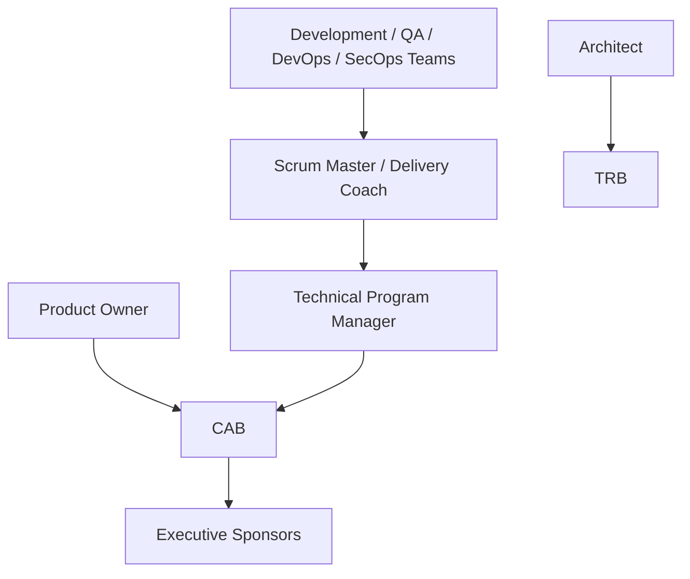

### 22.2 Report Types

| Report | Frequency | Owner | Audience | Content |
|---|---|---|---|---|
| Sprint Report | Per sprint | TPM/SM | PO, Stakeholders | Velocity, completed stories, blockers |
| Weekly Status Report | Weekly | TPM | Stakeholders | Progress, risks, decisions needed |
| Burndown/Burnup | Continuous | SM | Team, PO | Sprint progress |
| Risk Report | Weekly + gate | TPM | CAB | Risk register status |
| Quality Report | Weekly | QA | TPM, CAB | Defects, coverage, test results |
| Security Report | Per gate | SecOps | CAB, SRB | Scan results, vulnerabilities |
| Release Readiness Report | Per release | TPM | CAB | DoD, gate criteria, sign-off |
| Executive Dashboard | Monthly | TPM | Executive Sponsors | KPIs, milestones, outcomes |

### 22.3 Escalation Path

1. Team-level blocker → Scrum Master → remove or escalate to TPM.
2. TPM-level blocker (schedule/scope) → TPM → CAB.
3. CAB-level (strategic/architecture) → Executive Sponsors.

---

## 23. Decision-Making Process

### 23.1 Decision Framework

Decisions follow the governance model from AAB §11V and the approved decision process:

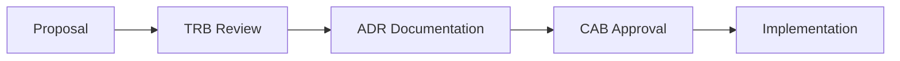

### 23.2 Decision Types & Authority

| Decision Type | Owner | Process |
|---|---|---|
| Architecture decision | Architect + TRB | ADR, then CAB approval |
| Scope / prioritization | Product Owner | Backlog governance |
| Schedule / delivery | TPM | PEP governance, phase gates |
| Technical design (non-architectural) | Development Team + Architect review | PR review |
| Security decision | SecOps + SRB | Security review |
| Financial / resourcing | Executive Sponsors | Steering review |
| Change to approved docs | CAB | Change management (§24) |

### 23.3 Decision Log (see §49)

- All significant decisions are recorded in the Decision Log with date, decision, rationale, alternatives, and approver.
- Decisions are referenced by downstream documents (not redefined).

---

## 24. Change Management Process

### 24.1 Purpose

Manage changes to approved baselines (scope, schedule, architecture, requirements) in a controlled, auditable way, consistent with AAB governance and the Configuration Management Plan (§25).

### 24.2 Change Control Model

| Change Type | Control Level | Approver |
|---|---|---|
| Scope change | High | CAB (PO recommends) |
| Schedule change (milestones) | High | CAB |
| Architecture change | High | TRB (ADR) → CAB |
| Technology change | High | TRB (TDR/ADR) → CAB |
| Requirement change (backlog item) | Medium | PO |
| Defect / fix | Low | Team (via sprint) |
| Documentation change | Medium | Document owner + CAB (if baseline) |

### 24.3 Change Process Flow

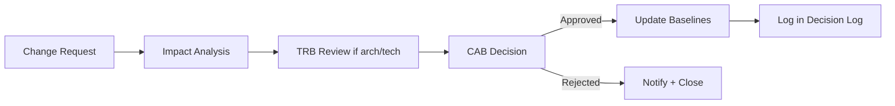

### 24.4 Change Request Fields

- Change ID, date, requester, type, description.
- Impact analysis: scope/schedule/architecture/risk/cost.
- Alternative options considered.
- Recommended decision + rationale.
- Approval decision + approver + date.
- Logged in Decision Log (§49).

### 24.5 Change Governance Rules

- No change to an approved baseline without the documented process.
- Emergency changes follow an expedited path with CAB notification within 24h.
- All changes are auditable (Audit by Design).

---

## 25. Configuration Management

### 25.1 Purpose

Ensure consistency, traceability, and reproducibility of all project artifacts (code, config, documentation, environments).

### 25.2 Configuration Items (CI)

| Category | Configuration Items |
|---|---|
| Code | Source repositories (trunk-based) |
| Configuration | Environment variables, IaC, feature flags |
| Documentation | AAB, PEP, guides, runbooks |
| Environments | Dev, Staging, Production (IaC) |
| Dependencies | Package locks, images, versions |
| Data | Schemas, migrations, seed data |

### 25.3 Configuration Management Strategy

- **Version control:** Git (trunk-based) for code; docs versioned too.
- **Secrets management:** Secrets in Vault/secret manager — never in code (AAB §11S).
- **Infrastructure as Code (IaC):** environments defined declaratively (Docker, GitHub Actions).
- **Versioning:** Semantic Versioning for releases; tags for releases.
- **Traceability:** every change tied to a work item and build.

### 25.4 Configuration Baseline

- Baselines are established at each phase gate and release.
- Changes to baselines require change management (§24).
- Baselines are recorded and frozen for auditability.

---

## 26. Quality Management

### 26.1 Quality Objectives

- Deliver a high-quality, reliable, secure enterprise platform.
- Meet or exceed Definition-of-Done for every deliverable.
- Maintain quality gates green throughout CI/CD.

### 26.2 Quality Management Plan (PMI/IEEE-aligned)

| Element | Approach |
|---|---|
| Quality Planning | Define standards, DoR/DoD, quality gates |
| Quality Assurance | Process compliance, audits, standards |
| Quality Control | Testing, inspection, defect management |
| Quality Metrics | Coverage, defect density, lead time (§45) |

### 26.3 Quality Gates (Pipeline Stages)

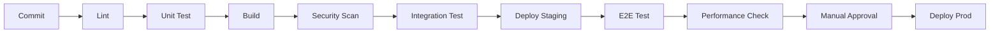

### 26.4 Testing & QA Responsibilities

- QA owns test strategy and execution (§38).
- Developer-owned unit tests.
- Continuous quality feedback into backlog.

### 26.5 Quality Metrics & Targets

| Metric | Target |
|---|---|
| Unit test coverage | ≥ 80% (critical modules) |
| Defect escape (critical) | ≤ 5% |
| Test pass rate on staging | 100% before release |
| Zero critical defects at release gate | Required |

---

## 27. Security Governance

### 27.1 Security Principles (from AAB)

- **Security by Design** — built-in, not added on.
- **Audit by Design** — every operation auditable.
- **Least Privilege** — users get only required permissions (BR-SEC-005).
- **Defense in Depth** — layered controls.

### 27.2 Security Governance Bodies & Controls

| Control | Owner | Description |
|---|---|---|
| Security Review Board | SecOps + Architect | Review of security-sensitive changes |
| Threat Modeling | SecOps + Architect | Per feature/module |
| OWASP ASVS L2 (MVP) | SecOps | Application security standard |
| SAST / DAST / SCA | SecOps/DevOps | Automated scanning in pipeline |
| Secrets Management | SecOps/DevOps | Vault; no secrets in code |
| Penetration Testing | SecOps | Quarterly + post major release |
| Compliance Monitoring | SecOps | GDPR + local standards (§11W) |
| Incident Response | SecOps | Detect→Contain→Eradicate→Recover→Lessons |

### 27.3 Security Architecture Elements

| Element | AssetX Approach |
|---|---|
| Authentication | Supabase Auth, JWT, refresh tokens, MFA-ready |
| Authorization | RBAC + granular permissions (§13.5) |
| Data Encryption | AES-256 at rest; TLS 1.3 in transit |
| Password Hashing | bcrypt/argon2 (cost ≥ 12) |
| Multi-tenancy isolation | `tenant_id` + RLS (ADR-004) |
| Audit | Append-only audit log (immutable) |
| Session Management | JWT 15 min + Refresh 7 days; session revocation |

### 27.4 Security in the Delivery Lifecycle

- **Every phase gate** includes a security review sign-off.
- **Every PR** is scanned (SAST) before merge.
- **Every release** requires security gate green + SRB sign-off.

---

## 28. Definition of Ready (DoR)

A backlog item is **Ready** for a Sprint when all of the following hold:

| # | DoR Criterion |
|---|---|
| 1 | Written in User Story format (As a / I want / So that). |
| 2 | Clear, testable **Acceptance Criteria** defined. |
| 3 | Technical design reviewed (if needed) by Architect. |
| 4 | Dependencies identified and resolved/available. |
| 5 | Estimated by the team (story points). |
| 6 | Value and priority understood (PO). |
| 7 | No blockers / no "Unknowns" that prevent start. |
| 8 | Referenced data/entities consistent with AAB (where applicable). |

> DoR is owned by the Product Owner, informed by the team.

---

## 29. Definition of Done (DoD)

A backlog item (and hence an Increment) is **Done** when all of the following are satisfied:

| # | DoD Criterion |
|---|---|
| 1 | Code written following coding standards (AAB §11AA). |
| 2 | Unit tests written; coverage target met (≥80% critical). |
| 3 | Integration tests pass. |
| 4 | Code reviewed and approved (1+ approver) per §36. |
| 5 | No lint/warnings/static-analysis errors. |
| 6 | Security scan clean (SAST). |
| 7 | Documentation updated (where applicable). |
| 8 | Deployed to Staging successfully. |
| 9 | UAT accepted (for major features). |
| 10 | Audit/logging integrated (Audit by Design). |

> DoD is the shared contract of the team; anything less is "Not Done."


---

## 30. Release Strategy

### 30.1 Release Model

AssetX uses **trunk-based development** with **release branches for tags**, per AAB §11AA (Git Workflow) and ADR-014 (Release Strategy). Releases are **versioned** (SemVer) and **reversible**.

### 30.2 Release Principles (ADR-014)

- **Trunk-based** development.
- **Feature Flags** to decouple deploy from release.
- **Blue/Green** deployment for major releases.
- **Canary** rollout for experimental features.
- **Automatic rollback** on failed health check.

### 30.3 Release Types

| Type | Frequency | Description |
|---|---|---|
| Patch (`MAJOR.MINOR.PATCH`) | As needed | Bug fixes, security patches |
| Minor | Per release train | New features, backward-compatible |
| Major | Per version (V1–V6+) | Milestone / enterprise releases |

### 30.4 Release Process

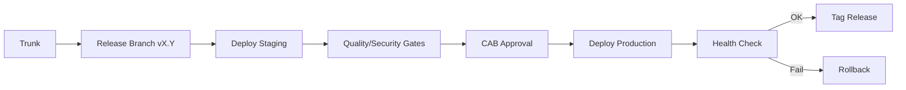

### 30.5 Release Readiness

Per AAB §11AB (Production Readiness Checklist), a release is ready when:
- Health check endpoint works.
- Metrics/logs/tracing enabled.
- Alerts configured.
- Backup verified.
- Rollback tested.
- Runbook written.
- Rate limiting enabled.
- Secrets in Vault.
- SSL/TLS valid.
- Load test passed.

### 30.6 Versioning

- **Semantic Versioning:** `MAJOR.MINOR.PATCH`.
- **Tags:** `v1.0.0`, `v2.0.0`, etc., on release branches.
- **Release Notes:** maintained per version (DL-15).

---

## 31. Environment Strategy

### 31.1 Environments

| Environment | Purpose | Characteristics |
|---|---|---|
| **Dev** | Developer integration | Per-developer/CI ephemeral |
| **Staging** | Pre-production validation | Mirrors production; parity |
| **Production** | Live service | Governed, monitored |
| **Preview/Ephemeral** | Per-PR review | CI-generated (Vercel preview) |

### 31.2 Environment Management

- **IaC** for reproducible environments (Docker, GitHub Actions).
- **Parity:** staging approximates production config/data (masked).
- **Isolation:** tenants/data isolated per environment.
- **Secrets:** per-environment secret management (Vault).

### 31.3 Promotion Path

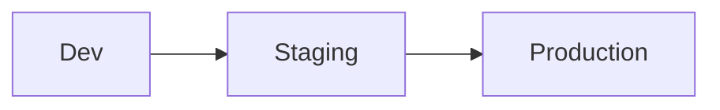

Promotion requires passing quality/security gates at each stage.

### 31.4 Environment Responsibilities

| Environment | Owner | Change Control |
|---|---|---|
| Dev | Development Team | Self-service |
| Staging | DevOps (with QA) | PR/gate driven |
| Production | DevOps/SRE + CAB | Release process (§30) |

---

## 32. Development Workflow

### 32.1 Workflow Overview

AssetX follows **trunk-based development** with short-lived feature branches merged to trunk via pull requests. Per AAB §11AA Git Workflow:

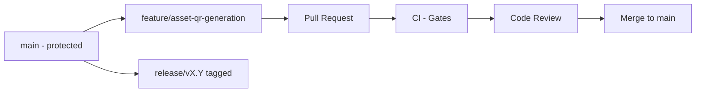

### 32.2 Branch Naming

| Branch | Pattern |
|---|---|
| Main | `main` (protected) |
| Feature | `feature/<slug>` |
| Fix | `fix/<slug>` |
| Refactor | `refactor/<slug>` |
| Docs | `docs/<slug>` |
| Release | `release/v<X.Y>` |

### 32.3 Commit Standards (Conventional Commits)

- `feat:`, `fix:`, `docs:`, `refactor:`, `test:`, `chore:`, `build:`, `ci:`.
- Commits are small, single-purpose, and reference the work item.

### 32.4 Workflow Rules

- Short-lived branches (merged within 1–2 days).
- Continuous integration into trunk.
- Every merge is a Pull Request (no direct pushes to main).
- Trunk is always deployable.

---

## 33. Git Strategy

### 33.1 Model

**Trunk-Based Development (TBD)** with short-lived branches and release tags — consistent with AAB §11AA and ADR-014.

### 33.2 Strategy Details

| Aspect | Decision |
|---|---|
| Default branch | `main` (protected, production) |
| Branch lifecycle | Short-lived feature/fix branches |
| Merges | Pull Request required |
| Release | `release/vX.Y` branches + SemVer tags |
| Rebase vs merge | Squash-and-merge for PRs (clean history) |
| Revert | `git revert` preferred for production fixes |

### 33.3 Repository Layout

- `main` — protected production branch.
- `feature/*` — new capabilities.
- `fix/*` — defect repairs.
- `release/vX.Y` — release stabilization.

### 33.4 Release & Hotfix Flow

- **Hotfix:** branch from tagged release → fix → merge back to main + release branch.
- **Feature flags** allow incremental feature release without code removal.

---

## 34. Branch Protection Rules

`main` (and `release/*`) are protected in the repository (GitHub):

| Rule | Value |
|---|---|
| Require PR before merging | Yes |
| Require approvals | ≥ 1 (≥ 2 for `main` architecture paths) |
| Dismiss stale approvals | Yes |
| Require status checks (CI green) | Yes (lint, unit, build, security) |
| Require conversation resolution | Yes |
| Restrict direct pushes | Yes (only via PR) |
| Enforce admins | Yes |
| Require linear history / squash | Yes |
| Require signed commits (optional) | Recommended for security |

### 34.1 Branch Protection Governance

- Changes to protection rules require CAB approval.
- Temporary relaxations (emergency) are time-boxed and logged.

---

## 35. Pull Request Policy

### 35.1 PR Requirements

| Requirement | Policy |
|---|---|
| Title | Conventional commit prefix + description |
| Description | What, Why, How; links to work item |
| Scope | Small, single-purpose |
| Checklist | Self-review completed |
| CI | All status checks green |
| Approvals | ≥ 1 (≥ 2 for architecture/security paths) |
| Conflicts | Resolved before merge |
| WIP | Marked as draft until ready |

### 35.2 PR Lifecycle

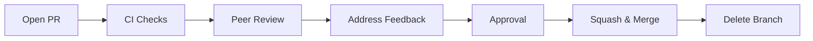

### 35.3 PR Template

A standard PR template enforces completeness (per AAB §11AA PR Standards): summary, motivation, acceptance criteria verification, tests, screenshots (UI), risk notes.

---

## 36. Code Review Policy

### 36.1 Objectives

- Ensure quality, consistency, security, and architecture fidelity.
- Knowledge sharing and defect prevention.

### 36.2 Review Standards

| Aspect | Standard |
|---|---|
| Reviewer count | ≥ 1 approver (≥ 2 for architecture/security paths) |
| Coverage | Logic, security, performance, naming, tests, docs |
| Architecture fidelity | Architect reviews architecture-affecting changes |
| Security | SecOps reviews security-sensitive changes |
| Timeliness | Review within 24h of PR readiness |
| Feedback | Constructive; use comments; resolve conversations |

### 36.3 Review Checklist (summary)

- Follows coding standards (AAB §11AA).
- Tests added/updated; coverage maintained.
- No secrets/credentials.
- No security anti-patterns.
- Backward compatibility / feature-flag considered.
- Performance considerations addressed.
- Documentation updated where applicable.

---

## 37. CI/CD Pipeline Overview

### 37.1 Tools

- **CI/CD:** GitHub Actions.
- **Containers:** Docker.
- **Hosting:** Vercel (Web), Supabase (backend/DB).
- **Monitoring:** OpenTelemetry, Prometheus, Grafana, Loki, Sentry.

### 37.2 Pipeline Stages

```mermaid
flowchart LR
    Commit --> Lint[Lint/Format] --> Unit[Unit Tests] --> Build[Build] --> SAST[Security Scan SAST] --> Image[Docker Build] --> Push[Push Image] --> DeployStg[Deploy Staging] --> E2E[E2E Tests] --> Perf[Performance Check] --> Approval[Manual Approval] --> DeployProd[Deploy Production]
```

### 37.3 Pipeline Jobs

| Job | Stage | Description |
|---|---|---|
| Lint & Format | Check | ESLint, Prettier |
| Unit Test | Test | Jest/Vitest (coverage gate) |
| Build | Build | Web + Backend build |
| SAST | Security | Secret scan, dependency scan (SCA) |
| Container Build | Build | Docker image |
| Deploy Staging | Deploy | Ephemeral/preview + staging |
| E2E Test | Test | Playwright/Cypress |
| Performance | Test | k6 load checks (on release) |
| Approval Gate | Release | Manual CAB approval |
| Deploy Production | Release | Blue/Green + health check + rollback |

### 37.4 CI/CD Governance

- Pipeline definitions are versioned (IaC).
- Pipeline changes require review (PR).
- Failed gates block merge/release.
- Rollback is automated on health-check failure.

---

## 38. Testing Strategy Overview

### 38.1 Test Pyramid

```mermaid
pyramid
    title AssetX Test Pyramid
    section E2E
        E2E / UAT
    section Integration
        Integration / Contract
    section Unit
        Unit Tests (Majority)
```

### 38.2 Test Levels

| Level | Scope | Tools | Coverage Goal |
|---|---|---|---|
| Unit | Functions/classes | Jest/Vitest, Flutter test | ≥ 80% critical |
| Integration | Modules + DB | Supertest, Prisma test | Cross-module |
| Contract | API contracts | OpenAPI conformance | Public API |
| E2E | User journeys | Playwright/Cypress | Critical flows |
| Performance | Load/stress/soak/spike | k6 | NFR targets |
| Security | SAST/DAST/SCA | Pipeline scanners | OWASP |
| Mobile | Widget/integration/device | Flutter integration tests | Field flows |
| Sync | Conflict/incremental/offline | Dedicated sync tests | Offline reliability |

### 38.3 Testing Strategy Details

- **Unit:** developers write unit tests; coverage gate in CI.
- **Integration:** test modules with real DB (PostgreSQL/Supabase test).
- **E2E:** critical user journeys (asset lifecycle, inventory cycle, login).
- **Performance:** k6 — load (1000 concurrent), stress, soak (24h), spike (10×).
- **Security:** SAST on every PR; DAST/SCA on release; quarterly pen test.
- **Mobile:** offline-first flows, QR scanning, camera, GPS.
- **Sync:** conflict scenarios, incremental sync, queue recovery.

### 38.4 Acceptance & UAT

- UAT in staging with real users before release (§40).
- Acceptance criteria per user story in DoR/DoD.


---

## 39. Documentation Strategy

### 39.1 Documentation Principles

- Documentation is a **first-class deliverable** (IEEE 830 / 12207 aligned).
- Docs are versioned, reviewed, and approved.
- Docs avoid placeholders and lorem ipsum; they use real AssetX terminology.
- The **Architecture Bible (AAB v6.0)** is the authoritative source; other docs reference it.

### 39.2 Documentation Structure (AAB §10 / §15)

| Document Set | Audience | Owner |
|---|---|---|
| AAB (01–18) | All | Architect + PO |
| User Guide | End users | Documentation Team |
| Admin Guide | Administrators | Documentation Team |
| Developer Guide | Engineers | Architect + Dev |
| Operations Runbooks | DevOps/SRE | DevOps/SRE |
| Release Notes | All | TPM |
| API Docs (OpenAPI/Swagger) | Developers/Partners | Backend |
| Data Dictionary | Developers/Architects | Architect |

### 39.3 Documentation Workflow

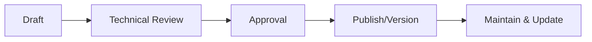

- Docs live in the repository (versioned).
- Doc changes require review (PR).
- Docs are updated as part of Definition-of-Done where applicable.

### 39.4 Documentation Quality

- Consistent terminology (AssetX naming conventions, AAB §11AA).
- Tables and Mermaid diagrams used where beneficial.
- No placeholders; no lorem ipsum; no assumptions contradicting AAB.

---

## 40. Acceptance Criteria

### 40.1 Purpose

Acceptance criteria define, in testable terms, when a feature/story/release is acceptable. They are captured at the story level (DoR) and validated via acceptance testing and UAT.

### 40.2 Acceptance Criteria Structure

- **Functional criteria:** behavior the user expects.
- **Non-functional criteria:** performance, security, usability.
- **Testable:** given/when/then format preferred.

### 40.3 Sample Acceptance Criteria (AssetX)

**User Story — Field agent counts an asset offline:**
- Given an offline-capable device and an active inventory cycle,
- When the agent scans the asset QR and confirms quantity,
- Then the record is saved locally with status "Matched" (or appropriate result),
- And remains pending in the sync queue,
- And is synced to the server once connectivity is restored,
- And is reflected in the campaign statistics.

### 40.4 Acceptance Gate

- Story acceptance: verified by QA against acceptance criteria + UAT sign-off (major features).
- Release acceptance: all DoD criteria + success criteria (§4) at the release gate.

---

## 41. Production Readiness Checklist

Adapted from AAB §11AB. A release/feature is **production-ready** when all items are verified:

| # | Checklist Item | Owner | Status |
|---|---|---|---|
| 1 | Health check endpoint working | DevOps | ☐ |
| 2 | Metrics + logs + tracing enabled | DevOps | ☐ |
| 3 | Alerts configured (PagerDuty/Slack) | DevOps | ☐ |
| 4 | Backup verified + restore tested | DevOps/SRE | ☐ |
| 5 | Rollback tested | DevOps | ☐ |
| 6 | Runbook written (RB-###) | SRE | ☐ |
| 7 | Rate limiting enabled | DevOps | ☐ |
| 8 | Secrets in Vault (not in code) | SecOps | ☐ |
| 9 | SSL/TLS valid | DevOps | ☐ |
| 10 | Load test passed | QA/DevOps | ☐ |
| 11 | Security scans clean (SAST/DAST/SCA) | SecOps | ☐ |
| 12 | Feature flags configured | DevOps | ☐ |
| 13 | Monitoring dashboards live | DevOps | ☐ |
| 14 | Error budget / SLO defined | DevOps | ☐ |
| 15 | Documentation updated | Doc Owner | ☐ |

> A single unchecked mandatory item blocks go-live (Release Gate not passed).

---

## 42. Go-Live Checklist

Executed at the Production go-live window by the TPM, DevOps, QA, and SecOps.

| # | Go-Live Step | Owner | Status |
|---|---|---|---|
| 1 | Production Readiness Checklist complete | TPM | ☐ |
| 2 | Final code tagged (`vX.Y.Z`) | DevOps | ☐ |
| 3 | Database migration backup taken | DevOps | ☐ |
| 4 | Feature flags staged for release | DevOps | ☐ |
| 5 | Blue/Green or canary switch prepared | DevOps | ☐ |
| 6 | Monitoring/alerts armed | DevOps | ☐ |
| 7 | Rollback plan confirmed | DevOps | ☐ |
| 8 | Communication sent to stakeholders | TPM | ☐ |
| 9 | Deployment executed | DevOps | ☐ |
| 10 | Health check + smoke tests passed | QA/DevOps | ☐ |
| 11 | Support on-call confirmed | SRE | ☐ |
| 12 | Go-live sign-off recorded | TPM/CAB | ☐ |

### 42.1 Go/No-Go Criteria

- All mandatory Go-Live items green.
- Zero open Critical/High defects blocking release.
- CAB approval recorded.
- Support team on standby.

---

## 43. Post Go-Live Support

### 43.1 Support Model

| Level | Responsibility | Channel |
|---|---|---|
| L1 Support | User triage, common issues | Service Desk |
| L2 Support | Product/technical resolution | Dev/QA on-call |
| L3 Support | Deep technical/architecture | Senior engineers/Architect |

### 43.2 Post-Go-Live Plan

- **Hypercare period:** first 2–4 weeks with intensified monitoring and on-call.
- **Incident management:** per ITSM (§11Q) with severity/priority and escalation matrix.
- **Health & performance monitoring:** continuous (Prometheus/Grafana/Sentry).
- **Feedback loop:** user feedback into backlog.
- **Stabilization sprints:** dedicated sprints for defects discovered post-go-live.
- **Go-live retrospective:** review and feed improvements into process.

### 43.3 Escalation Matrix (from AAB §11Q)

| Priority | Response | Resolution | Notify |
|---|---|---|---|
| P1 (critical/outage) | 15 min | 2 hours | CTO + On-Call |
| P2 (high) | 1 hour | 8 hours | Team Lead |
| P3 (medium) | 4 hours | 3 days | Developer |
| P4 (low) | 24 hours | 2 weeks | Backlog |

---

## 44. Maintenance Strategy

### 44.1 Maintenance Types

| Type | Description |
|---|---|
| Corrective | Fix defects and bugs |
| Adaptive | Adapt to environment/integration changes |
| Perfective | Improve performance, maintainability |
| Preventive | Proactive health, security, dependency updates |

### 44.2 Maintenance Plan

- **Release cadence:** scheduled minor/patch releases; hotfixes as needed.
- **Dependency management:** periodic updates with SCA scanning.
- **Technical debt:** tracked in Technical Debt Register (AAB §11V); addressed in dedicated sprints.
- **Security patching:** prioritized by CVSS; critical patched immediately.
- **Data governance:** retention, archiving, backup per AAB §11W/§11T.
- **Performance:** continuous monitoring; optimize per SLOs.
- **Observability:** keep dashboards/alerts current.

### 44.3 Maintenance Governance

- Maintenance changes follow the same PR/CI/release process (§30–§37).
- Changes to approved baselines require change management (§24).

---

## 45. Project KPIs

KPIs measure project performance against objectives (§3) and success criteria (§4). They align with AAB §11Z (Product Analytics) and §16 (Success Criteria).

### 45.1 Delivery KPIs

| KPI | Target | Measurement |
|---|---|---|
| Sprint velocity | Stable (±10% variance) | Burndown/velocity chart |
| Cycle time / lead time | Decreasing/stable | Issue tracker |
| Sprint completion (DoD) | 100% of committed-Done | Sprint review |
| Phase gate pass rate | 100% (or approved variance) | Gate records |

### 45.2 Quality KPIs

| KPI | Target | Measurement |
|---|---|---|
| Unit test coverage | ≥ 80% critical | Coverage report |
| Defect escape (critical) | ≤ 5% | Defect triage |
| Critical open defects | 0 at release | Backlog |
| Code review coverage | 100% merges | PR data |

### 45.3 Technical/Performance KPIs

| KPI | Target | Measurement |
|---|---|---|
| Dashboard load | < 2 s | Load test |
| Search latency | < 500 ms | Perf test |
| Asset list (10K) | < 1 s | Perf test |
| Sync rate | ≥ 1000 rec/min | Sync test |
| QR → display | < 300 ms | Mobile perf |
| SLA (MVP) | 99.5% | Monitoring |
| API p95 latency | < 500 ms | Monitoring |
| Sync success rate | ≥ 99.5% | Monitoring |

### 45.4 Security & Operations KPIs

| KPI | Target |
|---|---|
| SAST/DAST/SCA clean | 0 critical/high findings at release |
| Mean time to respond (P1) | ≤ 15 min |
| Mean time to resolve (P1) | ≤ 2 hours |
| Backup restore test | Pass monthly |

### 45.5 Business KPIs (from AAB §11Z)

Active Tenants · Total Assets Managed · Inventory Completion Rate · Discrepancy Rate · Time-to-Inventory · User Retention (M1/M3/M6).

---

## 46. Success Metrics

### 46.1 Quantitative Success Metrics

| Metric | Baseline | Target | Measurement Time |
|---|---|---|---|
| Inventory campaign time | Pre-AssetX | ≥ 70% reduction | Post go-live comparison |
| % assets inventoried | TBD | ≥ 95% | Per campaign |
| Discrepancy detection | Manual | Automated + reported | Per campaign |
| Sync completion | — | 100% no-loss | Per sync |
| Uptime (MVP) | — | 99.5% | Monthly |
| User satisfaction | — | ≥ 80% | Post go-live survey |

### 46.2 Qualitative Success Indicators

- User adoption and satisfaction.
- Reduced manual/paper effort.
- Trust in data accuracy.
- Audit readiness (every operation traceable).
- Enterprise scalability demonstrated.

### 46.3 Success Review Cadence

- KPIs reviewed weekly (operational), monthly (executive), and at each phase gate (strategic).

---

## 47. Timeline

### 47.1 Indicative Timeline (High-Level)

> Exact dates are maintained in the live schedule (tracker); below is the approved relative timeline and sequencing. Durations are indicative for planning.

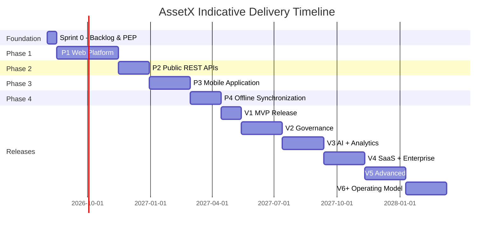

### 47.2 Phase Sequencing & Duration

| Phase | Typical Duration (indicative) | Key Output |
|---|---|---|
| Sprint 0 | 2 weeks | Backlog, PEP, environments |
| P1 Web | ~90 days | Web portal (MS-02) |
| P2 REST APIs | ~45 days | API surface (MS-03) |
| P3 Mobile | ~60 days | Mobile app (MS-04) |
| P4 Offline Sync | ~45 days | Offline capability (MS-05) |
| V1–V6+ | 60 days each (indicative) | Enterprise increments |

> Timeline updates require change management (§24). The Gantt reflects the approved relative order, not contractual absolute dates.

---

## 48. Phase Gates

Phase Gates are formal go/no-go checkpoints that govern progression between phases and releases. They enforce enterprise governance and auditability.

### 48.1 Gate Model

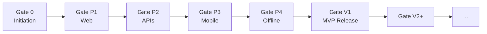

### 48.2 Gate Criteria (Generic)

Each gate requires sign-off from the accountable bodies:

| Criterion | Gate 0 | Gate P1–P4 | Gate V1–V6+ |
|---|---|---|---|
| Scope delivered per plan | ✔ | ✔ | ✔ |
| DoD met (100%) | ✔ | ✔ | ✔ |
| Quality gates green | ✔ | ✔ | ✔ |
| Security sign-off | ✔ | ✔ | ✔ |
| Performance targets met | — | ✔ | ✔ |
| Documentation updated | ✔ | ✔ | ✔ |
| Risks reviewed | ✔ | ✔ | ✔ |
| CAB approval | ✔ | ✔ | ✔ |
| Success criteria check | — | — | ✔ |

### 48.3 Gate Governance

- **Gate owner:** TPM.
- **Reviewers:** CAB (+ TRB for architecture, SRB for security).
- **Outcome:** Approve / Approve-with-conditions / Reject (with remediation).
- **Gate records:** logged and auditable (Decision Log §49).


---

## 49. Decision Log

The Decision Log records significant project decisions (architecture, scope, delivery, security) with rationale, alternatives, and approvals. It complements the ADR log (AAB §11P/§11AD) and the change process (§24).

### 49.1 Decision Log Table

| ID | Date | Decision | Rationale | Alternatives Considered | Approver |
|---|---|---|---|---|---|
| `DEC-001` | 2026-08-03 | Enterprise scope architecture; incremental implementation | Avoid redesign per release | Full MVP-only scope | CAB |
| `DEC-002` | 2026-08-03 | Design Web + Mobile together; implement Web first | Shared architecture; staged value | Mobile-first only | CAB |
| `DEC-003` | 2026-08-03 | Mandatory doc order 01→18; domain drives DB | Business-driven architecture | DB-first | CAB/TRB |
| `DEC-004` | 2026-08-03 | Approved tech stack (Next.js/NestJS/Supabase/Flutter) | Alignment with AAB | Alternatives | CAB/TRB |
| `DEC-005` | 2026-08-03 | Modular Monolith first (ADR-002) | Manageable for small team | Microservices-first | TRB |
| `DEC-006` | 2026-08-03 | `tenant_id` + RLS (ADR-004) | Multi-tenant ready, single tenant MVP | Schema/DB-per-tenant | TRB |
| `DEC-007` | 2026-08-03 | Trunk-based dev + phase gates | Delivery predictability + agility | Feature-branch heavy | TPM/CAB |
| `DEC-008` | 2026-08-03 | Blue/Green + canary + feature flags (ADR-014) | Reversible, low-risk releases | Direct deploy | CAB |

> This log is append-only; new decisions are added via change management. It is reviewed at each phase gate.

### 49.2 Open Decision Items (tracked)

| ID | Topic | Owner | Due | Status |
|---|---|---|---|---|
| `DEC-OPEN-1` | Final billing/subscription model | PO | V4 planning | Open |
| `DEC-OPEN-2` | Data residency for specific tenants | SecOps/Architect | V4 planning | Open |
| `DEC-OPEN-3` | Third-party AI provider abstraction details | Architect | V3 planning | Open |

---

## 50. Appendix

### 50.1 Acronyms & Glossary

| Term | Definition |
|---|---|
| AAB | AssetX Architecture Bible (Single Source of Truth) |
| ADR | Architecture Decision Record |
| CAB | Change Approval Board |
| TRB | Technical Review Board |
| SRB | Security Review Board |
| DoR / DoD | Definition of Ready / Definition of Done |
| TPM | Technical Program Manager |
| PO | Product Owner |
| RLS | Row-Level Security |
| LWW | Last-Write-Wins (conflict resolution) |
| NFR | Non-Functional Requirement |
| SLA / SLO | Service Level Agreement / Objective |
| RPO / RTO | Recovery Point / Recovery Time Objective |
| PITR | Point-in-Time Recovery |
| SAST / DAST / SCA | Static / Dynamic / Software Composition Analysis |
| IaC | Infrastructure as Code |
| UAT | User Acceptance Testing |
| E2E | End-to-End (testing) |
| SemVer | Semantic Versioning |
| UUID | Universally Unique Identifier |

### 50.2 References

| Reference | Location |
|---|---|
| AssetX Architecture Bible v6.0 | `AssetX_Architecture_Bible/` (AAB) |
| Master Context Document | `AssetX_README (3).md` |
| Product README | `README.md` |
| This PEP | `Execution/Project_Execution_Plan.md` |

### 50.3 Templates & Artifacts (linked in tracker)

- PR Template (§35).
- Release Notes Template.
- Phase Gate Review Template.
- Risk Register Template.
- Go-Live Checklist (§42).
- Runbook Templates (RB-001…RB-006).

### 50.4 Definitions of Terms Used

- **Increment:** sum of all Done product backlog items produced in a Sprint (Scrum).
- **Phase Gate:** formal go/no-go checkpoint between phases/releases.
- **Release Train:** cadence of coordinated releases.
- **Hypercare:** intensified support period immediately post go-live.

### 50.5 Compliance & Standards Map

| Standard | Application in PEP |
|---|---|
| PMBOK (PMI) | Scope/schedule/risk/comms/stakeholder management |
| MSF | Team model, release readiness, risk discipline |
| IEEE 830 / 12207 / 1061 | Documentation, lifecycle, quality metrics |
| Scrum Guide 2020 | Framework, roles, events, artifacts |
| TOGAF (informed) | Architecture governance, phased development |

---

## End of Project Execution Plan (PEP)

> This document is a **living deliverable** and the **official execution manual** of AssetX. It is governed by the AssetX Architecture Bible v6.0 (Single Source of Truth). Any change to this plan requires Change Management (§24) and CAB approval.
>
> **Next actions:** Approve PEP v1.0 at Gate 0, then execute Sprint 0 (backlog + environments) to begin Phase 1 — Web Platform.


---

## 50.6 Deep-Dive: Delivery Governance Operating Rhythm

This appendix expands the operating rhythm that ties the governance bodies, ceremonies, and artifacts into a continuous, auditable cadence. It operationalizes the "Scrum with Phase Gates" hybrid described in §11 and the communication plan in §21.

### 50.6.1 Weekly Operating Cadence

| Day | Activity | Lead | Participants | Output |
|---|---|---|---|---|
| Monday AM | Backlog Refinement | PO | PO, Team, Architect | Refined/estimated backlog items |
| Monday PM | Architecture Clinic | Architect | Architect, leads | Design decisions, ADR inputs |
| Tuesday | Daily Scrum + pairing | SM | Team | Impediment log, progress |
| Wednesday | Security checkpoint | SecOps | SecOps, DevOps, QA | Security findings, threat updates |
| Thursday | Risk review | TPM | TPM, risk owners | Updated risk register |
| Friday | Sprint Planning (or Review/Retro on close) | SM | Team, PO | Sprint goal, committed backlog |
| Friday PM | Weekly status report | TPM | Stakeholders | Progress, risks, decisions needed |

### 50.6.2 Monthly Executive Cadence

| Activity | Lead | Audience | Focus |
|---|---|---|---|
| Executive Dashboard Review | TPM | Sponsors | KPIs, milestones, outcomes |
| Steering Checkpoint | TPM/PO | Sponsors, CAB | Strategic alignment, funding, decisions |
| Risk & Dependency Review | TPM | CAB | Top risks, escalations |
| Roadmap Refresh | PO | Sponsors | Release outlook, prioritization |

### 50.6.3 Cadence Governance Rules

- The cadence is the **default**; deviations require coordination and are logged.
- All cadence artifacts are stored in the shared project workspace for traceability.
- Cadence health is reviewed at each Sprint Retrospective.

---

## 50.7 Deep-Dive: Role of the Architect in Delivery

The Senior Enterprise Solution Architect is embedded in delivery but remains an **independent gatekeeper of architecture fidelity**. Their delivery accountabilities include:

| Activity | Detail |
|---|---|
| ADR maintenance | Author and maintain ADRs (AAB §11P/§11AD); ensure every architecture-affecting PR maps to an ADR |
| Design review | Review technical design documents and architecture-affecting PRs (approval required) |
| Module boundaries | Enforce Bounded Contexts (§11A) and module boundaries to preserve the Modular Monolith |
| Data model governance | Ensure Domain drives Database (approved decision); review migrations |
| Integration strategy | Maintain the Integration Catalog (AAB §11U) and adapter strategy |
| AI design | Oversee AI tiering (L1/L2/L3) and provider abstraction |
| Technical debt | Maintain the Technical Debt Register (AAB §11V) |
| TRB participation | Present architecture decisions to TRB; record outcomes |

> The Architect is **consulted** on scope and **accountable** for architecture quality (RACI §9.1). They do **not** single-handedly block delivery without rationale; disagreements are escalated to TRB.

---

## 50.8 Deep-Dive: Multi-Tenant Execution Considerations

Per ADR-004 and AAB §11J, multi-tenancy is **designed** from the start but **activated incrementally**. Execution must respect this:

### 50.8.1 Tenant-Readiness in Early Phases

- Every business table includes `tenant_id` + RLS policies (AAB §11K).
- UUID technical identifiers used throughout (ADR-001).
- Data-access layers resolve the current tenant at runtime.
- MVP operates a single tenant but through the same tenant-scoped code paths.

### 50.8.2 Multi-Tenant Activation (V4)

- Full tenant onboarding, subscription/billing.
- RLS fully exercised; tenant admin roles.
- Integration hub for external systems.
- White-label branding.

### 50.8.3 Execution Controls

| Control | Description |
|---|---|
| Tenant isolation tests | Verify no cross-tenant data leakage |
| RLS policy tests | Automated tests for policy enforcement |
| Tenant lifecycle | Onboard, suspend, offboard procedures |
| Data residency | Per-tenant residency decisions (DEC-OPEN-2) |

---

## 50.9 Deep-Dive: AI Layer Execution Plan

The AI layer is tiered (L1/L2/L3) per ADR-013 and AAB §11E/§12. Execution sequencing:

### 50.9.1 AI Tiers & Delivery

| Tier | Capabilities | Delivery Phase | Data Requirement |
|---|---|---|---|
| L1 | Smart search, duplicate detection, NL reports, anomaly | V3 | Existing operational data |
| L2 | Image comparison, auto-classification, root cause | V4 | Photos + cumulative history |
| L3 | Predictive maintenance, voice, smart route | V5+ | Large data volumes |

### 50.9.2 AI Execution Principles

- **Provider abstraction** (OpenAI/LangGraph) to avoid lock-in.
- **Tiered activation** — do not build L3 before L1/L2 foundations.
- **Caching** of AI results; **batch processing** to control cost (AAB §11Y).
- **Cost KPIs** — monitor inference cost per request.
- **Data readiness gates** — AI tiers activate only when data volumes justify.

### 50.9.3 AI Risk & Governance

| Aspect | Control |
|---|---|
| Accuracy | Human-in-the-loop for critical outputs |
| Cost | Cost KPIs; caching; quantization |
| Data privacy | No PII leakage; classification (AAB §11W) |
| Bias | Review of model behavior on Arabic content |

---

## 50.10 Deep-Dive: Offline-First Execution Plan

Offline-first is the strategic differentiator (§2) and the most complex delivery area (RK-01, RK-06). Execution plan:

### 50.10.1 Offline Architecture (from AAB ADR-003, §11)

```
Phone → SQLite (Local) → Queue → API → Server (Cloud) → Ack → Update Local DB
```

### 50.10.2 Sync Engine Execution

| Concern | Approach |
|---|---|
| Local storage | SQLite via repository pattern |
| Change capture | Local change log / queue |
| Sync protocol | REST upload/download endpoints |
| Incremental sync | Timestamp/sequence-based deltas |
| Conflict resolution | LWW for simple fields; manual for critical |
| Conflict dashboard | Field ops management (AAB §11N) |
| Device management | Device ID + user + assigned campaign |

### 50.10.3 Offline-First Testing

- Offline create/edit/delete flows.
- Network interruption/recovery.
- Conflict scenarios (two devices modify same asset).
- Queue persistence across app restarts.
- Storage limits and eviction.
- Sync rate validation (≥ 1000 records/min).

### 50.10.4 Field Operations Governance

| Metric | Target |
|---|---|
| Device status visibility | Online/offline/last-seen |
| Last sync time | Per device |
| Pending records | Queued, unsynced |
| Failed sync | Count + reason |
| Unresolved conflicts | Count + resolution |

---

## 50.11 Deep-Dive: Observability & Operations Execution

Per ADR-006/ADR-010 and AAB §11R, observability is foundational and activated from the start (not deferred to V6):

### 50.11.1 Observability Stack

| Pillar | Tool |
|---|---|
| Metrics | Prometheus / Grafana |
| Logs | Loki |
| Tracing | OpenTelemetry |
| Errors | Sentry |
| Alerts | AlertManager → PagerDuty/Slack |
| External health | Uptime Kuma |

### 50.11.2 SLI / SLO / SLA & Error Budget

| Concept | Value |
|---|---|
| SLI | e.g., 99.95% API success |
| SLO | 99.9% monthly availability |
| SLA (MVP) | 99.5% |
| Error budget | 0.1% ≈ ~43 min/month allowed downtime |

### 50.11.3 Operations Execution

- Health checks + alerts armed in every environment.
- Runbooks (RB-001…RB-006) written and rehearsed.
- Backup + restore tested monthly (ADR-007).
- RPO/RTO: MVP 24h/8h; Enterprise 15min/1h.
- Incident response per AAB §11Q/§11S.

---

## 50.12 Deep-Dive: Cost & Performance Governance

Per AAB §11X/§11Y, cost and performance are governed continuously:

### 50.12.1 Performance Engineering

| Area | Approach |
|---|---|
| Caching | L1 in-memory (Redis), L2 CDN, L3 materialized views, L4 HTTP |
| Indexing | GIN (LTREE), B-Tree (asset_code/tenant_id), partial indexes |
| Pagination | Cursor-based (no OFFSET) |
| Partitioning | By tenant_id for large tables |
| Pooling | PgBouncer |
| Read replicas | For reporting/dashboards |

### 50.12.2 Capacity Planning

| Stage | Assets | Users | DB |
|---|---|---|---|
| MVP | 10K | 100 | Small |
| Growth | 100K | 1K | Medium + replica |
| Enterprise | 1M+ | 10K+ | Large + sharding |

### 50.12.3 Cost Management

- Auto-scaling; scale-to-zero when idle.
- Tiered storage (hot/warm/cold).
- Reserved instances for core servers (30–60% savings).
- Monthly cost review; retire unused resources.
- AI cost: caching, batch, quantization.

---

## 50.13 Deep-Dive: Quality & Testing Execution Details

### 50.13.1 Test Data Strategy

- Synthetic + masked production-like data in staging.
- Tenant-scoped test data; no cross-tenant leakage.
- Data fixtures versioned with code.

### 50.13.2 Test Environment

- Ephemeral preview environments per PR (Vercel previews).
- Shared staging approximating production.
- Production smoke tests post-deploy.

### 50.13.3 Performance Test Plan (k6)

| Test | Scenario |
|---|---|
| Load | 1000 concurrent users |
| Stress | Find breaking point |
| Soak | 24h sustained (memory leaks) |
| Spike | 10× sudden jump (inventory season) |

### 50.13.4 Security Testing

- SAST on every PR.
- DAST + SCA on release candidates.
- Quarterly penetration testing.
- OWASP ASVS L2 (MVP) / L3 (Enterprise).

### 50.13.5 Quality Gates (Final)

All CI stages must pass; any gate failure blocks merge/release. Quality is not negotiable for "Done."

---

## 50.14 Deep-Dive: Stakeholder & Change Interfaces

### 50.14.1 Integration with Architecture Bible

- The PEP references AAB decisions; it never redefines them.
- Changes to architecture flow through ADR → TRB → CAB.
- Changes to delivery flow through Change Management (§24).

### 50.14.2 Escalation & Decision Interfaces

| Interface | Owner | Purpose |
|---|---|---|
| Sprint-level | SM/Team | Remove blockers |
| Phase-level | TPM | Schedule/scope decisions |
| Architecture | TRB | Architecture decisions |
| Security | SRB | Security decisions |
| Strategic | CAB | Change/scope/risk approval |
| Executive | Sponsors | Funding/strategic direction |

### 50.14.3 Communication Records

All decisions, gate outcomes, and change approvals are recorded in the Decision Log (§49) and configuration baselines (§25) for full traceability.

---

## End of Project Execution Plan (PEP) — Appendices Complete

> The appendices above operationalize the PEP's core sections. They are part of the approved baseline and are governed by the same change management and review process.

---

## 50.15 Deep-Dive: Release Management Operating Procedure

### 50.15.1 Release Cycle Definition

A release cycle spans from code-freeze to production deployment and stabilization. It is governed by the Release Strategy (§30) and Release Readiness criteria (§41).

| Stage | Activity | Owner | Exit Criteria |
|---|---|---|---|
| Code Freeze | Merge window closes for new features | TPM | Backlog locked for release |
| Release Candidate | Branch `release/vX.Y` cut | DevOps | CI green on RC |
| Staging Validation | Full test pass + UAT | QA | All gates green |
| Security Review | SAST/DAST/SCA + SRB sign-off | SecOps | 0 critical/high findings |
| CAB Approval | Release readiness review | CAB | Approval recorded |
| Production Deploy | Blue/Green + canary | DevOps | Health check green |
| Verification | Smoke + monitoring | QA/DevOps | SLOs met |
| Stabilization | Hypercare + hotfix path | SRE | Go-live retrospective |

### 50.15.2 Feature Flags in Release

- Features behind flags are deployed dormant and activated by schedule/tenant.
- Flag health monitored; stale flags retired after stable rollout.
- Flags enable canary and progressive rollback without redeployment.

### 50.15.3 Rollback Procedure

| Trigger | Action |
|---|---|
| Health check fail after deploy | Automatic rollback to prior version |
| Critical defect discovered | Feature flag off / revert specific commit |
| Data migration issue | Restore from verified backup (PITR) |

> Rollback is rehearsed in staging before every major release.

---

## 50.16 Deep-Dive: Change Management Detailed Workflow

### 50.16.1 Change Request Lifecycle

```mermaid
flowchart TD
    A[Change Request Raised] --> B[Logged in Change Log]
    B --> C[Impact Assessment]
    C --> D{Type?}
    D -->|Scope/Schedule| E[CAB Review]
    D -->|Architecture/Tech| F[TRB Review + ADR]
    F --> E
    E --> G{Decision}
    G -->|Approve| H[Update Baselines & Plan]
    G -->|Reject| I[Notify Requester & Close]
    H --> J[Implement + Verify]
    J --> K[Record in Decision Log]
```

### 50.16.2 Impact Assessment Fields

| Field | Purpose |
|---|---|
| Description | What changes and why |
| Impact scope | Affected deliverables, modules, teams |
| Schedule impact | Milestones/sprints affected |
| Architecture impact | ADR relevance |
| Risk impact | New/updated risks |
| Cost/resource impact | Effort, budget |
| Alternatives | Options considered |
| Recommendation | Preferred option + rationale |

### 50.16.3 Emergency Change Path

- For critical production incidents, an expedited change is authorized by the on-call lead.
- CAB is notified within 24 hours for retroactive approval.
- Emergency changes are logged and reviewed for process improvement.

---

## 50.17 Deep-Dive: Reporting & Metrics Definitions

### 50.17.1 Velocity & Capacity

- **Story Points:** Fibonacci (1,2,3,5,8,13,21).
- **Velocity:** average story points completed per sprint.
- **Capacity planning:** velocity adjusted for leave, ceremonies, and technical debt.

### 50.17.2 Lead Time & Cycle Time

- **Lead time:** request → delivered.
- **Cycle time:** work started → delivered.
- Tracked to identify bottlenecks; reviewed in retrospectives.

### 50.17.3 Defect Metrics

| Metric | Definition | Target |
|---|---|---|
| Defect density | Defects per module/KLOC | Declining |
| Defect escape | Defects found in prod / total | ≤ 5% critical |
| Mean time to resolve | Avg time to close defect | Decreasing |
| Reopen rate | % reopened defects | < 10% |

### 50.17.4 Reporting Frequency & Owners

| Report | Frequency | Owner |
|---|---|---|
| Velocity/Burndown | Continuous | SM |
| Quality Report | Weekly | QA |
| Security Report | Per gate | SecOps |
| Risk Register | Weekly | TPM |
| Release Readiness | Per release | TPM |
| Executive Dashboard | Monthly | TPM |

---

## 50.18 Deep-Dive: Operations & Maintenance Interfaces

### 50.18.1 Service Transition

- Development → Operations transition via documented handover.
- Runbooks, dashboards, alerts, and support escalation live with SRE.
- Training provided to support staff before go-live.

### 50.18.2 Support Tiers in Operation

| Tier | Handles | Escalates To |
|---|---|---|
| L1 Service Desk | Triage, common issues | L2 |
| L2 Product/Technical | Bug fixes, config | L3 |
| L3 Architecture/Engineering | Deep technical issues | Architect/Senior |

### 50.18.3 Maintenance Windows & SLAs

- Scheduled maintenance communicated via SLA notice.
- Emergency maintenance only with change management.
- SLA targets tracked in monitoring dashboards.

---

## 50.19 Deep-Dive: Security Posture Execution

### 50.19.1 Identity & Access

- **Auth:** Supabase Auth, JWT, refresh tokens, MFA-ready.
- **Authorization:** RBAC + granular per-module permissions (View/Add/Edit/Delete/Print).
- **Least privilege:** users get only required permissions (BR-SEC-005).

### 50.19.2 Data Protection

- Encryption at rest (AES-256); in transit (TLS 1.3).
- Password hashing with bcrypt/argon2 (cost ≥ 12).
- Data classification and PII handling (AAB §11W).
- Retention policies: assets permanent; audit 7 years; inventory 5 years.

### 50.19.3 Application Security

- OWASP ASVS L2 (MVP), L3 (Enterprise).
- SAST/DAST/SCA in CI/CD.
- Input validation (Zod), output encoding, rate limiting.
- Secure session management; revocation.

### 50.19.4 Security Monitoring & Response

- SIEM + threat detection.
- Audit monitoring of sensitive operations.
- Incident response: Detect → Contain → Eradicate → Recover → Lessons.

---

## 50.20 Deep-Dive: Data Management & Migration Execution

### 50.20.1 Legacy Data Migration

Per AAB §11M, the legacy system (WPF/C#/SQL Server, 17 tables) is a **knowledge source**, and its data is migrated through a 7-stage pipeline:

```
Extract → Profile → Cleansing → Validation → Transformation → Import → Reconciliation
```

### 50.20.2 Cleansing Rules

- Duplicate detection (Levenshtein ≥ 90% + same location → merge alert).
- Missing data (asset without location/status/type → warning).
- Illogical data (negative value, future date, depreciation > 100%).
- UTF-8 normalization, trim, remove double spaces.

### 50.20.3 Migration Report

Per `TableImportResult` pattern: imported / skipped / failed / warnings per table. Reconciliation compares legacy vs new counts.

### 50.20.4 Data Governance in Execution

- Data ownership per dataset (AAB §11W).
- Master data single-source-of-truth.
- Data quality rules enforced at entry.
- Retention, archiving, soft-delete enforced.

---

## End of Project Execution Plan (PEP) — Final

> **Document Status:** Approved Baseline v1.0. This is the official execution manual of AssetX, governed by the AssetX Architecture Bible (Version 6.0) as the Single Source of Truth. All execution, delivery, and governance decisions are governed by this plan and its references.
