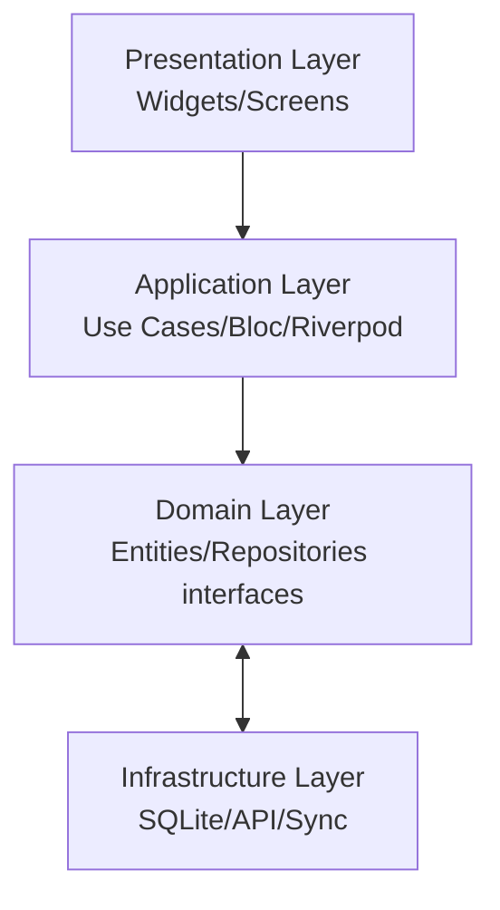
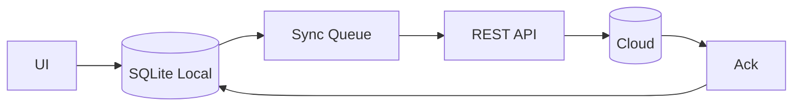
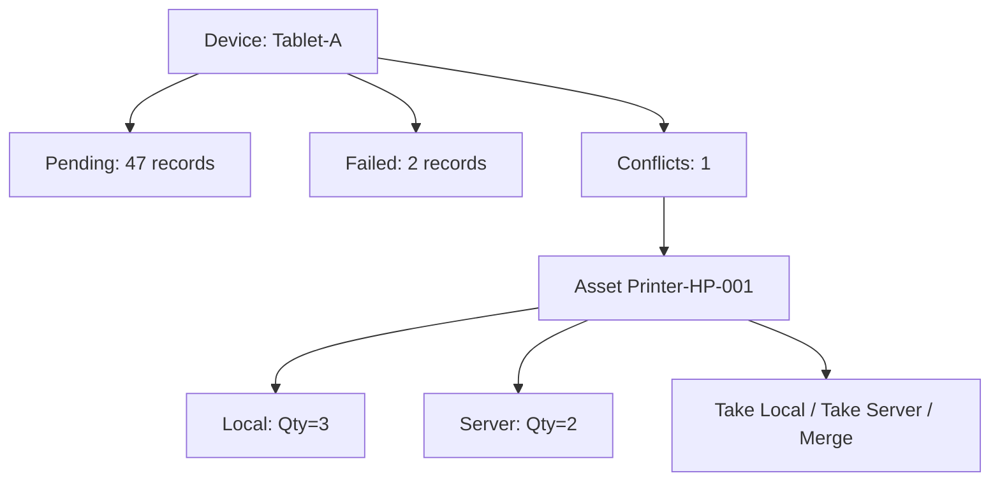

# MOBILE TECHNICAL SPECIFICATION
## AssetX Mobile Field Application

> **Document ID:** `MOB-SPEC-001` | **Version:** 1.0 | **Status:** Approved Baseline
> **Reference:** AAB v6.0 (§8, §11N, ADR-003) · SAD · PEP v1.0
> **Path:** `Mobile/Mobile_Technical_Specification.md`

---

## 0. Document Control

| Field | Value |
|---|---|
| **Document Title** | Mobile Technical Specification |
| **Document Owner** | Mobile Lead / Solution Architect |
| **Contributors** | Mobile Team, Backend, QA |
| **Authoritative Basis** | AAB v6.0; Offline-First (ADR-003) |
| **Approval Body** | CAB |
| **Version** | 1.0 |

---

## 1. Introduction

### 1.1 Purpose

Specifies the technical architecture and implementation of the **AssetX Mobile Field Application** — the offline-first field inventory client for Android, iOS, and Tablet, built with **Flutter**.

### 1.2 Scope

Mobile app functionality, offline architecture (SQLite + sync queue + conflict resolution), QR/barcode, camera, GPS, notifications, device management, and performance. The app is a **first-class citizen** designed alongside the Web portal; implemented in Phase 3 (after Web + REST APIs).

---

## 2. Platform & Tools

| Item | Choice |
|---|---|
| Framework | Flutter (cross-platform) |
| Platforms | Android, iOS, Tablet |
| Local DB | SQLite |
| Data access | Repository Pattern |
| Sync | Sync Queue + Conflict Resolution + Incremental |
| QR/Barcode | Camera-based scanner |
| GPS | Location services |
| Camera | Photo capture |
| NFC / Bluetooth | Ready (V5+) |
| Notifications | Firebase Cloud Messaging (FCM) |

### 2.1 Why Flutter (Approved Decision)

Cross-platform · Offline First · SQLite · High performance · Camera · QR scanner · NFC-ready · GPS-ready · Bluetooth-ready.

---

## 3. Application Architecture

### 3.1 Clean Architecture Layers



### 3.2 State Management

- Flutter with a state management approach (Riverpod/Bloc) for reactive UI + offline state.
- Repository pattern abstracts data source (SQLite vs API).

### 3.3 Module Structure

```text
lib/
├── features/
│   ├── auth/
│   ├── inventory/
│   ├── assets/
│   └── sync/
├── core/ (theme, navigation, networking, db, sync engine)
├── domain/ (entities, repositories, use cases)
└── main.dart
```

---

## 4. Offline-First Architecture (Core)

### 4.1 Sync Pipeline (ADR-003)



### 4.2 Components

| Component | Responsibility |
|---|---|
| **Local DB (SQLite)** | Store entities + change log; offline operation |
| **Change Log / Queue** | Capture local mutations (create/update/delete) |
| **Sync Manager** | Upload queue, download changes, apply ack |
| **Incremental Sync** | Transfer only changes since last sync |
| **Conflict Resolver** | LWW for simple fields; manual for critical |
| **Repository** | Abstract data source (local vs remote) |

### 4.3 Offline Behavior Rules

- All field operations work fully offline.
- Records saved locally first, queued for sync.
- On reconnect, queue uploads then downloads deltas.
- No data loss on network failure / app restart (queue persisted).

---

## 5. Conflict Resolution

### 5.1 Strategy (ADR-003)

| Field Type | Resolution |
|---|---|
| Simple fields (quantity, location) | Last-Write-Wins (LWW) with versioning |
| Critical fields (disposal, high-value) | Manual resolution via conflict dashboard |
| Conflicts | Logged; surfaced in Field Operations Management |

### 5.2 Conflict Dashboard (AAB §11N)



---

## 6. Field Inventory Features

| Feature | Description |
|---|---|
| Quick Match | One-tap match selected asset |
| Bulk match by location | Match all assets of a location |
| Undo inventory | Reset record to "Not Inventoried" |
| Verification | Verify/Unverify/VerifyAll + who/when |
| Auto-advance | Auto-move to next record |
| Actual holder tracking | Capture actual custodian |
| QR scan → display | < 300 ms |
| Photo capture | Attach proof photo |
| GPS verification | Prove presence at location |
| Print empty form | Generate blank inventory form |

---

## 7. QR / Barcode

- Generate/display QR from full asset code.
- Scan via camera to select asset.
- Support barcode scanning.
- **Performance:** QR scan → display < 300 ms.

---

## 8. Camera & Attachments

- Capture photos during inventory.
- Store to Supabase Storage (when online) or queue for sync.
- Image comparison (AI L2) in later versions.

---

## 9. GPS

- Record location at inventory time.
- GPS verification to prevent manipulation (AAB §16 new features).
- Works offline (last-known position).

---

## 10. Notifications (FCM)

- Push notifications for campaign assignments, sync failures, approvals.
- Works with Supabase Auth + FCM.
- Offline notifications queued/displayed on reconnect.

---

## 11. Device Management

| Capability | Description |
|---|---|
| Register device | Device ID + user + assigned campaign |
| Last seen | Online/offline status |
| Revoke device | Revoke + wipe local queue |
| Storage limit | Local storage cap + warning |

### 11.1 Sync Monitoring

| Metric | Description |
|---|---|
| Device status | Online/Offline/Last seen |
| Last sync | Time of last successful sync |
| Pending records | Queued, not yet uploaded |
| Failed sync | Count + reason |
| Conflicts | Unresolved count |

---

## 12. Security on Mobile

| Control | Implementation |
|---|---|
| Auth | Supabase Auth, JWT, refresh, MFA-ready |
| Local data | SQLite; encryption at rest |
| Token storage | Secure storage (Keychain/Keystore) |
| Offline data | Minimal retention; wipe on revoke |
| Audit | Inventory actions audited on sync |

---

## 13. Performance Targets

| Metric | Target |
|---|---|
| App cold start | < 2 s |
| QR scan → display | < 300 ms |
| Local record save | Immediate (no network) |
| Sync rate | ≥ 1000 records/min |
| Large cycle load | Responsive (lazy/virtualized lists) |

---

## 14. Accessibility & i18n

- Arabic-first UI + English; RTL/LTR.
- Large touch targets for field use.
- Clear visual status colors.

---

## 15. Testing Strategy (Mobile)

| Level | Scope |
|---|---|
| Widget/unit | Widgets, use cases, repositories |
| Integration | Local DB + sync flows |
| Device/E2E | Real device: offline, QR, camera, GPS |
| Sync tests | Conflict, incremental, queue recovery |
| Performance | Load/perf on device |

---

## 16. Release & Deployment

- Mobile releases via app stores (Android/iOS) with versioning.
- PWA consideration in V5.
- CI/CD: GitHub Actions for mobile build/test.

---

## 17. Traceability

| Mobile Feature | FRS / Epic |
|---|---|
| Offline inventory | FR-FLD |
| Sync engine | FR-SYN |
| QR/barcode | FR-FLD-002 / E-03 |
| Device mgmt | FR-SYN-005 |

---

## 18. References

| Reference | Location |
|---|---|
| SAD | Architecture/Software_Architecture_Document.md |
| API Spec | API/API_Specification.md |
| DDS | Database/Database_Design_Specification.md |
| Test Strategy | Testing/Test_Strategy.md |

---

## 19. Document Control (Closure)

| Field | Value |
|---|---|
| **Status** | Approved Baseline |
| **Approved By** | CAB |

> **End of Mobile Technical Specification.**
