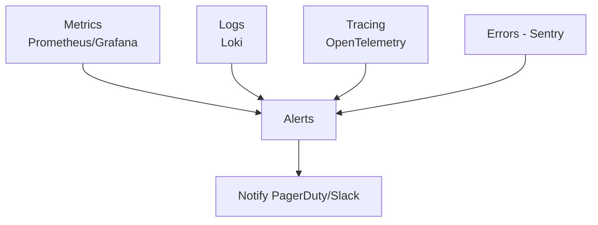
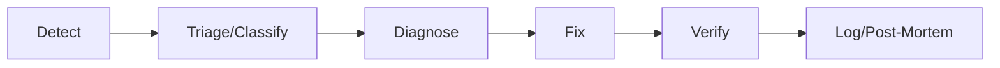
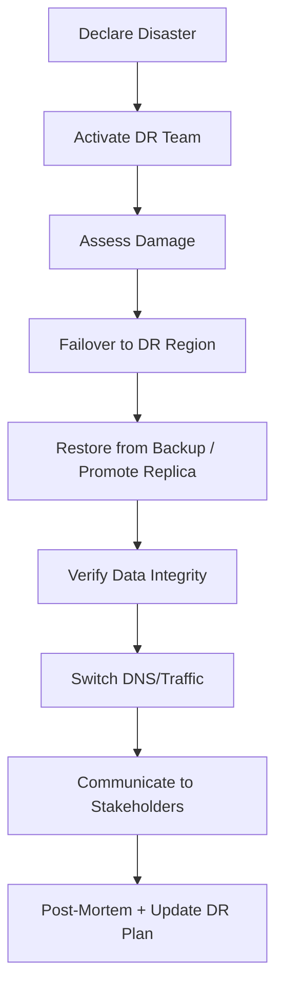

# OPERATIONS MANUAL
## AssetX Enterprise Platform — Operations & Runbooks

> **Document ID:** `OPS-MANUAL-001` | **Version:** 1.0 | **Status:** Approved Baseline
> **Reference:** AAB v6.0 (§11Q, §11R, §11T, §11U) · ADR-006/007/010/015 · PEP v1.0
> **Path:** `Operations/Operations_Manual.md`

---

## 0. Document Control

| Field | Value |
|---|---|
| **Document Title** | Operations Manual |
| **Document Owner** | DevOps/SRE Lead |
| **Contributors** | SecOps, Support, Architecture |
| **Authoritative Basis** | AAB v6.0 (Operations, Observability, DR) |
| **Approval Body** | CAB |
| **Version** | 1.0 |

---

## 1. Introduction

### 1.1 Purpose

Defines the **operating model** for AssetX in production: service management (ITSM), observability, incident response, backup/disaster recovery, integration operations, and runbooks.

### 1.2 Scope

Platform operations, monitoring, alerting, incident management, escalation, backup/DR, and operational procedures (Runbooks RB-001…RB-006).

---

## 2. Operating Model

### 2.1 Service Management (ITSM — AAB §11Q)

| Domain | Description |
|---|---|
| **Incident Management** | Classify (P1–P4) → diagnose → fix → log |
| **Problem Management** | Root-cause analysis of recurring incidents (RCA) |
| **Change Management** | Production changes via CR + CAB |
| **Release Management** | Versioning + rollback + release notes |
| **Configuration Mgmt** | Technology asset registry (CMDB) |
| **Service Desk** | Single ticket channel + SLA |

### 2.2 Escalation Matrix

| Priority | Response | Resolution | Notify |
|---|---|---|---|
| P1 (critical/outage) | 15 min | 2 hours | CTO + On-Call |
| P2 (high) | 1 hour | 8 hours | Team Lead |
| P3 (medium) | 4 hours | 3 days | Developer |
| P4 (low) | 24 hours | 2 weeks | Backlog |

---

## 3. Observability & Monitoring (AAB §11R)

### 3.1 Three Pillars

### 3.2 Monitoring Stack

| Concern | Tool |
|---|---|
| Metrics | Prometheus / Grafana |
| Logs | Loki |
| Tracing | OpenTelemetry |
| Errors | Sentry |
| Alerts | AlertManager → PagerDuty/Slack |
| External health | Uptime Kuma |

### 3.3 SLI / SLO / SLA & Error Budget

| Concept | Value |
|---|---|
| SLI | e.g., 99.95% API success |
| SLO | 99.9% monthly |
| SLA (MVP) | 99.5% |
| Error budget | 0.1% ≈ ~43 min/month |

> If error budget exhausted → freeze new features, focus on stability.

### 3.4 Monitoring KPIs

| KPI | Target |
|---|---|
| Uptime | ≥ 99.9% |
| API p95 | < 500 ms |
| API error rate | < 0.1% |
| Sync success | ≥ 99.5% |
| DB query p95 | < 100 ms |
| Background jobs success | ≥ 99% |

---

## 4. Incident Management

### 4.1 Incident Lifecycle

### 4.2 Incident Severity

| Severity | Definition | Example |
|---|---|---|
| P1 | System down / data loss risk | Full outage |
| P2 | Major feature broken | Inventory broken |
| P3 | Minor feature | Cosmetic issue |
| P4 | Low/improvement | Enhancement request |

---

## 5. Backup & Disaster Recovery (ADR-007/015, AAB §11T)

### 5.1 Backup Strategy

| Type | Frequency | Retention |
|---|---|---|
| Full | Weekly | 4 weeks |
| Incremental | Daily | 30 days |
| WAL (continuous) | Continuous | 7 days |
| Snapshot | Every 6 h | 1 week |
| Archive | Monthly | 1 year+ |

### 5.2 Recovery Objectives

| Metric | MVP | Enterprise |
|---|---|---|
| RPO | 24 h | 15 min |
| RTO | 8 h | 1 hour |

### 5.3 DR Plan

> **Monthly restore test is mandatory** — an untested backup is no backup.

---

## 6. Runbooks

### 6.1 Runbook List (AAB §11Q)

| ID | Scenario |
|---|---|
| `RB-001` | Restore database from backup |
| `RB-002` | Handle mass sync failure |
| `RB-003` | Rollback a faulty release |
| `RB-004` | Scale up/out servers |
| `RB-005` | Stop a compromised tenant account |
| `RB-006` | Disaster recovery failover |

### 6.2 Runbook Format (template)

- **Purpose:** what the runbook resolves.
- **Prerequisites:** tools/access.
- **Steps:** numbered procedure.
- **Verification:** how to confirm resolution.
- **Escalation:** next-level contact.
- **Post-incident:** RCA notes.

---

## 7. Operations Schedule (AAB §11Q)

| Frequency | Tasks |
|---|---|
| **Daily** | Health check, review alerts, backup, error review |
| **Weekly** | Performance review, incident report, capacity check, sync failure review |
| **Monthly** | Security review, restore test, trend analysis, tech-debt review |
| **Quarterly** | Penetration testing, DR drill, capacity planning |
| **Annual** | Full architecture review, ADR updates, compliance audit |

---

## 8. Integration Operations (AAB §11U)

- Webhook retry strategy (5 attempts: 30s, 5m, 30m, 2h, 12h) → Dead Letter Queue.
- mTLS for sensitive integrations.
- Rate limiting per integration.
- Webhook signature verification (HMAC).

---

## 9. Security Operations (AAB §11S)

| Domain | Practice |
|---|---|
| Security monitoring | 24/7 suspicious patterns + SIEM |
| Threat detection | IDS/IPS + anomaly |
| Vulnerability mgmt | SAST/DAST/SCA + CVSS |
| Secrets mgmt | Vault |
| Key rotation | 90-day |
| Certificate mgmt | Auto-renew |
| Incident response | Detect→Contain→Eradicate→Recover→Lessons |

---

## 10. Post-Go-Live Support (from PEP §43)

- **Hypercare** first 2–4 weeks with intensified monitoring.
- L1/L2/L3 support model.
- Feedback loop into backlog.
- Stabilization sprints for post-go-live defects.

---

## 11. Operations Roles & Responsibilities

| Role | Responsibility |
|---|---|
| SRE/DevOps | Monitoring, deployments, runbooks |
| On-call | Incident response |
| Support L1/L2/L3 | Ticket resolution |
| SecOps | Security monitoring |
| Architect | Deep technical escalation |

---

## 12. Traceability

| Ops Element | Reference |
|---|---|
| ITSM | AAB §11Q |
| Observability | ADR-006/010, AAB §11R |
| Backup/DR | ADR-007/015, AAB §11T |
| Integration ops | ADR-008, AAB §11U |
| SecOps | AAB §11S |

---

## 13. References

| Reference | Location |
|---|---|
| AAB v6.0 | AssetX-Architecture-Bible/ |
| CI/CD Guide | DevOps/CI_CD_Guide.md |
| Security Architecture | Security/Security_Architecture.md |
| PEP (support) | Execution/Project_Execution_Plan.md |

---

## 14. Document Control (Closure)

| Field | Value |
|---|---|
| **Status** | Approved Baseline |
| **Approved By** | CAB |

> **End of Operations Manual.**
