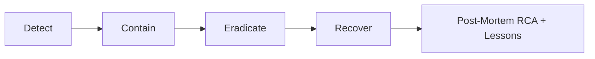

# SECURITY ARCHITECTURE
## AssetX Enterprise Platform

> **Document ID:** `SEC-ARCH-001` | **Version:** 1.0 | **Status:** Approved Baseline
> **Reference:** AAB v6.0 (§10, §11S, §11W, §13.5, §13.14) · ADR-004 · NFR · PEP v1.0
> **Path:** `Security/Security_Architecture.md`

---

## 0. Document Control

| Field | Value |
|---|---|
| **Document Title** | Security Architecture |
| **Document Owner** | Security Lead / SecOps |
| **Contributors** | Solution Architect, DevOps |
| **Authoritative Basis** | AAB v6.0 (Security §10, SecOps §11S) |
| **Review Body** | Security Review Board |
| **Approval Body** | CAB |
| **Version** | 1.0 |

---

## 1. Introduction

### 1.1 Purpose

Defines the **security architecture** of AssetX: security principles, identity & access management, application security, data protection, network/cloud security, audit, and SecOps. It operationalizes "Security by Design" and "Audit by Design."

### 1.2 Scope

Covers the Web Portal, REST APIs (NestJS), Mobile app, database (PostgreSQL/Supabase), AI layer, and operations — per the approved stack and OWASP ASVS.

---

## 2. Security Principles (AAB §5/§10)

| Principle | Meaning |
|---|---|
| **Security by Design** | Built-in, not an add-on |
| **Audit by Design** | Every operation traceable |
| **Least Privilege** | Minimal required permissions (BR-SEC-005) |
| **Defense in Depth** | Layered controls |
| **Zero Trust posture** | Verify everything, trust nothing |
| **Privacy by Design** | PII handled per data classification |

---

## 3. Security Objectives

| Objective | Target |
|---|---|
| Protect data confidentiality & integrity | AES-256 at rest; TLS 1.3 |
| Enforce access control | RBAC + granular permissions + RLS |
| Maintain compliance | OWASP ASVS L2 (MVP) / L3 (Enterprise) |
| Ensure auditability | Immutable audit trail |
| Detect & respond to threats | SecOps, SIEM, monitoring |

---

## 4. Identity & Access Management (IAM)

### 4.1 Authentication

| Component | Implementation |
|---|---|
| Identity provider | Supabase Auth |
| Tokens | JWT (15 min) + Refresh (7 days) |
| MFA | Ready (OTP/app) — V2 |
| SSO | Ready (OAuth2/SAML) — V3 |
| Password hashing | bcrypt/argon2 (cost ≥ 12) |
| Session management | Remote revocation |

### 4.2 Authorization

| Component | Implementation |
|---|---|
| Model | RBAC + granular per-module permissions |
| Permissions | View/Add/Edit/Delete/Print per module |
| Per-user grants | Supported (AAB §13.5) |
| Enforcement | NestJS guards; API middleware |
| Tenant scope | RLS (tenant_id) |

### 4.3 Roles (from AAB §15)

Administrator · Asset Manager · Auditor · Department Manager · Inventory Team · Maintenance · Employee.

---

## 5. Application Security (OWASP ASVS)

| Control | Implementation |
|---|---|
| Input validation | Zod / class-validator |
| Output encoding | Framework defaults |
| Authentication | JWT (Supabase) |
| Authorization | RBAC + RLS |
| Session mgmt | Secure, revocable |
| Access control | Least privilege |
| Error handling | No sensitive leakage |
| Logging | Audit by design |
| Rate limiting | Per tenant/user |
| CSRF/XSS protection | Framework (Next.js/NestJS) |
| API security | OpenAPI, security headers |

---

## 6. Data Protection

### 6.1 Encryption

| Concern | Implementation |
|---|---|
| At rest | AES-256 (DB + storage) |
| In transit | TLS 1.3 |
| Passwords | bcrypt/argon2 (cost ≥ 12) |
| Secrets | Vault; never in code |
| Key rotation | Rotate signing keys every 90 days |

### 6.2 Data Classification & PII (AAB §11W)

| Class | Handling |
|---|---|
| Public | Default |
| Internal | Access controlled |
| Confidential | Encryption + limited access |
| Restricted (PII) | Employee names/phones encrypted + restricted |

### 6.3 Data Isolation (Multi-Tenant)

- `tenant_id` on all business tables + **RLS** (ADR-004).
- Automated RLS isolation tests.
- No cross-tenant leakage.

---

## 7. Network & Cloud Security

| Control | Implementation |
|---|---|
| TLS | TLS 1.3 everywhere |
| API Gateway | Central auth/rate-limit entry |
| mTLS | For sensitive integrations (ERP/Finance) |
| Secrets | Vault (HashiCorp/AWS Secrets) |
| Security headers | HSTS, CSP, X-Frame-Options |

---

## 8. Audit & Monitoring

### 8.1 Audit (by Design)

- Append-only audit log (immutable).
- Record: ActionType, TableName, RecordID, UserID, Date, Details, IP.
- Retention: 7 years.
- Audit of sensitive operations in real time.

### 8.2 Security Monitoring (AAB §11S)

| Capability | Implementation |
|---|---|
| Security monitoring | 24/7 suspicious patterns |
| Threat detection | IDS/IPS + anomaly |
| Vulnerability mgmt | SAST/DAST/SCA + CVSS |
| Secrets mgmt | Vault |
| SIEM | Aggregated security logs |
| Incident response | Detect→Contain→Eradicate→Recover→Lessons |

---

## 9. SecOps & Compliance

### 9.1 Security Operations

| Domain | Practice |
|---|---|
| Vulnerability management | Periodic scanning; patch by CVSS |
| Key rotation | 90-day rotation |
| Certificate mgmt | Auto-renew (Let's Encrypt/ACM) |
| Penetration testing | Quarterly + post major release |
| OWASP verification | ASVS L2 (MVP) / L3 (Enterprise) |
| Compliance monitoring | GDPR + local standards |

### 9.2 Compliance

| Requirement | Implementation |
|---|---|
| Data retention | Assets permanent; audit 7yr; inventory 5yr |
| Right-to-erasure | GDPR mode |
| Data classification | Enforced |
| Privacy | PII encryption + limited access |

---

## 10. Mobile Security

| Control | Implementation |
|---|---|
| Secure token storage | Keychain/Keystore |
| Local DB encryption | SQLite at rest |
| Offline data | Minimal retention; wipe on revoke |
| Device mgmt | Register/revoke + wipe queue |
| Auth | Supabase Auth + JWT + MFA-ready |

---

## 11. AI Security

| Control | Implementation |
|---|---|
| Data privacy | No PII leakage to models |
| Provider security | Secure API keys (Vault) |
| Output validation | Human-in-the-loop for critical |
| Cost & abuse | Rate limiting, caching |

---

## 12. Incident Response (AAB §11S)

### 12.1 Response Phases

### 12.2 Incident Response Plan

- P1-P4 severity classification.
- Escalation to CTO + on-call (P1).
- RB-005: stopping a compromised tenant account.
- Post-incident RCA documented.

---

## 13. Security Testing & Governance

| Practice | When |
|---|---|
| SAST | Every PR |
| DAST | Release candidates |
| SCA | Continuous dependency scan |
| Penetration test | Quarterly + post release |
| Threat modeling | Per feature/module |
| Security Review Board | Sensitive changes |

---

## 14. Security Roles & Responsibilities

| Role | Responsibility |
|---|---|
| Security Lead/SecOps | Security posture, monitoring |
| Solution Architect | Security architecture |
| DevOps | Secrets, infrastructure security |
| QA | Security test execution |
| Developers | Secure code practices |
| Security Review Board | Review sensitive changes |

---

## 15. Traceability

| Security Element | FRS/NFR |
|---|---|
| IAM | FR-AUT, FR-ADM, NFR-SEC |
| RLS | ADR-004, NFR-SEC-006 |
| Audit | FR-AUD, NFR-CMP-006 |
| Encryption | NFR-SEC-002/003 |

---

## 16. References

| Reference | Location |
|---|---|
| AAB v6.0 | AssetX-Architecture-Bible/ |
| NFR | Requirements/Non_Functional_Requirements.md |
| API Spec | API/API_Specification.md |
| Test Strategy | Testing/Test_Strategy.md |
| Operations Manual | Operations/Operations_Manual.md |

---

## 17. Document Control (Closure)

| Field | Value |
|---|---|
| **Status** | Approved Baseline |
| **Reviewed By** | Security Review Board |
| **Approved By** | CAB |

> **End of Security Architecture.**
