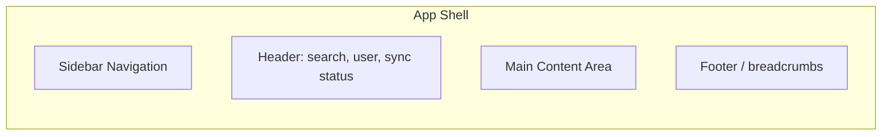
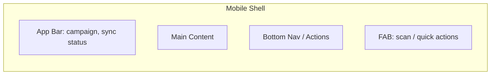

# UI/UX SPECIFICATION
## AssetX Enterprise Platform — Design System & Experience

> **Document ID:** `UX-SPEC-001` | **Version:** 1.0 | **Status:** Approved Baseline
> **Reference:** AAB v6.0 (§11, §11AA, §13.11) · PRD (Personas) · PEP v1.0
> **Path:** `UI-UX/UI_UX_Specification.md`

---

## 0. Document Control

| Field | Value |
|---|---|
| **Document Title** | UI/UX Specification |
| **Document Owner** | UX/UI Lead |
| **Contributors** | Product, Development (Web + Mobile), QA |
| **Authoritative Basis** | AAB v6.0; PRD personas; approved stack |
| **Approval Body** | CAB |
| **Version** | 1.0 |

---

## 1. Introduction

### 1.1 Purpose

Defines the **user experience and visual design system** for AssetX across the **Web Administration Portal** (Next.js) and **Mobile Field Application** (Flutter). It establishes design principles, design tokens, components, layouts, and experience guidelines for both platforms.

### 1.2 Scope

Design system, tokens, components, navigation, key user journeys, responsive behavior, dark mode, and accessibility — consistent across Web and Mobile.

---

## 2. Design Principles

1. **Clarity first** — complex asset data presented simply.
2. **Mobile-first for field** — optimized for outdoor/field use.
3. **Efficiency** — reduce taps/clicks in frequent flows (inventory).
4. **Offline awareness** — clear sync/offline status always visible.
5. **Consistency** — shared design system across Web + Mobile.
6. **Accessibility** — Arabic-first, RTL, touch targets.
7. **Trust** — audit/status clarity for governance.

---

## 3. Design System

### 3.1 Design Tokens

Tokens define the visual foundation (colors, typography, spacing, radius) used by both Web (Tailwind/shadcn) and Mobile (Flutter theme).

| Token Group | Examples |
|---|---|
| **Colors** | Primary, secondary, success, warning, danger, neutral, dark |
| **Status colors** | Distinct colors per asset status (AAB §13.9) |
| **Typography** | Type scale, weights, Arabic font support |
| **Spacing** | 4/8/12/16/24 scale |
| **Radius** | sm/md/lg |
| **Shadows** | Elevation levels |
| **Dark mode** | Token variants for dark theme |

### 3.2 Component Library

| Layer | Approach |
|---|---|
| Web | shadcn/ui components + Tailwind v4 |
| Mobile | Flutter widgets backed by same tokens |
| Consistency | Shared token/spec source |

### 3.3 Component Catalog (indicative)

Buttons · Inputs · Forms · Tables · Cards · Badges · Modals · Drawers · Toast/Notifications · Data grids · Charts · Filter bars · Status chips · QR display · Tabs · Steppers.

---

## 4. Platform Layouts

### 4.1 Web Administration Portal

- **Sidebar:** module navigation (Assets, Locations, Inventory, Reports, Dashboard, Admin).
- **Responsive:** desktop, tablet, mobile widths.
- **Dark mode:** toggle.

### 4.2 Mobile Field Application

- **Thumb-friendly:** bottom navigation, large buttons.
- **Field-first:** minimal typing, QR-driven.
- **Sync status:** persistent indicator (offline/online/pending).

---

## 5. Key User Journeys (UX)

### 5.1 Asset Manager (Web)

Login → Dashboard → Create Campaign → Monitor → Review → Approve → Report.

### 5.2 Field Agent (Mobile)

Open offline → Select campaign → Scan QR → Confirm → Photo → Save → Sync.

### 5.3 Auditor (Web)

Login → Review → Filter discrepancies → Verify → Notes → Approve.

### 5.4 UX Guidance per Journey

| Journey | UX Guidance |
|---|---|
| Field counting | Auto-advance, one-tap quick match, minimal typing |
| Campaign creation | Wizard: cycle details → locations → team → notify |
| Review/verification | Split-pane: expected vs actual, notes, verify controls |
| Reporting | Filter-first; preview before export |
| Dashboard | Live charts; drill-down to details |

---

## 6. Inventory Experience Details

| Feature | UX Treatment |
|---|---|
| Quick Match | Prominent one-tap button |
| Bulk match by location | Group action |
| Undo | Clear "Not Inventoried" reset |
| Verification | Verify/Unverify/VerifyAll with audit trail |
| Auto-advance | Auto focus next record |
| Actual holder | Optional field during count |
| Result color | Matched/Deficit/Surplus/Transferred/Missing/Not Inventoried color-coded |

---

## 7. Responsive & Multi-Platform

- **Web:** fluid from mobile to large desktop.
- **Mobile:** portrait + tablet landscape layouts.
- **Consistent behavior** across Android/iOS.

---

## 8. Dark Mode

- Token-driven dark theme for Web and Mobile.
- System-preference detection + manual toggle.

---

## 9. Accessibility & i18n

| Concern | Standard |
|---|---|
| Primary language | Arabic (authentic), English |
| Direction | RTL + LTR |
| Font | Arabic-optimized typography |
| Contrast | WCAG AA |
| Touch targets | ≥ 44px for field use |
| Keyboard (Web) | Ctrl+S save, F3 new, F4 copy, F5 refresh, Esc cancel |

---

## 10. Motion & Feedback

- Loading states (skeletons/spinners).
- Success/error toasts.
- Offline/sync status feedback.
- Confirmation dialogs for destructive actions (disposal, delete).
- Progress indicators for long operations (import, reports).

---

## 11. UX Metrics

| Metric | Target |
|---|---|
| Dashboard load | < 2 s |
| QR → display | < 300 ms |
| Task completion (inventory record) | Minimal taps |
| User satisfaction | ≥ 80% |

---

## 12. Accessibility Testing

- Verified in QA (automated + manual).
- Arabic RTL tested across platforms.

---

## 13. Traceability

| UX Element | PRD/FRS |
|---|---|
| Inventory UX | FR-FLD |
| Dashboard | FR-DSH |
| Reporting | FR-RPT |
| Dark mode/i18n | NFR-USR |

---

## 14. References

| Reference | Location |
|---|---|
| PRD | Requirements/Product_Requirements_Document.md |
| FRS | Requirements/Functional_Requirements_Specification.md |
| Mobile Spec | Mobile/Mobile_Technical_Specification.md |
| NFR | Requirements/Non_Functional_Requirements.md |

---

## 15. Document Control (Closure)

| Field | Value |
|---|---|
| **Status** | Approved Baseline |
| **Approved By** | CAB |

> **End of UI/UX Specification.**
