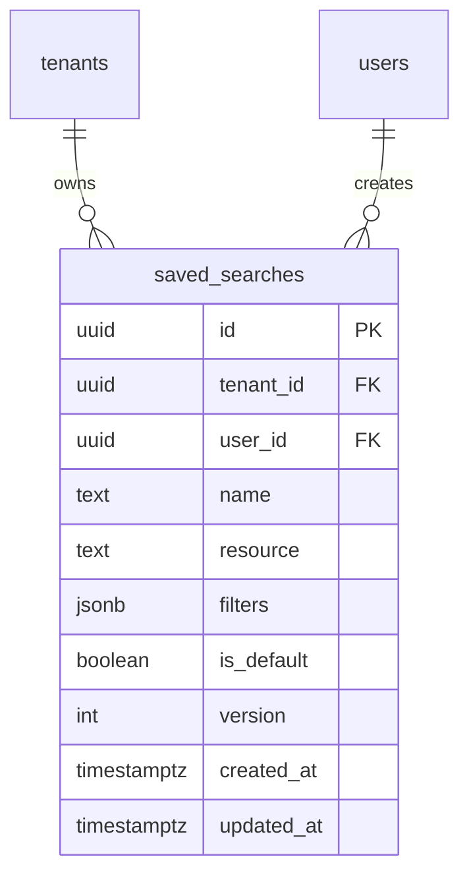

# ADR-011 — Introduce `saved_searches` Table

**Status:** Proposed — awaiting approval (do not apply migration until approved)
**Date:** 2026-08-03
**Deciders:** Senior Enterprise Solution Architect, TPM, Product Owner
**Approved decision referenced:** OD-2 → Option B (Advanced Search Design Specification)

---

## Context

Advanced Search (Phase 11.4) includes **Saved Searches** — users persist a named set of search filters and re-run them later. Per the approved design decision **OD-2 → Option B**, these are stored in a **dedicated `saved_searches` table** rather than reusing the existing `settings` key-value table.

## Why a new table is required

1. **Structured, typed storage:** a saved search is not a scalar key-value pair; it is a structured record (name, resource, filters JSON, owner user, timestamps, possibly shared flag). A dedicated table models this cleanly with real columns and constraints.
2. **Per-user ownership & isolation:** saved searches must be private and user-scoped. A dedicated table supports `user_id` + `tenant_id` + RLS naturally, and per-user CRUD with clear indexing.
3. **Queryability & management:** listing, ordering, and managing a user's saved searches (e.g. default flag) is far cleaner on a real table than string-concatenated keys in `settings`.
4. **Search/audit on saved searches:** a dedicated table integrates with RLS and future management screens without parsing opaque `setting_value` strings.

## Why existing tables cannot be reused

- **`settings`** is a generic key-value store for platform/tenant configuration (org name, logo, backup flags). Modeling saved searches there would require encoding structured JSON into `setting_value`, defeating type safety, per-user isolation (settings are tenant-scoped, not user-scoped), indexing, and management. It also pollutes the config store with high-churn user data.
- **`notifications` / `notification_templates`** are for delivery, unrelated to persisted query filters.
- No other existing table models "a named, user-owned query definition."

## Database impact

- **One new table:** `saved_searches`.
- **Columns:**
  - `id UUID PK`
  - `tenant_id UUID NOT NULL REFERENCES tenants(id)`
  - `user_id UUID NOT NULL REFERENCES users(id)`
  - `name TEXT NOT NULL`
  - `resource TEXT NOT NULL`  (assets | movements | audit)
  - `filters JSONB NOT NULL`  (the persisted SearchQuery filters)
  - `is_default BOOLEAN NOT NULL DEFAULT false`
  - `created_at TIMESTAMPTZ DEFAULT now()`
  - `updated_at TIMESTAMPTZ DEFAULT now()`
- **Indexes:**
  - `(tenant_id, user_id)` for per-user listing
  - `UNIQUE (tenant_id, user_id, name)` to prevent duplicate names per user
- **RLS:** enabled; tenant isolation via `current_tenant_id()` (same pattern as other business tables).
- No change to existing tables; no columns added elsewhere.

## Migration impact

- New file `db/migrations/003_saved_searches.sql` (additive, forward-only).
- Non-breaking: existing tables/features untouched.
- The `authenticated` role must be granted SELECT/INSERT/UPDATE/DELETE on the new table (same as other business tables) and RLS enabled.
- App bootstrap (db-init) will apply it alongside 001/002 once approved.

## Rollback strategy

- **Forward migration** (003) is additive. Rollback = run the inverse:
  ```sql
  DROP TABLE IF EXISTS saved_searches;
  ```
- Since it is a brand-new table with no dependencies on it elsewhere, dropping it has **no impact** on existing data or features.
- Any seeded saved-search rows are user data; rollback would remove them (acceptable pre-production).

## Future extensibility

- The table can be extended without breaking consumers:
  - `is_shared` / `shared_with` for team-shared searches.
  - `sort` + `page_size` defaults per saved search.
  - `tags` for organization.
  - Additional resource types (global) without schema change (filters is JSONB).
  - Soft-delete (`is_active`) if needed for user-facing "trash".

## Verification

- New integration/E2E tests cover: create/list/update/delete saved searches, per-user isolation (user A cannot see user B's), tenant isolation, and RLS enforcement.

---

## 1. Data Model

### 1.1 Entity-Relationship (ERD)



### 1.2 Relationships

| Relationship | Cardinality | Meaning |
|---|---|---|
| `tenants` → `saved_searches` | 1..N | A tenant owns many saved searches |
| `users` → `saved_searches` | 1..N | A user owns many saved searches (within a tenant) |

### 1.3 Ownership

- **Owner:** the `user_id` who created the saved search.
- **Scope:** ownership is **per (tenant_id, user_id)** — a saved search always belongs to exactly one tenant and one user.
- No cross-user or cross-tenant access by default.

### 1.4 Lifecycle

```
Created → Active → (Updated / Re-executed) → Archived/Deleted
```

- **Create:** user saves the current search filters.
- **Active:** available in the user's "Saved Searches" list.
- **Update:** user edits name/filters.
- **Execute:** user re-runs the saved search against current data (always live, not snapshotted).
- **Delete:** soft-friendly removal (per-manent delete acceptable; archiving is future extensibility).
- `is_default` marks the user's default saved search (max 1 per user).

---

## 2. Security

### 2.1 RLS Policies

Enabled on `saved_searches`; tenant isolation via `current_tenant_id()`:

| Policy | Scope |
|---|---|
| `SELECT` | `tenant_id = current_tenant_id()` |
| `INSERT` | `WITH CHECK (tenant_id = current_tenant_id())` |
| `UPDATE` | `USING (tenant_id = current_tenant_id()) WITH CHECK (tenant_id = current_tenant_id())` |
| `DELETE` | `USING (tenant_id = current_tenant_id())` |

### 2.2 Tenant isolation

- A tenant can never read/write another tenant's saved searches (RLS + `tenant_id`).
- Verified by tests (tenant A vs tenant B).

### 2.3 Ownership rules

- **Per-user privacy:** a user can only `SELECT/UPDATE/DELETE` their own rows (`user_id` enforced in the service layer in addition to RLS).
- Application-level check: `WHERE tenant_id = ? AND user_id = ?` on every operation.

### 2.4 Sharing rules

| Visibility | Future flag | Behavior |
|---|---|---|
| **Private** (default now) | `is_shared = false` | Only the owner sees it |
| **Shared** (future) | `is_shared = true`, `shared_with` | Selected users/teams |
| **Public** (future) | `is_shared = true`, `visibility='public'` | Tenant-wide (respecting RLS) |

> The table is designed **sharing-ready**: an `is_shared` boolean + optional `shared_with` JSONB can be added without breaking consumers. Sharing is **not implemented** in this phase.

---

## 3. Limits

| Limit | Value | Enforcement |
|---|---|---|
| Max saved searches per user | **50** | Service-layer check on INSERT |
| Max filter payload size | **4 KB** (JSONB serialized) | Service-layer validation before persist |
| Max sort conditions | **1** (this phase) | Query builder normalizes to single sort |
| Max name length | **80 chars** | Validation |
| `resource` allowed values | `assets` / `movements` / `audit` | Enum validation |
| Max `is_default` per user | 1 | Partial unique index `(tenant_id, user_id) WHERE is_default` |

### Validation rules

- `name` required, trimmed, ≤ 80 chars, non-empty.
- `resource` in allowed set.
- `filters` must be a valid JSON object; size ≤ 4 KB.
- Duplicate `name` for the same user+tenant → 409 CONFLICT.

---

## 4. Versioning

### 4.1 Surviving filter changes

- Saved searches store the **filter criteria** (not the result set). Re-executing always runs against current data, so filter-format evolution is handled by a **`version`** column.
- `filters` payload is stored under a schema version; consumers interpret it according to `version`.

### 4.2 Version field

- `version INT NOT NULL DEFAULT 1`.
- When the search filter schema changes (e.g. new fields), version is bumped; older saved searches are migrated/interpreted by version.

### 4.3 Migration strategy

- **Data migration:** a background/on-read migrator upgrades `filters` from version N → N+1.
- **Backward compatible:** keep parsing v1; only new features require v2.
- The `version` column is added now (default 1) so future changes don't need an ALTER.

---

## 5. Audit

Which operations are audited (via AuditService + `AUDIT_EVENTS`):

| Operation | Audit event | Metadata |
|---|---|---|
| **Create** | `SAVED_SEARCH_CREATED` | user, tenant, resource, name |
| **Update** | `SAVED_SEARCH_UPDATED` | user, tenant, id, changed fields |
| **Delete** | `SAVED_SEARCH_DELETED` | user, tenant, id, name |
| **Execute** | `SAVED_SEARCH_EXECUTED` | user, tenant, id, resource |

> New audit event keys added to `audit-events.ts` catalog. Execution is audited lightly (no result payload) to avoid audit bloat — consistent with the "Audit = what happened" principle.

---

## 6. Performance

### 6.1 Expected table growth

- Bounded by **50 saved searches × active users**. For 10k users → ~500k rows max (realistically far fewer).
- Low write rate (user-triggered); read rate = search execution.

### 6.2 Required indexes

| Index | Purpose |
|---|---|
| `(tenant_id, user_id)` | per-user listing |
| `UNIQUE (tenant_id, user_id, name)` | name uniqueness |
| Partial `(tenant_id, user_id) WHERE is_default` | enforce single default |
| `(tenant_id, user_id, resource)` | resource-scoped listing |

### 6.3 Query plans

- All access paths are **index-seek** on `(tenant_id, user_id)` — O(1)–O(log n), no full scans at expected size.
- `filters` is JSONB (no GIN needed for exact-fetch; GIN added later if filter-field queries are needed).

### 6.4 Cleanup strategy

- Deleted saved searches are removed (or soft-deleted later with `is_active`).
- Optional periodic cleanup of unused stale searches (future job).

---

## 7. API Contract

### 7.1 GET /search/saved
List the caller's saved searches.
```json
{ "items": [ { "id":"uuid", "name":"High-value", "resource":"assets", "filters":{}, "is_default":false, "version":1 } ], "total":1 }
```
- Query: `?page=&limit=`
- Permission: `search.save`

### 7.2 POST /search/saved
Create a saved search.
```json
{ "name":"High-value", "resource":"assets", "filters":{ "price_from":50000 }, "is_default":false }
```
- Returns `201` with the created row.
- Permission: `search.save`

### 7.3 PATCH /search/saved/:id
Update name / filters / is_default.
- Body: partial update.
- Returns `200` with updated row.
- Permission: `search.save` (owner only).

### 7.4 DELETE /search/saved/:id
Delete a saved search.
- Returns `204`.
- Permission: `search.save` (owner only).

### 7.5 Validation
- `name` required ≤ 80 chars.
- `resource` in `assets|movements|audit`.
- `filters` valid JSON object ≤ 4 KB.
- `version` server-managed (client cannot set).

### 7.6 Error codes

| Code | HTTP | Case |
|---|---|---|
| `VALIDATION_ERROR` | 400 | invalid name/resource/filters |
| `UNAUTHORIZED` | 401 | no/invalid token |
| `FORBIDDEN` | 403 | not the owner, or no `search.save` |
| `NOT_FOUND` | 404 | saved search id not found |
| `CONFLICT` | 409 | duplicate name |
| `LIMIT_EXCEEDED` | 409 | max saved searches (50) reached |

---

## 8. Acceptance Criteria

1. A user can create, list, update, and delete their own saved searches.
2. Saved searches are **per-user**: user A cannot see/edit/delete user B's.
3. Saved searches are **tenant-scoped** (RLS + tenant_id); no cross-tenant access.
4. Duplicate name for same user+tenant returns 409.
5. Re-executing a saved search returns **current** data (live, not snapshotted).
6. `is_default` limited to 1 per user.
7. Validation enforces name/resource/filters/limits.
8. Max 50 saved searches per user enforced.
9. All four operations are audited.
10. `version` defaults to 1 and survives future filter-schema changes.
11. RLS enforced (tenant isolation tested).
12. All existing 137 tests remain passing; new saved-search tests added.

---

**Status: PROPOSED.** Applying `db/migrations/003_saved_searches.sql` requires explicit approval of this ADR. Until then, the rest of Advanced Search (query builder, providers, controllers, permissions, tests) proceeds on existing tables.
