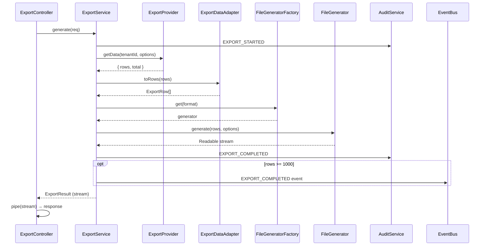

# Phase 11.3 Completion Report — Enterprise Export Engine

> **Project:** AssetX — Enterprise Asset Management System
> **Phase:** 11.3 — Export Engine
> **Status:** ✅ Completed & Approved
> **Date:** 2026-08-03
> **Document Type:** Closure Report (permanent reference for the team)

---

## 1. Executive Summary

Phase 11.3 delivered a **clean, extensible Enterprise Export Engine** that produces CSV / Excel (xlsx) / PDF files from the platform's reporting and domain data. The design follows **Clean Architecture** and **SOLID**: `ExportService` (Application) orchestrates with **zero SQL** and **zero format-specific logic**; data is fetched by per-resource **ExportProviders** (decoupled from repositories); rows are normalized by an **Application-layer adapter**; and files are generated by **format-specific generators selected through a factory**. The contract always returns a **Node `Readable` stream**, regardless of file type, keeping the API stable and memory-efficient.

The phase also integrated the export capability with the platform's existing **permission matrix**, **audit engine**, and **event/notification system**, while adding **no new tables and no schema changes**.

- **Tests:** 124/124 PASS (8 new for this phase).
- **TypeScript:** Clean (src + test).
- **Breaking Changes:** None.

---

## 2. Scope

### In Scope
- Export entity model (Request/Result/Format/Options/Metadata/Mode).
- Per-resource data providers (Assets, Movements, Inventory, Audit, Dashboard).
- CSV (native, streamed), Excel (`exceljs`), PDF (`pdfkit`) generators.
- `FileGeneratorFactory` + `FileGenerator` interface.
- `ExportService` (Application) + `ExportDataAdapter`.
- `ExportController` exposing `GET /exports/{resource}?format=`.
- Resource-specific permissions `export.*`.
- Audit events (`EXPORT_STARTED/COMPLETED/FAILED`) + `EXPORT_COMPLETED` domain event.
- Integration + E2E tests.

### Out of Scope (deferred — see Technical Debt Register)
- Async / queued export, S3 storage, email export, scheduled export, retry, zip, compression, large-file strategy.

---

## 3. Architecture Before

Before Phase 11.3, the platform had **no export capability**. Reporting data existed (`ReportingService`, `InventoryResultService`) but there was no way to serialize it into downloadable files. Controllers were permission-protected but no export endpoints existed. The `report.export`/`audit.export` permissions existed as broad booleans with no format/resource granularity.

---

## 4. Architecture After

```
Controller (GET /exports/{resource})
        │
        ▼
ExportService (Application — orchestrates, no SQL)
        │
        ├── ExportProvider (per resource; knows only its data source)
        │       └── fetches raw rows (Assets/Movements/Inventory/Audit/Dashboard)
        │
        ├── ExportDataAdapter (Application — normalizes to ExportRow)
        │
        ├── FileGeneratorFactory → FileGenerator (CSV/Excel/PDF)
        │       └── generate(...) → Readable stream
        │
        ├── AuditService (EXPORT_STARTED/COMPLETED/FAILED)
        └── EventBus → NotificationService (EXPORT_COMPLETED for large exports)
```

**Key principle:** `ExportService` never touches a repository or SQL directly; it talks to `ExportProvider` implementations (injected via the `EXPORT_PROVIDERS` DI token). `FileGeneratorFactory` removes any `if(format==...)` switch from the orchestration.

---

## 5. Decisions Taken

| # | Decision | Rationale |
|---|---|---|
| D1 | **ExportProvider per resource** instead of ExportService knowing repositories | Low coupling; each provider owns one data source; adding a resource = adding a provider. |
| D2 | **Adapter in Application layer** (not Infrastructure) | It maps domain models to export rows; conversion is an application concern, not a storage concern. |
| D3 | **FileGeneratorFactory** | Centralizes format selection; ExportService has no switch; adding a format = adding a generator. |
| D4 | **Always return a `Readable` stream** (never Buffer/string/Uint8Array) | Stable contract for any file type; supports streaming large files. |
| D5 | **Audit events with rich metadata** (resource, format, rows, duration, user, tenant) | Enterprise traceability; one event per lifecycle stage (no duplication). |
| D6 | **`EXPORT_COMPLETED` independent domain event** (not `SYSTEM_ALERT`) | NotificationService decides delivery; keeps concerns separated. |
| D7 | **`export.*` permissions** replace broad `report.export`/`audit.export` | Resource/format granularity; old keys kept as deprecated aliases to avoid breaking existing tests. |
| D8 | **`/exports/*` route naming** | Resource is the "exports" collection. |
| D9 | **`ExportMode` (SYNC/ASYNC)** in the entity from day one | Future async/queue support without changing the contract. |
| D10 | `exceljs` + `pdfkit` only, behind abstract interface | No library leak into Application layer; isolatable. |

---

## 6. New Files

| File | Purpose |
|---|---|
| `src/core/entities/export.entity.ts` | ExportRequest/Result/Format/Options/Metadata/Mode |
| `src/core/ports/export.port.ts` | `ExportPort.generate()` → `Readable` |
| `src/core/ports/export-provider.port.ts` | `ExportProvider` interface |
| `src/infrastructure/export/csv.generator.ts` | Native CSV (streamed) |
| `src/infrastructure/export/excel.generator.ts` | xlsx via exceljs |
| `src/infrastructure/export/pdf.generator.ts` | pdf via pdfkit |
| `src/infrastructure/export/file-generator.interface.ts` | `FileGenerator` contract |
| `src/infrastructure/export/file-generator.factory.ts` | Selects generator by format |
| `src/application/export/adapters/export-data.adapter.ts` | Normalize rows |
| `src/application/export/providers/assets-export.provider.ts` | Assets data |
| `src/application/export/providers/movements-export.provider.ts` | Movements data |
| `src/application/export/providers/inventory-export.provider.ts` | Inventory data |
| `src/application/export/providers/audit-export.provider.ts` | Audit data |
| `src/application/export/providers/dashboard-export.provider.ts` | Dashboard data |
| `src/application/export.service.ts` | Orchestrator (no SQL) |
| `src/api/export/export.controller.ts` | `/exports/*` endpoints |
| `test/export.integration.spec.ts` | Integration tests |
| `test/export.e2e.spec.ts` | E2E tests |

## 7. Modified Files

| File | Change |
|---|---|
| `src/app.module.ts` | Register generators/factory/adapter/providers/`EXPORT_PROVIDERS`/service/controller |
| `src/core/ports/tokens.ts` | Added `EXPORT_PROVIDERS` |
| `src/core/constants/audit-events.ts` | Added `EXPORT_STARTED/COMPLETED/FAILED` |
| `src/core/events/event-types.ts` | Added `EXPORT_COMPLETED` |
| `src/bootstrap/permission-seed.ts` | Added `export.*`; kept `report.export`/`audit.export` as deprecated |
| `src/common/http/error-codes.ts` | Added `UNSUPPORTED_EXPORT_FORMAT/RESOURCE` |
| `src/application/inventory-result.service.ts` | Added `getSummaryForLatest()` |
| `test/support/db.harness.ts` | Added ExportService wiring |
| `package.json` / lock | Added `exceljs`, `pdfkit`, `@types/pdfkit` |

---

## 8. Sequence Diagram



## 9. Export Flow Diagram

```mermaid
flowchart LR
    R[ExportRequest] --> ES[ExportService]
    ES --> PROV[ExportProvider]
    PROV --> R1[Raw Rows]
    R1 --> AD[ExportDataAdapter]
    AD --> R2[ExportRow[]]
    R2 --> FF[FileGeneratorFactory]
    FF -->|csv| CSV
    FF -->|xlsx| XLSX
    FF -->|pdf| PDF
    CSV & XLSX & PDF --> STR[Readable Stream]
    STR --> RES[Response]
```

---

## 10. Permissions Matrix

| Role | export.assets | export.movements | export.inventory | export.audit | export.dashboard |
|---|---|---|---|---|---|
| Administrator | ✅ | ✅ | ✅ | ✅ | ✅ |
| Asset Manager | ✅ | ✅ | ✅ | ❌ | ✅ |
| Auditor | ✅ | ✅ | ✅ | ✅ | ✅ |
| Department Manager | ❌ | ❌ | ❌ | ❌ | ❌ |
| Inventory Team | ❌ | ❌ | ❌ | ❌ | ❌ |
| Maintenance | ❌ | ❌ | ❌ | ❌ | ❌ |
| Employee | ❌ | ❌ | ❌ | ❌ | ❌ |

> Deprecated aliases `report.export` / `audit.export` retained for backward compatibility (Administrator, Auditor) — to be removed in a future cleanup.

---

## 11. Security Review

- **Tenant isolation:** each provider queries within `tenant_id` + RLS; verified by test (tenant A export does not leak tenant B).
- **Permission-based:** resource-specific `export.*` enforced via `@RequirePermission` + `PermissionGuard` (not role-only).
- **JWT / permission version:** enforced by `AuthGuard` before controller reaches export.
- **Audit:** every export lifecycle stage logged with user/tenant/resource/format/rows/duration.
- **No SQL / no business logic in controllers.**

---

## 12. Performance Review

- **Streaming:** CSV generated and piped as a stream; Excel/PDF buffered internally then streamed — the contract is always `Readable`.
- **No duplicate arrays / large JSON serialization** beyond what the providers already return.
- CSV generator writes row-by-row (memory-efficient for large datasets).
- `limit` option caps rows per export (default 10,000) to bound memory/time.
- **Trade-off:** Excel/PDF currently buffer fully (library constraint); addressed in Technical Debt Register (streaming/large-file strategy).

---

## 13. Test Coverage

| Suite | Tests | Coverage |
|---|---|---|
| `export.integration.spec.ts` | 6 | CSV content, xlsx stream, pdf stream, audit events, tenant isolation, unsupported resource |
| `export.e2e.spec.ts` | 2 | admin CSV 200 + content-type, 401 unauth, 403 permission-less |
| **Total (phase)** | **8** | |
| **Full regression** | **124/124** | all prior suites still pass |

---

## 14. Known Limitations

- Excel/PDF generators buffer the full file in memory (library constraint); acceptable for typical export sizes, not for very large files.
- PDF uses default PDFKit font (no advanced Arabic RTL typesetting yet).
- `getSummaryForLatest` exports only the latest inventory cycle summary unless a `cycle_id` filter is provided.
- Streaming size metadata is `0` until measured downstream.
- `ExportMode.ASYNC` is designed but not yet implemented (see register).

---

## 15. Future Improvements

- Async export with a job queue (BullMQ) + download endpoint.
- S3/object-storage upload for large files.
- Email + scheduled export delivery.
- Retry strategy and dead-letter handling for async jobs.
- ZIP + compression for multi-file/batch exports.
- Advanced PDF formatting (headers/footers, Arabic fonts, landscape).
- Add `report.export`/`audit.export` removal after migration.

---

## 16. Lessons Learned

1. **Provider-per-resource** kept `ExportService` small and open for extension — adding a new export (e.g. "locations") is just a new provider + permission, with no change to the service.
2. **A stable `Readable` contract** prevented rework when adding PDF after CSV/Excel.
3. **`FileGeneratorFactory`** removed repeated `if(format==...)` and made generators individually testable.
4. **Decorator return types matter** — `@RequirePermission` must be applied per-method, not at class level (class decorators require a different signature).
5. **DI of heterogeneous providers** requires a dedicated token + array provider, not bare type injection.
6. Keeping deprecated permission aliases avoided breaking existing tests while enabling a clean migration path.

---

## 17. Closing

Phase 11.3 is **complete and approved**. It is a durable reference point: the Export Engine is extensible, testable, permission-isolated, tenant-safe, and audited. See `Technical-Debt-Register.md` for deferred items and `Advanced-Search-Design-Specification.md` for the next phase design.

*Reference documents: ADR-009, ADR-010, Security Architecture, Audit Guide.*
