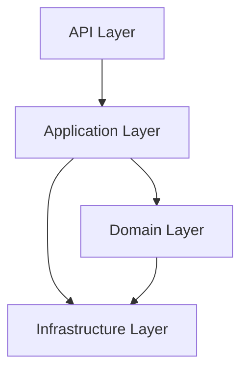

# 1. Architecture Principles

> **Version:** 1.0 | **Status:** Approved | **Owner:** Senior Enterprise Solution Architect
> **Last Updated:** 2026-08-03 | **Review Cycle:** Quarterly
> **Handbook:** Enterprise Engineering Handbook — AssetX

## 1.1 Purpose

Defines the engineering philosophy and non-negotiable standards that govern every design and implementation decision in AssetX. These principles are **mandatory** — a design that violates them must be revised before it can be approved.

## 1.2 Scope

Applies to all engineering work: backend, database, API, mobile, AI, security, DevOps, testing, and operations. It governs decisions made by developers, architects, reviewers, and AI agents.

## 1.3 Responsibilities

- **All engineers:** follow these principles in every change.
- **Architecture Review Board (ARB):** enforces them during review.
- **Reviewers:** reject changes that violate them.

## 1.4 Engineering Vision

Build a **modular, secure, offline-first, multi-tenant enterprise platform** that manages the full fixed-asset lifecycle with reliability, auditability, and scalability — designed to grow from a modular monolith to an event-driven, AI-native enterprise platform without rework.

## 1.5 Architectural Values

1. **Correctness** — the system does the right thing, transactionally safe, auditable.
2. **Security by design** — built-in, not retrofitted.
3. **Simplicity** — the simplest design that meets requirements (KISS).
4. **Extensibility** — modules/ports allow growth without rewrite.
5. **Observability** — every component is measurable and traceable.
6. **Tenant isolation** — data is never shared across tenants.
7. **Auditability** — every sensitive operation is recorded.

## 1.6 Clean Architecture

- Dependencies point **inward**: Domain → Application → Infrastructure → API.
- The **Domain layer** holds entities, ports, and business rules (no framework, no SQL).
- The **Application layer** holds use-cases/services (no SQL, no HTTP details).
- The **Infrastructure layer** implements ports (DB, external services).
- The **API layer** exposes HTTP (controllers only, no business logic).

## 1.7 SOLID

| Principle | Application |
|---|---|
| **S**ingle Responsibility | Each class has one reason to change. |
| **O**pen/Closed | Extend via ports/providers, not modification. |
| **L**iskov | Implementations honor their port contracts. |
| **I**nterface Segregation | Ports are small and focused. |
| **D**ependency Inversion | Depend on abstractions (ports/tokens), not concrete infra. |

## 1.8 DRY (Don't Repeat Yourself)

- Reuse ports/providers/services rather than duplicating logic.
- Centralize cross-cutting concerns (auth, audit, error handling) in shared components.
- **Anti-pattern:** duplicating repository calls or business rules in multiple controllers/services.

## 1.9 KISS (Keep It Simple, Stupid)

- Prefer the simplest solution that meets requirements.
- Avoid speculative abstraction and over-engineering.
- **Anti-pattern:** adding layers/factories before there is a demonstrated need.

## 1.10 YAGNI (You Aren't Gonna Need It)

- Do not build features "just in case."
- **Anti-pattern:** adding async/queue/S3 before the scale or requirement exists (defer to Technical Debt Register).
- Future extensibility is expressed via **interfaces/ports**, not via unused implementations.

## 1.11 Security First

- **Security by design:** every request validates auth + permission + tenant.
- **Least privilege:** users get only required permissions.
- **RLS** enforced at the database for tenant isolation.
- **Audit by design:** sensitive operations are logged.
- See `Security/Security_Architecture.md` and `10_Production_Readiness_Checklist.md`.

## 1.12 API First

- Every function has an API before its UI.
- Controllers carry **no business logic and no SQL**.
- Errors use the standard error-code catalog.
- See `API/API_Specification.md`.

## 1.13 Offline First

- Field operations work without connectivity and sync later.
- Local store (SQLite) + sync queue + conflict resolution.
- See `Mobile/Mobile_Technical_Specification.md` and `Engineering-Specifications/11_Offline_Synchronization_Specification.md`.

## 1.14 Domain Driven Design (DDD)

- Code is organized by **Bounded Context** (Asset, Inventory, Movement, Identity, ...).
- **Aggregates** enforce invariants; cross-aggregate effects flow via **events**.
- Domain rules live in the domain/application layers, not the API.

## 1.15 Event-Driven Readiness

- The platform is **event-ready**: domain events publish through an in-process **EventBus**.
- Events are used to decouple notification/audit/analytics from business transactions.
- Evolve to Redis/RabbitMQ/Kafka at scale (ADR-011 of event bus strategy).

## 1.16 AI Ready

- Architecture supports a **tiered AI layer** (L1/L2/L3) without coupling business logic to any model provider.
- Data, embeddings (pgvector), and provider abstraction are designed to be added incrementally.
- See `Engineering-Specifications/09_AI_*` (planned).

## 1.17 Testability

- Services depend on **ports** so they can be tested with fakes.
- **Unit** tests target pure logic (query builders, validators, services with fakes).
- **Integration** tests run against real PostgreSQL (PGlite).
- **E2E** tests exercise HTTP + guards + RLS.
- See `Testing/Test_Strategy.md`.

## 1.18 Scalability

- Modular monolith first (ADR-002); split to microservices at scale triggers.
- Tenant partitioning, cursor pagination, caching, read replicas as needed.
- See `Engineering-Specifications/` performance docs.

## 1.19 Maintainability

- Consistent naming, structure, and conventions.
- Clear separation of concerns; no god-objects.
- Cross-referenced documentation; each module has a home.

## 1.20 Backward Compatibility

- API evolution is **additive** within a major version.
- Breaking changes require a major version + migration plan + deprecation notice.
- Database changes are forward migrations with rollback strategy.

## 1.21 Technical Debt Policy

- Technical debt is **recorded** in `docs/Technical-Debt-Register.md`, not silently carried.
- Deferred items are documented with a trigger to revisit.
- Debt is addressed in dedicated sprints; it is never "free."

## 1.22 Mandatory Guidelines (summary)

1. Follow Clean Architecture layering (no SQL in controllers, no business logic in API).
2. Use Repository Pattern; never bypass RLS.
3. Enforce permission-based authorization (not role-only).
4. Audit every sensitive operation once.
5. Add tests (unit/integration/e2e) for every feature.
6. Update documentation for every feature (RFC/ADR/design/completion).
7. No schema change without an approved ADR + migration + rollback.

## 1.23 Anti-patterns

| Anti-pattern | Why it's wrong |
|---|---|
| SQL in controllers | Breaks Clean Architecture; not testable. |
| Business logic in API layer | Duplicated, untestable, unmaintainable. |
| Role-only authorization | Cannot express fine-grained access. |
| Duplicate audit logging | Pollutes audit trail. |
| Silent schema change | Breaks migrations and rollback. |
| Bypassing RLS | Compromises tenant isolation. |

## 1.24 Review Checklist

- [ ] Follows layering (no SQL/business logic in API).
- [ ] Uses ports/repositories (no direct DB coupling in services).
- [ ] Permission-based authorization + RLS preserved.
- [ ] Sensitive ops audited once.
- [ ] Tests added (unit/integration/e2e).
- [ ] Docs updated (RFC/ADR/design/completion).
- [ ] No schema change without ADR.

## 1.25 References

- `2_Architecture_Governance.md` (how principles are enforced)
- `3_Decision_Process.md` (decision flow)
- `Technical-Debt-Register.md`
- `Security/Security_Architecture.md`

## 1.26 Future Evolution

Principles evolve only via an approved RFC/ADR; they are **not** changed ad hoc. Any proposal to alter a principle must go through `2_Architecture_Governance.md`.
