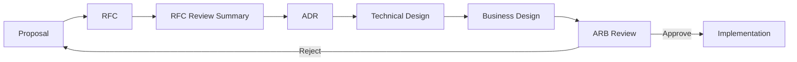

# 2. Architecture Governance

> **Version:** 1.0 | **Status:** Approved | **Owner:** Architecture Review Board (ARB)
> **Last Updated:** 2026-08-03 | **Review Cycle:** Quarterly

## 2.1 Purpose

Defines how the AssetX architecture **evolves** in a controlled, auditable way — who reviews, what process governs change, and how compliance is enforced. This is the operational backbone of the Architecture Principles (`1_Architecture_Principles.md`).

## 2.2 Scope

Applies to architecture-affecting changes: new features, new modules, schema changes, new integrations, technology decisions, and structural refactors.

## 2.3 Responsibilities

| Role | Responsibility |
|---|---|
| **Architecture Review Board (ARB)** | Reviews major decisions; enforces principles; owns ADR/RFC outcomes. |
| **Technical Leads** | Champion proposals; prepare RFC/ADR/design docs. |
| **All engineers** | Follow the process for architecture-affecting changes. |
| **TPM / CAB** | Sequence and approve delivery of approved changes. |

## 2.4 Architecture Review Board

- **Composition:** Senior Enterprise Solution Architect (chair), Backend Lead, Security Engineer, DevOps/SRE, QA Lead, Product Owner (advisory).
- **Cadence:** Weekly (or on-demand for critical changes).
- **Authority:** approves/rejects architecture-affecting RFCs, ADRs, and designs.

## 2.5 Architecture Review Process

## 2.6 ADR Lifecycle

| Stage | Description |
|---|---|
| **Proposed** | ADR drafted; not yet applied. |
| **Accepted** | Approved by ARB/CAB; may be implemented. |
| **Superseded** | A later ADR replaces it. |
| **Rejected** | Considered and declined. |

- Each ADR is stored at `db/ADR-*.md` and logged in the Decision Log.
- Schema-changing ADRs require explicit approval **before** applying the migration.

## 2.7 RFC Lifecycle

| Stage | Description |
|---|---|
| **Proposed** | RFC written; open for comment. |
| **Review** | Stakeholders comment; RFC Review Summary produced. |
| **Accepted/Rejected** | Decision captured; may proceed to ADR. |
| **Deferred** | Accepted in principle; not scheduled. |

- RFCs live in `docs/rfc/`.

## 2.8 Design Review

- Technical + business design docs produced after ADR acceptance.
- Reviewed by ARB + affected teams before implementation.
- Design must reference the ADR it implements.

## 2.9 Approval Flow

| Change type | Required approvals |
|---|---|
| Bug fix / minor | 1 reviewer + CI green |
| Feature (non-architectural) | Team lead + QA + CAB (if release) |
| Architecture change | RFC + ADR + ARB + CAB |
| Schema change | ADR (ARB/CAB) approved **before** migration |
| Security change | ADR + Security Review Board |

## 2.10 Change Control

- Approved baselines (architecture, scope, docs) change only via the change process.
- All changes are logged in the Decision Log / Change Request Process (`docs/project/`).
- No change to an approved baseline without documented approval.

## 2.11 Architecture Compliance

- **Enforcement:** review gates (verification checklist) + CI.
- **Monitoring:** periodic architecture audits against the handbook.
- **Non-compliance:** a change that violates principles is rejected and logged as technical debt (or reworked).

## 2.12 Review Checklist

- [ ] Architecture-affecting? If so, RFC → ADR → Design.
- [ ] Schema change has approved ADR **before** migration.
- [ ] Decision Log / ADR log updated.
- [ ] Compliance with Architecture Principles verified.

## 2.13 References

- `1_Architecture_Principles.md`
- `3_Decision_Process.md`
- `4_ADR_Template.md`
- `5_RFC_Template.md`
- `docs/project/Change_Request_Process.md`

## 2.14 Future Evolution

Governance evolves via the same process it defines — a change to governance is itself an architecture change requiring RFC/ADR/ARB approval.
