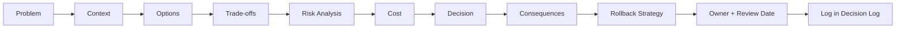

# 3. Decision Process

> **Version:** 1.0 | **Status:** Approved | **Owner:** Senior Enterprise Solution Architect / TPM
> **Last Updated:** 2026-08-03 | **Review Cycle:** Quarterly

## 3.1 Purpose

Defines how engineering decisions are made, evaluated, and recorded — so every significant decision is traceable, justified, and reversible.

## 3.2 Scope

Applies to technical, architectural, security, and delivery decisions that affect the platform.

## 3.3 Responsibilities

- **Proposer:** prepares the decision with options and analysis.
- **Reviewers/ARB:** evaluate and decide (per `2_Architecture_Governance.md`).
- **Recorder:** logs the outcome in the Decision Log / ADR.

## 3.4 Decision Framework

A decision is complete only when the following are addressed:

### 3.4.1 Problem
What is the concrete problem to solve? State it clearly.

### 3.4.2 Context
Facts, constraints, and existing decisions that shape the choice.

### 3.4.3 Options
Enumerate ≥ 2 realistic alternatives (including "do nothing" when applicable).

### 3.4.4 Trade-offs
Compare options across: simplicity, cost, risk, effort, extensibility, performance.

### 3.4.5 Risk Analysis
Identify risks per option and their mitigations.

### 3.4.6 Cost
Estimate implementation + maintenance + operational cost.

### 3.4.7 Decision
State the chosen option and the rationale (why it wins).

### 3.4.8 Consequences
Positive and negative consequences after adoption.

### 3.4.9 Rollback Strategy
How to undo or mitigate if the decision proves wrong.

### 3.4.10 Owner
The accountable owner of the decision.

### 3.4.11 Review Date
When the decision will be revisited (or "on trigger").

## 3.5 Decision Flow

## 3.6 Decision Types

| Type | Decider | Recorded as |
|---|---|---|
| Architectural | ARB | ADR |
| Feature scope | Product Owner | Backlog/PRD |
| Security | Security Review Board | ADR + security review |
| Delivery/schedule | TPM/CAB | PEP / decision log |
| Technical (localized) | Team lead | PR review |

## 3.7 Logging

- Every decision is logged with: date, decision, rationale, alternatives, owner, status.
- See `docs/project/Decision_Log.md`.

## 3.8 Review Checklist

- [ ] Problem & context stated.
- [ ] ≥ 2 options compared with trade-offs + risk.
- [ ] Decision + rationale recorded.
- [ ] Consequences + rollback documented.
- [ ] Owner + review date assigned.
- [ ] Logged in Decision Log / ADR.

## 3.9 References

- `2_Architecture_Governance.md`
- `4_ADR_Template.md`
- `5_RFC_Template.md`
- `docs/project/Decision_Log.md`

## 3.10 Future Evolution

The decision process is stable; adjustments require an ADR.
