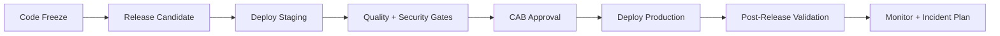

# 9. Release Checklist

> **Version:** 1.0 | **Status:** Approved | **Owner:** DevOps / TPM / CAB
> **Last Updated:** 2026-08-03 | **Review Cycle:** Per release

This is the **enterprise release guide** — the steps from code-freeze to post-release validation.

## Versioning

- **Semantic Versioning:** `MAJOR.MINOR.PATCH`.
- `MAJOR` — breaking changes (with deprecation + migration).
- `MINOR` — new features, backward compatible.
- `PATCH` — bug/security fixes.
- Releases are tagged `vX.Y.Z` on `release/vX.Y` branches.

## Release Process

## Migration

- [ ] Migration scripted (forward + rollback).
- [ ] Applied to staging first; verified.
- [ ] Backward compatible or explicit breaking plan.
- [ ] Data migration verified + reconciled.

## Rollback

- [ ] Rollback procedure tested.
- [ ] Feature flags allow instant disable.
- [ ] Blue/Green or canary strategy for major releases.

## Feature Flags

- [ ] New features behind flags (ADR-014).
- [ ] Flags named, documented, and cleanup scheduled.

## Release Notes

- [ ] User-facing changelog (new features, fixes, breaking changes).
- [ ] Technical notes (migrations, config, env vars).

## Deployment

- [ ] CI/CD pipeline green (GitHub Actions + Docker).
- [ ] Secrets in vault.
- [ ] Backups taken before deploy.
- [ ] Monitoring + alerts armed.

## Monitoring

- [ ] Health checks passing.
- [ ] Metrics/logs/tracing live (Prometheus/Loki/Sentry).
- [ ] Alerts configured for P1/P2.

## Verification

- [ ] Smoke tests (login, key flows) after deploy.
- [ ] Security checks (SAST/DAST) green.
- [ ] Performance spot-check within targets.

## Post-Release Validation

- [ ] Sync success rate, error rate, latency within SLO.
- [ ] No critical incidents in hypercare window.
- [ ] Feedback loop to backlog.

## Incident Plan

- [ ] Escalation matrix defined (P1–P4).
- [ ] On-call confirmed.
- [ ] Runbooks available (RB-001…006).
- [ ] Rollback on-call decision documented.

## Cross-reference

- `8_Verification_Checklist.md` (quality gates)
- `10_Production_Readiness_Checklist.md` (production gate)
- `DevOps/CI_CD_Guide.md`
- `Operations/Operations_Manual.md`
