# Enterprise Engineering Handbook — AssetX

> **Version:** 1.0 | **Status:** Approved Baseline | **Owner:** Senior Enterprise Solution Architect
> **Last Updated:** 2026-08-03 | **Review Cycle:** Quarterly, or upon any approved architectural change

This handbook is the **official Engineering Constitution** of the AssetX Enterprise Asset Management platform. It is the **mandatory reference** for every developer, architect, reviewer, DevOps engineer, QA engineer, AI agent, and contributor.

It is **internal engineering governance**, not user documentation. It does not document features for end users; it governs how engineering work is designed, decided, implemented, verified, released, and operated.

## How to use this handbook

1. **New contributor?** Read this index, then `1_Architecture_Principles.md` and `2_Architecture_Governance.md` first.
2. **Making a decision?** Follow `3_Decision_Process.md` → produce an `RFC` (template `5_RFC_Template.md`) → then an `ADR` (template `4_ADR_Template.md`).
3. **Designing a feature?** Use `6_Design_Template.md`.
4. **Implementing?** Follow `7_Completion_Report_Template.md` + `8_Verification_Checklist.md`.
5. **Releasing?** Follow `9_Release_Checklist.md` → `10_Production_Readiness_Checklist.md`.

## Document map (cross-references)

```mermaid
flowchart LR
    P[1 Architecture Principles] --> G[2 Architecture Governance]
    G --> DP[3 Decision Process]
    DP --> RFC[5 RFC Template]
    RFC --> ADR[4 ADR Template]
    ADR --> DSG[6 Design Template]
    DSG --> IMP[7 Completion Report Template]
    IMP --> VER[8 Verification Checklist]
    VER --> REL[9 Release Checklist]
    REL --> PROD[10 Production Readiness Checklist]
```

## Documents

| # | Document | Purpose |
|---|---|---|
| 1 | Architecture Principles | Engineering philosophy, values, and non-negotiable standards |
| 2 | Architecture Governance | How architecture evolves (boards, review, ADR/RFC lifecycle) |
| 3 | Decision Process | How engineering decisions are made and recorded |
| 4 | ADR Template | Official Architecture Decision Record template |
| 5 | RFC Template | Official Request For Comments template |
| 6 | Design Template | Standard technical design document template |
| 7 | Completion Report Template | Mandatory implementation closure report |
| 8 | Verification Checklist | Pre-merge / pre-release / pre-production checks |
| 9 | Release Checklist | Enterprise release guide |
| 10 | Production Readiness Checklist | Final production gate |

## Cross-references to other governance

- Project governance: `docs/project/` (Definition of Ready/Done, Quality Gates, Risk Register, etc.)
- RFCs: `docs/rfc/`
- ADRs: `db/ADR-*.md`
- Feature specs: `docs/*.md`, `Engineering-Specifications/`
