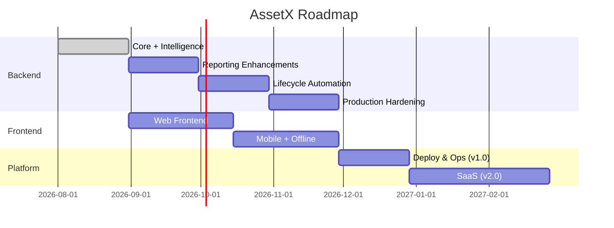

# Roadmap — AssetX

> **Version:** 1.0 | **Status:** Living artifact | **Owner:** Product Owner
> **Last Updated:** 2026-08-03

Single roadmap. Updated (replaces earlier multiple roadmap sections).

## Phases

| Phase | Focus | Outcome |
|---|---|---|
| **Phase A (done)** | Backend core + intelligence | All backend modules, 137 tests |
| **Phase B** | Reporting enhancements + automation | Scheduled reports, rules, integrity |
| **Phase C** | Production hardening | Async export, performance, retention |
| **Phase D** | Web frontend | Usable web app on APIs |
| **Phase E** | Mobile + offline | Field inventory offline |
| **Phase F** | Deploy & ops | v1.0 production |
| **Phase G** | SaaS | Multi-tenant, billing, integrations |

## Rules

- **This is the only roadmap.** Earlier multiple roadmap definitions (in the master context doc) are superseded by this file.
- The roadmap updates at each milestone/release planning, never ad hoc.
- Detailed items live in the Backlog; this is the strategic view only.
